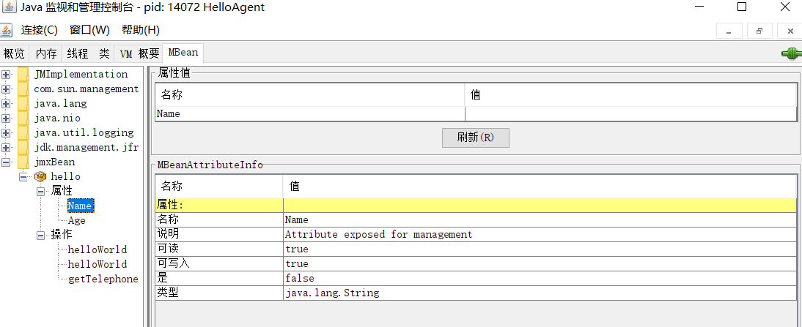

# 深入理解JVM笔记

## 垃圾回收机制

### 判断对象是否死亡

#### 1.引用计数法

##### 原理

​	给对象添加一个引用计数器，每当有一个地方引用他时，计数器就+1，引用失效时，计数器-1，当计数器为0时，对象不可使用，认为其死亡。

##### 缺点

​	无法解决对象互相循环引用的问题

##### 疑问

​	如何判断引用了多少次，如何判断引用失效？

​	书上的objA==null为什么不代表objA引用失效且objA指向objB的引用失效？

#### 2.可达性分析算法

##### 原理

​	通过一系列的称为“GC Roots”的对象作为起始点，从这些节点开始向下搜索，搜索走过的路径称之为引用链，引用链上的对象都是活着的，不在任何引用链上的对象是不可达的，是死亡的。

#### 3.引用相关
>​	每种编程语言都有自己的数据处理方式。有些时候，程序员必须注意将要处理的数据是什么类型。你是直接操纵元素，还是用某种基于特殊语法的间接表示（例如C/C++里的指针）来操作对象。所有这些在 Java 里都得到了简化，一切都被视为对象。因此，我们可采用一种统一的语法。尽管将一切都“看作”对象，但操纵的标识符实际是指向一个对象的“引用”（reference）。															 		 		《Java编程思想》

##### 引用的概念有四种 

- 强引用 ``Object obj = new Object();``
- 软引用，在内存溢出异常之前，将对象列进回收范围之中进行第二次回收，用SoftReference实现
- 弱引用，只生存到下次垃圾收集发生之前，用WeakReference实现
- 虚引用，无法取得对象实例，也不会对对象生存时间造成影响，唯一价值就是在对象被收集器回收时受到系统通知

#### 4.死亡过程

​	当对象不可达时，在它被收集器收集之前，其至少经过两次标记过程。

##### 第一次

​	发现对象a不可达，a被第一次标记，针对其是否有必要执行finalize()方法进行筛选。如果finalize()未被重写，或者finalize()已经被虚拟机调用过，虚拟机将这两种情况都视为“没必要执行”。否则，即视为有必要执行。

##### 第二次

​	当对象没必要执行finalize()时，对象接下来会被收集器回收。

​	当对象那个有必要执行finalize()时，对象会被放置于F-Queue队列中，在稍后会被JVM自动建立的一个低优先级的Finalizer线程执行其finalize()方法，但是并不保证会等待他运行结束。如果运行的太慢，或者产生了死循环，也不会使得整个队列的其他对象永远处于等待。

​	稍后GC会对队列中的对象进行第二次标记，如果其finalize()方法没有使得这个对象变得可达，那么他就也要被回收了。

##### 注意

​	finalize()运行代价高昂，不确定性大，用try-finally可以完美替代它，所以这方法基本上一点用都没有。

####5.回收方法区（永久代）

> ​	方法区(Method Area)与java堆一样，属于各个线程共享的内存区域，其被用户存储已经被虚拟机加载的类信息，常量，静态变量，即时编译器（JIT）编译后的代码等数据

​	JVM虚拟机规范中明确表示可以不要求虚拟机在方法区实现垃圾收集，并且在方法区一般收集不到什么垃圾。

##### 到底永久代会存些什么信息

- 常量

  常量指的是不可变的常量，从语法上来讲就是添加着final关键字来修饰的变量，当final修饰之后，此变量就就不能被再次赋值。

  对于基本数据类型，final会将值变为一个无法改变的常数，对于对象句柄，句柄会变成一个常数，无法再将句柄指向另一个对象。但是对象本身也是可以修改的，数组也是如此。

  final修饰的方法在子类不可被重写，final修饰的类不可被继承。

- 静态变量

  对于普通的成员变量，每创建一个该类的实例就会创建该成员变量的拷贝，分配一次内存。因为成员变量和类的实例是绑定的，所以需要通过对象名进行访问，而不能直接通过他的类名称对其进行访问。

  但是静态变量在内存中只存一份，JVM只会为静态变量分配一次内存，在加载类的过程中完成静态变量的内存分配，静态变量属于类，与类的实例无关，可以直接通过类名来访问这类变量。

##### 为什么收集不到垃圾

​	永久代的垃圾收集主要回收两个部分的内容，废弃常量和无用类。

​	无用类的判定条件：

- 该类所有实例被回收

- 加载该类的ClassLoader被回收

- 类对应的Class对象没有在任何地方被引用，无法在任何地方通过反射访问该类方法

  当满足了以上三条，也不一定就必然回收。

##### JDK8之后的元空间

​	jdk8之后，使用元空间替代永久代，元空间所使用的是堆内存。

​	元空间的优点

- 类和方法的信息大小难以确定，给永久代大小的指定带来了困难，但是默认情况下，类元数据只受可用的本地内存限制（容量取决于是32位或是64位操作系统的可用虚拟内存大小）。新参数（MaxMetaspaceSize）用于限制本地内存分配给类元数据的大小。如果没有指定这个参数，元空间会在运行时根据需要动态调整。
- 永久代会为GC带来不必要的复杂度，现在回收垃圾就在堆里面搞就可以了

​        缺点：

- 因为元空间的大小是会动态变化的，如果不对此加以限制，有可能会出现死循环之类的东西把内存全吃了。

### 垃圾回收算法

#### 1.标记清除

##### 原理

​	标记出所有需要回收的对象，在标记完成后统一回收。

##### 缺点

​	标记与清除的效率不高

​	会产生大量不连续的内存碎片，太多的碎片会导致难以给大对象分配空间，这又会导致触发另一次的垃圾收集

#### 2.复制算法

##### 原理

​	将内存分为两块（a与b），用a，a用完了，将a上还存活的对象复制到b上，清除a。

​	采用这种方法的比较多，一般将内存（新生代）分为一个Eden和两个Survivor,一个Eden和一个Survivor组成a，另一个Survivor是b，HotSpot虚拟机的Eden与Survivor大小比例默认8：1，如果b放不下，就放到老年代。

##### 优点

​	不会产生大量的内存碎片。

##### 缺点

​	如果对象存活率高，那么大量复制会使得效率变低，并且为了保证b一定能容下a存活的对象，我们要不就将ab所占内存五五开，要不就得用老年代为其当条后路。

​	很明显，内存条这么贵，谁敢浪费一半的内存区让ab五五开，所以只能选择第二条路

​	那老年代就没人给他当担保了，老年代怎么回收垃圾呢？

#### 3.标记整理

##### 原理

​	标记不用的空间，让存活的对象朝着一端移动，排列好之后设置端边界，然后清理掉端边界以外的内存

##### 优点

​	不会产生大量的内存碎片，不需要浪费一般内存，不需要再给他设置个区域给他担保。老年代用了都说好

#### 4.分代收集

​	把堆分成新生代和老年代，用不同的方式来对两个代进行垃圾回收

### HotSpot的算法实现

​	垃圾回收的第一步就是判断对象是否是存活着的，而jvm使用的是可达性分析。而可达性分析第一步就是GC Roots。

#### 1.枚举根节点

##### 可达性分析的难点

​	从可达性分析中从GC Roots节点找引用链这个操作为例，可作为GC Roots的节点主要在全局性的引用（例如常量或者类静态属性）	与执行上下文（例如栈帧中的本地变量表）中，现在很多应用仅仅方法区就有数百兆，如果要逐个检查里面的引用，那么就必然会消耗很多时间。

​	此外，可达性分析时，必须暂停所有的Java执行进程（stop the world），否则的话对象的引用关系会不断变化，无法保证垃圾回收的准确性。

##### HotSpot解决

>Exact VM因它使用准确式内存管理而得名，即虚拟机可以知道内存中的某个位置的数据具体是什么类型，这就是准确式GC

​	主流的java虚拟机都是使用准确式GC，所以当STW后，并不需要一个不漏的检查完所有执行上下文和全局的引用位置，虚拟机应当是有办法直接获知那些地方存放着对象的引用。	

​	在HotSpot中，使用了OopMap在类加载完成的时候，就把对象内什么偏移量上是什么类型的数据计算出来，在JIT编译过程中，也会在特定位置记录下栈和寄存器中那些位置是引用。就不需要逐个检查，而是直接扫描OopMap来获得对象引用的存储位置，进行GC Roots枚举。

​	在HotSpot中，对象的类型信息里有记录自己的OopMap，记录了在该类型的对象内什么偏移量上是什么类型的数据。所以从对象开始向外的扫描可以是准确的；这些数据是在类加载过程中计算得到的。

​	在源代码里面每个变量都是有类型的，但是编译之后的代码就只有变量在栈上的位置了oopMap就是一个附加的信息，告诉你栈上哪个位置本来是个什么东西。

​	这个信息是在JIT编译时跟机器码一起产生的。因为只有编译器知道源代码跟产生的代码的对应关系。
​	每个方法可能会有好几个oopMap，就是根据safepoint把一个方法的代码分成几段，每一段代码一个OopMap，作用域自然也仅限于这一段代码。

​	换句话说，通过使用OopMap，我们在得到一个GC Root的时候，我们可以直接查看OopMap来得到这个GC Root中其他类的对象的引用（指针）。

​	但是OopMap是在段代码里的所有GC Root的一个类似于结构快照的东西，因为在不同的地方GC Root会发生变化，所以OopMap只能适用于一段代码

​	而JVM能做到这一点的关键在于，通过OopMap可以识别堆栈中的一个数据类型是否为引用类型。

#### 2.安全点

​	在OopMap的帮助下，HotSpot可以准确的完成GC Roots枚举，但是，引用关系可能是会非常多变的，这导致OopMap也可能是非常多变的，如果每过来一个指令都要生成对应的OopMap，会占用大量的额外空间。

​	所以jvm只在安全点记录OopMap，程序只有在抵达安全点时才可以暂停。

##### 安全点的特点

​	程序具有可以让程序长时间执行的特征

​	但是很明显，在最终解释成的汇编里面，没有单独一条指令可以使程序长时间停止的，那么就只有在指令序列复用的时候这行代码才可以长时间执行

​	所以在方法调用，循环跳转，异常跳转的时候才会产生SafePoint

##### 问题

​	为什么安全点的特征是：程序具有可以让程序长时间执行的特征？

​	因为在程序长时间执行的过程中，现有的对象不会发生变化！

​	不对啊，在安全点都STW了，无论如何对象都不会发生变化啊。

​	不懂。

##### 如何让所有线程都跑到安全点再暂停

- 暂停所有进程，让没跑到安全点的进程继续跑，直到跑到安全点
- 设置一个标志，让各个线程轮询这个标志，发现中断标志时线程自己终端挂起

#### 3.安全区域

​	很明显之前说了，OopMap很多时候是作用于一个区域的而不是一个点的，所以这部分OopMap所包含的区域很明显都是安全点。也就是组成了安全区

### 垃圾收集器

#### 1.Serial收集器

- 单线程，在它收集垃圾的时候必须暂停其他所有的工作线程，知道他收集结束
- 对于单线程CPU来说，它简单高效
- 可以配合CMS

#### 2.ParNew收集器

- 多线程版本的Serial，单线程下远逊于Serial
- 可以配合CMS

#### 3.Parallel Scavenage

- 新生代收集器，使用了复制算法
- 多线程收集
- 主要关注于吞吐量

#### 4.Serial Old

- Serial的老年代特供版本
- 用于配合Parallel Scavenage
- 给CMS保个底，CMS出bug它能顶一会儿

#### 5.Parallel Old

- Parallel Scavenage的老年代版本
- 关注于吞吐量

#### 6.CMS

##### 设计目的

​	以获取最短回收停顿时间为目标。

​	在互联网网站或者B/S系统的服务端上，尤其重视服务器的响应速度，希望系统停顿时间最短。CMS就符合这个要求

##### 运作步骤

- 初始标记
- 并发标记
- 重新标记
- 并发清除

​       初始标记和重新标记需要STW，但是初始标记只需要标记一下GC Roots能直接关联到的对象，速度很快，在并发标记阶段才是进行GC Roots Tracing的过程，即用OopMap搜寻对象引用。

​	之后重新标记则是修正并发标记期间因为用户程序继续运作而导致标记产生变动的一部分的对象标记记录，比初始标记长，但是比并发标记时间短。

​	有以下缺点：

- 标记清除算法实现，负责清除老年代
- 在GC过程中，耗时最长的两个阶段可以与用户线程一起工作
- 吃CPU，必须预留一部分空间提供并发收集时程序运作使用，会产生大量的内存碎片

#### 7.G1

##### 设计目的

​	G1是一种服务端应用使用的垃圾收集器，目标是用在**多核、大内存**的机器上，它在大多数情况下可以实现指定的GC暂停时间，同时还能保持较高的吞吐量。

##### 初衷

​	之前的垃圾收集器都有几个共同的问题，G1来解决：

- 所有针对老年代的操作必须扫描整个老年代空间
- 年轻地和老年代是独立的连续的内存块，必须先决定年轻代和老年代在虚拟地址空间的位置。

##### 特点

- 可以像CMS并行并发来缩短STW
- 可以分代收集
- 基于标记整理，不会有太多内存碎片
- 可预测停顿
- 同时处理新生代和老年代，不需要，也没有任何收集器与其配合

##### 使用场景

- 可以像CMS收集器一样，允许垃圾收集线程和应用线程并行执行，即需要额外的CPU资源；
- 压缩空闲空间不会延长GC的暂停时间；
- 需要更易预测的GC暂停时间；
- 不需要实现很高的吞吐量（看起来要求吞吐量的话还得看Parallel）

##### Region

​	G1将内存划分为了多个大小相等的Region，最小1M，最大32M，默认分2048个Region。

​	Region在逻辑上连续，物理内存地址不连续，Region有四种类型，分别为Eden，Survivor，Old，Humongous，其中E，S为年轻代，O，H为老年代

​	当分配的对象大于等于Region大小的一半会被认为是巨型对象，而H作为老年代可以防止GC时候大对象的内存拷贝。如果堆内存容不下H对象，则GC。

##### 跨区引用

​	一个对象被分配在了某个Region中，它并非只能被本Region中的其他对象引用，还可能被其他Region的对象引用，为了判断这个对象到底是否还活着，我们就得遍历java堆来保证准确性。但是这样GC效率太低了

​	所以就产生了下面的东西：

##### Card和Remember Set

​	RememberedSet用于处理这类问题：

​	新生代GC发生的非常频繁，一般来说，GC时，先枚举根节点，根节点可能在新生代中，也有可能在老年代中，但是我们只想收集新生代，所以没必要对位于老年代的GC Roots做全面的可达性分析，但问题是，如果不分析老年代的话，老年代的某个GC Root有可能引用了新生代的对象，无法确保这个新生代对象是否真的是不能清除的。

​	解决方法就是RSet，位于不同年代对象之间的引用关系记录在Region所属的RSet中，Region中分成多个Card，RSet所记录的就是本Region中的哪个Card被哪个别的区域的对象所引用了。

​	这样，我们就可以在新生代GC的时候，新生代的GC Roots+RememberedSet才是新生代全部的GC Roots，以此来判断新生代存活的对象。

##### 侧重点

​	G1是Garbage First，G1是一个并行回收器,它把内存分割为很多不相关的区间(Region),每一个区间可以属于老年代或年轻代,并且每个区间上是可以物理上不连续的,老年代区间这个设计理念本身是为了服务于并行后台线程,这些线程的主要工作是寻找未被引用的对象,而这样就会产生一种现象,即**某些区间的垃圾多余其它区间**,垃圾回收时都是需要停下应用程序,不然没办法防止应用程序的干扰,然后G1可以集中精力在垃圾最多的区间上,并且只需要一点点时间就可以清空这些区间垃圾,腾出完全空闲的时间.总而言之:**G1侧重点在于处理垃圾最多的区间**,所以叫Garbege First

##### 操作阶段

- 年轻代回收
- 运行在后台并行循环
- 混合回收
- 全量回收（full GC）

##### 运作步骤

- 初始标记（STW）
- 并发标记
- 最终标记（需要停顿线程，但是可以并发执行）
- 筛选回收（只回收一部分的Region）

##### SATB

​	SATB的全称（Snapshot At The Beginning）字面意思是开始GC前存活对象的一个快照。SATB的作用是保证在并发标记阶段的正确性。

​	如果在并发标记的过程中，在引用链上的未被标记的对象a，突然变成了已被扫描标记的对象b的引用，那么因为b已经被完全扫面，所以系统不会再次扫描b的引用，这导致a不会被系统标记，a就会因为没有标记而被系统当作垃圾回收。但是事实上，a被b引用了，a是不该死的。

​	G1采用的是``pre-write barrier``解决了这个问题。在并发标记阶段，当引用关系发生了变化的时候，通过``pre-write barrier``会将这种变化记录并保存在一个队列里，在JVM源码中这个队列叫`satb_mark_queue`。在remark阶段会扫描这个队列，通过这种方式，旧的引用所指向的对象就会被标记上，其子孙也会被递归标记上，这样就不会漏标记任何对象，snapshot的完整性也就得到了保证。

​	当然还有一种可能，就是在快照的时候他是活着的，但是之后它死了，它就被称为浮动垃圾，只能等到下一次收集的时候回收。

​	另外在GC中新分配的对象自然是不应该在快照之中的，自然也不应该被当作垃圾回收。

##### 那么如何知道哪些对象是GC之后新分配的呢

​	在Region中通过top-at-mark-start（TAMS）指针，分别为prevTAMS和nextTAMS来记录新配的对象。

​	Region中有五个指针，bottom，pre，next，top，end，其中[bottom,top)表示已用部分，[top,end)是尚未使用的可分配空间，[bottom,pre)是快照里的，[prevTAMS, nextTAMS): 这部分里的对象在第n-1轮concurrent marking是隐式存活的，[nextTAMS, top): 这部分里的对象在第n轮concurrent marking是隐式存活的。

G1的concurrent marking用了两个bitmap： 一个**prevBitmap**记录第n-1轮concurrent marking所得的对象存活状态。由于第n－1轮concurrent marking已经完成，这个bitmap的信息可以直接使用。 一个**nextBitmap**记录第n轮concurrent marking的结果。这个bitmap是当前将要或正在进行的concurrent marking的结果，尚未完成，所以还不能使用。

##### Young GC

​	Young GC回收的是所有年轻代的Region，当E区不公分配新对象的时候就会触发，E区对象会异地哦那个到S区，S区不够大的时候，E会直接晋升到O区，同时S区的数据会移动到新的S区，如果S区的对象如果到达15岁（默认），会晋升到O区。

##### Mixed GC

​	Mixed GC为混合回收，会回收所有的年轻代和部分的老年代。

​	回收老年代是通过指定参数``-XX:MaxGCPauseMillis``,指定一个G1回收停顿时间（默认为200ms），通过这个时间，用他的停顿预测模型来判断挑选哪些部分的Region来达到这个预期时间。

​	Mixed GC的触发也是由一些参数控制。比如`XX:InitiatingHeapOccupancyPercent`表示老年代占整个堆大小的百分比，默认值是45%，达到该阈值就会触发一次Mixed GC。

​	Mixed GC主要可以分为两个阶段：
1、全局并发标记（global concurrent marking）
​	全局并发标记又可以进一步细分成下面几个步骤：

- 初始标记（initial mark，STW）。它标记了从GC Root开始直接可达的对象。初始标记阶段借用young GC的暂停，因而没有额外的、单独的暂停阶段。
- 并发标记（Concurrent Marking）。这个阶段从GC Root开始对heap中的对象标记，标记线程与应用程序线程并行执行，并且收集各个Region的存活对象信息。过程中还会扫描上文中提到的SATB write barrier所记录下的引用。
- 最终标记（Remark，STW）。标记那些在并发标记阶段发生变化的对象，将被回收。
- 清除垃圾（Cleanup，部分STW）。这个阶段如果发现完全没有活对象的region就会将其整体回收到可分配region列表中。 清除空Region。

2、拷贝存活对象（Evacuation）
​       Evacuation阶段是全暂停的。它负责把一部分region里的活对象拷贝到空region里去（并行拷贝），然后回收原本的region的空间。Evacuation阶段可以自由选择任意多个region来独立收集构成收集集合（collection set，简称CSet），CSet集合中Region的选定依赖于上文中提到的**停顿预测模型**，该阶段并不evacuate所有有活对象的region，只选择收益高的少量region来evacuate，这种暂停的开销就可以（在一定范围内）可控。

##### G1日志测试

测试代码

```java
/**
 * -verbose:gc -Xms20M -Xmx20M -Xmn10M -XX:+PrintGCDetails
 * java version "11.0.4" 2019-07-16 LTS
 * Java(TM) SE Runtime Environment 18.9 (build 11.0.4+10-LTS)
 * Java HotSpot(TM) 64-Bit Server VM 18.9 (build 11.0.4+10-LTS, mixed mode)
 */
public class AllocationTest {
    private static final int _1KB = 1024;

    public static void main(String[] args) {
        byte[] bytes_1,bytes_2,bytes_3,bytes_4,bytes_5;
        bytes_1 = new byte[200*_1KB];
        bytes_2 = new byte[500*_1KB];
        bytes_3 = new byte[1024*_1KB];
        bytes_4 = new byte[1569*_1KB];
        bytes_5 = new byte[4096*_1KB];
    }
}

```

测试日志

```
D:\jdk-11\bin\java.exe -verbose:gc -Xms20M -Xmx20M -Xmn10M -XX:+PrintGCDetails "-javaagent:D:\ideaU\IntelliJ IDEA 2018.2.4\lib\idea_rt.jar=50905:D:\ideaU\IntelliJ IDEA 2018.2.4\bin" -Dfile.encoding=UTF-8 -classpath D:\java_test\2019_9_2\out\production\2019_9_2 AllocationTest
[0.004s][warning][gc] -XX:+PrintGCDetails is deprecated. Will use -Xlog:gc* instead.
[0.014s][info   ][gc,heap] Heap region size: 1M
[0.016s][info   ][gc     ] Using G1
[0.016s][info   ][gc,heap,coops] Heap address: 0x00000000fec00000, size: 20 MB, Compressed Oops mode: 32-bit
[0.238s][info   ][gc,heap,exit ] Heap
[0.238s][info   ][gc,heap,exit ]  garbage-first heap   total 20480K, used 11264K [0x00000000fec00000, 0x0000000100000000)
[0.238s][info   ][gc,heap,exit ]   region size 1024K, 3 young (3072K), 0 survivors (0K)
[0.238s][info   ][gc,heap,exit ]  Metaspace       used 6410K, capacity 6443K, committed 6528K, reserved 1056768K
[0.238s][info   ][gc,heap,exit ]   class space    used 559K, capacity 570K, committed 640K, reserved 1048576K

Process finished with exit code 0
```

再测试

```java
/**
 * -verbose:gc -Xms20M -Xmx20M -Xmn10M -XX:+PrintGCDetails
 * java version "11.0.4" 2019-07-16 LTS
 * Java(TM) SE Runtime Environment 18.9 (build 11.0.4+10-LTS)
 * Java HotSpot(TM) 64-Bit Server VM 18.9 (build 11.0.4+10-LTS, mixed mode)
 */
public class AllocationTest {
    private static final int _1KB = 1024;

    public static void main(String[] args) {
        byte[] bytes_1,bytes_2,bytes_3,bytes_4,bytes_5;
        bytes_1 = new byte[200*_1KB];
        bytes_2 = new byte[500*_1KB];
        bytes_3 = new byte[1024*_1KB];
        bytes_4 = new byte[2048*_1KB];
        bytes_5 = new byte[4096*_1KB];
    }
}
```

测试结果

```
D:\jdk-11\bin\java.exe -verbose:gc -Xms20M -Xmx20M -Xmn10M -XX:+PrintGCDetails "-javaagent:D:\ideaU\IntelliJ IDEA 2018.2.4\lib\idea_rt.jar=51164:D:\ideaU\IntelliJ IDEA 2018.2.4\bin" -Dfile.encoding=UTF-8 -classpath D:\java_test\2019_9_2\out\production\2019_9_2 AllocationTest
[0.004s][warning][gc] -XX:+PrintGCDetails is deprecated. Will use -Xlog:gc* instead.
[0.013s][info   ][gc,heap] Heap region size: 1M
[0.015s][info   ][gc     ] Using G1
[0.015s][info   ][gc,heap,coops] Heap address: 0x00000000fec00000, size: 20 MB, Compressed Oops mode: 32-bit
[0.199s][info   ][gc,start     ] GC(0) Pause Young (Concurrent Start) (G1 Humongous Allocation)
[0.199s][info   ][gc,task      ] GC(0) Using 2 workers of 8 for evacuation
[0.203s][info   ][gc,phases    ] GC(0)   Pre Evacuate Collection Set: 0.0ms
[0.203s][info   ][gc,phases    ] GC(0)   Evacuate Collection Set: 3.2ms
[0.203s][info   ][gc,phases    ] GC(0)   Post Evacuate Collection Set: 0.2ms
[0.203s][info   ][gc,phases    ] GC(0)   Other: 0.4ms
[0.203s][info   ][gc,heap      ] GC(0) Eden regions: 3->0(8)
[0.203s][info   ][gc,heap      ] GC(0) Survivor regions: 0->2(2)
[0.203s][info   ][gc,heap      ] GC(0) Old regions: 0->0
[0.203s][info   ][gc,heap      ] GC(0) Humongous regions: 5->5
[0.203s][info   ][gc,metaspace ] GC(0) Metaspace: 6383K->6383K(1056768K)
[0.203s][info   ][gc           ] GC(0) Pause Young (Concurrent Start) (G1 Humongous Allocation) 7M->6M(20M) 3.898ms
[0.203s][info   ][gc,cpu       ] GC(0) User=0.00s Sys=0.00s Real=0.00s
[0.203s][info   ][gc           ] GC(1) Concurrent Cycle
[0.203s][info   ][gc,marking   ] GC(1) Concurrent Clear Claimed Marks
[0.203s][info   ][gc,marking   ] GC(1) Concurrent Clear Claimed Marks 0.013ms
[0.203s][info   ][gc,marking   ] GC(1) Concurrent Scan Root Regions
[0.204s][info   ][gc,marking   ] GC(1) Concurrent Scan Root Regions 1.026ms
[0.204s][info   ][gc,marking   ] GC(1) Concurrent Mark (0.204s)
[0.204s][info   ][gc,marking   ] GC(1) Concurrent Mark From Roots
[0.204s][info   ][gc,task      ] GC(1) Using 2 workers of 2 for marking
[0.204s][info   ][gc,marking   ] GC(1) Concurrent Mark From Roots 0.098ms
[0.204s][info   ][gc,marking   ] GC(1) Concurrent Preclean
[0.204s][info   ][gc,marking   ] GC(1) Concurrent Preclean 0.211ms
[0.204s][info   ][gc,marking   ] GC(1) Concurrent Mark (0.204s, 0.204s) 0.353ms
[0.206s][info   ][gc,start     ] GC(1) Pause Remark
[0.207s][info   ][gc,stringtable] GC(1) Cleaned string and symbol table, strings: 2872 processed, 0 removed, symbols: 26752 processed, 0 removed
[0.207s][info   ][gc            ] GC(1) Pause Remark 11M->11M(20M) 1.420ms
[0.207s][info   ][gc,cpu        ] GC(1) User=0.00s Sys=0.00s Real=0.00s
[0.207s][info   ][gc,marking    ] GC(1) Concurrent Rebuild Remembered Sets
[0.207s][info   ][gc,marking    ] GC(1) Concurrent Rebuild Remembered Sets 0.061ms
[0.208s][info   ][gc,start      ] GC(1) Pause Cleanup
[0.208s][info   ][gc            ] GC(1) Pause Cleanup 11M->11M(20M) 0.057ms
[0.208s][info   ][gc,cpu        ] GC(1) User=0.00s Sys=0.00s Real=0.00s
[0.208s][info   ][gc,marking    ] GC(1) Concurrent Cleanup for Next Mark
[0.208s][info   ][gc,marking    ] GC(1) Concurrent Cleanup for Next Mark 0.060ms
[0.208s][info   ][gc            ] GC(1) Concurrent Cycle 4.897ms
[0.209s][info   ][gc,heap,exit  ] Heap
[0.209s][info   ][gc,heap,exit  ]  garbage-first heap   total 20480K, used 11912K [0x00000000fec00000, 0x0000000100000000)
[0.209s][info   ][gc,heap,exit  ]   region size 1024K, 3 young (3072K), 2 survivors (2048K)
[0.209s][info   ][gc,heap,exit  ]  Metaspace       used 6453K, capacity 6539K, committed 6784K, reserved 1056768K
[0.209s][info   ][gc,heap,exit  ]   class space    used 567K, capacity 602K, committed 640K, reserved 1048576K

Process finished with exit code 0

```

### 内存分配和回收策略

​	对象主要分配在新生代的Eden区上面，如果启动了本地线程分配缓冲，将按照线程优先在TLAB上分配。

- 对象优先在Eden分配，因为大多数对象都活不久

- 大对象直接进入老年代，因为这样可以避免在Eden和Survivor之间发生大量的内存复制，在之前，判断一个对象是不是大对象，取决于``PretenureSizeThreshold``的设置，默认为3MB，而G1中默认值是Region的一半

- 长时间存活的对象进入老年代

  对象在Eden出生之后，如果它经历了以此Minor GC(新生代GC)，并且Survivor容得下他，那么他就进入Survivor区（容不下就只去老年区），并且将它的年龄设置为1，在每经过一次Minor GC之后，这个对象的年龄就增加1，当年龄达到一定程度后就晋升为老年代（默认为15），可以通过``-XX:MaxTenuringThreshold``设置

- 如果Survivor空间中相同年龄的所有对象大小总和超过Survivor空间的一半，那么年龄大于等于该年龄的对象可以直接进入老年代

- 在Minor GC之前，如果老年代**最大可用的连续空间**大于新生代所有对象总空间，那么说明即使新生代所有对象都活着，并且Survivor没地方放，他也可以保证这些对象都能进入老年代存放，这次Minor GC就可以确保是安全的。如果条件不成立，则虚拟机回去查看参数``HandlePromotionFailure``设置值，看看是否允许担保失败。如果允许，再判断**老年代最大可用的连续空间**是否大于**历次晋升到老年代对象的平均大小**，如果大于，则说明这次GC非常有可能是成功的，所以会尝试一次Minor GC，但是这次GC是有可能会失败的。如果小于，那么就会改为进行一次Full GC

  **失败风险**：假如本次Eden区对象都还活着，那么Survivor区就放不下活着的对象，这些对象就都得进入老年代，如果老年代还是放不下所有对象，那么本次GC失败，重新发起一次Full GC，这会给jvm带来很大的开销

### 相关

​	new出来的对象并不一定被分配到堆上，栈和TLAB也都可以存放对象。

​	在JVM中，堆是线程共享的，因为堆上的对象对于各个线程都是共享和可见的，只要持有对象的引用，就可以访问堆中存储的对象数据。虚拟机的垃圾回收系统可以回收堆中不再使用的对象，但是这依然要耗费时间。

​	所以如果确定一个对象的作用域不会逃逸出方法之外，可以将对象分配到栈上，这样对象所占用的内存空间就可以随栈帧出栈而销毁。无需垃圾收集器收集，就可以减小开销。

#### 1.逃逸

##### 什么是逃逸

​	逃逸指在某个方法之内创建的对象，除了在方法体之内被引用之外，还在方法体之外被其他变量所引用。这导致方法执行完毕之后，该方法创建的对象无法被GC回收。这就称之为逃逸。

##### JVM参数

``-XX:-DoEscapeAnalysis``

##### 逃逸分析的作用

- 同步省略

  如果一个对象被发现只能从一个线程被访问到，那么对于这个对象的操作可以不考虑同步

- 将堆分配转化为栈分配

  如果一个对象在子程序中被分配，要使指向该对象的指针永远不会逃逸，对象可能是栈分配的**候选**，而不是堆分配

- 分离对象或标量替换

  有的对象可能不需要作为一个连续的内存结构存在也可以被访问到，那么这个对象的部分可以不存储在内存中，而是可以存储在CPU寄存器中

##### 同步省略

```java
public void f() {
    Object hollis = new Object();
    synchronized(hollis) {
        System.out.println(hollis);
    }
}
```

​	如果hollis对象的生命周期只在f（）中，并不会被其他线程所访问到，所以在JIT编译阶段会被优化为

```java
public void f() {
    Object hollis = new Object();
    System.out.println(hollis);
}
```

##### 标量替换

​	标量（Scalar）指一个无法再分解为更小的数据的数据，Java中的原始数据类型就是标量，相对的，那些可以被分解的数据叫做聚合量（Aggregate），Java中的对象就是聚合量。

​	JIT阶段，如果经过逃逸分析，发现一个对象不会被外界所访问到的话，经过JIT优化，就会把这个对象拆解成若干个对象包含的成员变量来替代。

```java
public static void main(String[] args) {
   alloc();
}

private static void alloc() {
   Point point = new Point（1,2）;
   System.out.println("point.x="+point.x+"; point.y="+point.y);
}
class Point{
    private int x;
    private int y;
}
```

​	因为point对象并没有逃逸出alloc方法，所以JIT不会直接创建Point对象，而会直接使用两个标量（int x与int y）来替代point对象。

##### 栈分配

​	优点在于可以自动销毁对象，减轻jvmGC的负担。

​	劣势在于，栈分配受限于栈的空间大小，有可能会导致栈内存溢出。

#### 2.TLAB

​	TLAB全称Thread Local Allocation Buffer，即线程本地分配缓存区，这是一个线程专用的内存分配区域。

​	由于对象是分配在堆上的，堆是全局共享的，因此在同一时间，可能会有多个线程在堆上申请同一个空间，因此对象分配必须要进行同步。而在锁竞争激烈的时候分配效率会进一步下降。JVM使用了TLAB避免对象成冲突，在给对象分配内存的时候，每个线程使用自己的TLAB。这样就避免了线程同步。

​	但是**在对于TLAB的分配过程，还是需要进行同步控制的。**但是这种开销相比于每次为单个对象划分内存时候对进行同步控制的要低的多。

​	TLAB本身占用Eden空间，但是TLAB空间的内存并不大，在缺省的情况下仅仅占用Eden的1％（可以通过``-XX:TLABWasteTargetPercent``设置TLAB所占用的Eden空间的百分比大小）

​	所以，虽然对象刚开始可能通过TLAB分配内存，存放在Eden区，但是还是会被垃圾回收或者被移到Survivor Space、Old Gen等。

​	但是TLAB有个缺点在于，TLAB本身并不大，很容易装满。，一个100K的空间，已经使用了80KB，当需要再分配一个30KB的对象时，肯定就无能为力了。这时虚拟机会有两种选择，第一，废弃当前TLAB（看看另一个TLAB能不能装下），这样就会浪费20KB空间；第二，将这30KB的对象直接分配在堆上，保留当前的TLAB，这样可以希望将来有小于20KB的对象分配请求可以直接使用这块空间。

​	虚拟机内部会维护一个叫作refill_waste的值，当请求对象大于refill_waste时，会选择在堆中分配，若小于该值，则会废弃当前TLAB，新建TLAB来分配对象。这个阈值可以使用``TLABRefillWasteFraction``来调整，它表示TLAB中允许产生这种浪费的比例。默认值为64，即表示使用约为1/64的TLAB空间作为refill_waste。默认情况下，TLAB和refill_waste都会在运行时不断调整的，使系统的运行状态达到最优。如果想要禁用自动调整TLAB的大小，可以使用``-XX:-ResizeTLAB``禁用ResizeTLAB，并使用``-XX:TLABSize``手工指定一个TLAB的大小。

#### 3.JIT

##### 编译与解释

​	计算机不能直接理解高级语言，只能理解机器语言，所以我们要把高级语言翻译成机器语言，计算机才能执行。

​	把高级语言翻译成机器语言的两种方式：一种是编译，一种是解释。两种方式只是**翻译的时间不同**。

- 编译

  编译型语言写的程序执行之前，需要一个专门的编译过程，把程序编译成为机器语言的文件，比如exe文件，以后要运行的话就不用重新翻译了，直接使用编译的结果就行了（exe文件），因为翻译只做了一次，运行时不需要翻译，所以编译型语言的程序执行效率高，但也不能一概而论，部分解释型语言的解释器通过在运行时动态优化代码，甚至能够使解释型语言的性能超过编译型语言。

- 解释

  解释则不同，解释性语言的程序不需要编译，省了道工序，解释性语言在运行程序的时候才翻译，比如解释性basic语言，专门有一个解释器能够直接执行basic程序，每个语句都是执行的时候才翻译。这样解释性语言每执行一次就要翻译一次，效率比较低。解释是一句一句的翻译。

  此外，随着Java等基于虚拟机的语言的兴起，我们又不能把语言纯粹地分成解释型和编译型这两种。

  用Java来举例，Java首先是通过编译器编译成字节码文件，然后在运行时通过解释器给解释成机器文件。所以我们说Java是一种先编译后解释的语言。

  再换成C#，C#首先是通过编译器将C#文件编译成IL文件，然后在通过CLR将IL文件编译成机器文件。所以我们说C#是一门纯编译语言，但是C#是一门需要二次编译的语言。同理也可等效运用到基于.NET平台上的其他语言。

##### 简介

​	JIT 是 just in time 的缩写, 也就是即时**编译**器。使用即时编译器技术，能够加速 Java 程序的执行速度。下面，就对该编译器技术做个简单的讲解。

​	首先，通常通过 javac 将程序源代码编译，转换成 java 字节码，JVM 通过解释字节码将其翻译成对应的机器指令，逐条读入，逐条解释翻译。很显然，经过解释执行，其执行速度必然会比可执行的二进制字节码程序慢很多。为了提高执行速度，引入了 JIT 技术。

​	在运行时 JIT 会把翻译过的机器码保存起来，以备下次使用，因此从理论上来说，采用该 JIT 技术可以接近以前纯编译技术。

##### HotSpot编译

​	当JVM执行代码（Byte Code，即.class文件）的时候，它并不立即开始编译代码。

###### 原因1

​	如果这段代码在未来只会被执行一次，那么编译它就是在浪费时间。因为JIT就算是存下来了机器码，它也不会被再次调用。

​	当然，如果这段代码被多次执行，那么编译就是非常值得的了。因此，编译器需要具有权衡能力去分辨哪些代码会被多次执行。事实上，编译器会先执行解释后的代码，然后再去分辨哪些方法会被频繁调用来保证其本身的编译。而这，就是JIT要做的事情了。

###### 原因2

​	为了优化代码。当JVM执行某一方法越多，就会更加了解代码的结构，就会在编译代码的时候对代码进行优化。

​	先举一个简单的例子：我们知道 equals() 这个方法存在于每一个 Java Object 中（因为是从 Object class 继承而来）而且经常被覆写。当解释器遇到 b = obj1.equals(obj2) 这样一句代码，它则会查询 obj1 的类型从而得知到底运行哪一个 equals() 方法。而这个动态查询的过程从某种程度上说是很耗时的。

##### 寄存器和主存

​	关于JVM编译代码时对代码优化的策略，最重要的一个是编译器可以决定何时从主存取值，何时向寄存器存值。

```java
public class RegisterTest {
 	private int sum;
 	public void calculateSum(int n) {
 		for (int i = 0; i < n; ++i) {
 		sum += i;
 		}
    }
}
```

​	在某些时刻，sum 变量居于主存之中，但是从主存中检索值是开销很大的操作，需要多次循环才可以完成操作。正如上面的例子，如果循环的每一次都是从主存取值，性能是非常低的。相反，编译器加载一个寄存器给 sum 并赋予其初始值，利用寄存器里的值来执行循环，并将最终的结果从寄存器返回给主存。这样的优化策略则是非常高效的。但是线程的同步对于这种操作来说是至关重要的，因为一个线程无法得知另一个线程所使用的寄存器里变量的值，线程同步可以很好的解决这一问题。

 	寄存器的使用是编译器的一个非常普遍的优化。

## 虚拟机性能监控与故障处理工具

### 概述

​	即用实践的角度去了解虚拟机内存管理的世界。

​	给系统定位问题的时候，知识和经验是关键基础，数据是依据，工具是运用知识处理数据的手段。数据包括：

- 运行日志
- 异常堆栈
- GC日志
- 线程快照（threaddump/javacore文件）
- 堆转储快照（heapdump/hprof文件）

### JDk命令行工具

#### 1.JPS：虚拟机进程状况工具

​	JPS（JVM Process Status Tool），其功能类似于linux的ps命令：

​	可以列出正在运行的虚拟机进程，并显示虚拟机执行主类（Main Class,main()函数所在类）名称以及这些进程的本地虚拟机唯一ID。

​	虽然功能比较单一，但它是使用频率最高的JDK命令行工具，因为其他JDK工具大多需要输入他查询到的LVMID来确定要监控是哪一个虚拟机进程。对于本地虚拟机进程来说，LVMID和操作系统的进程ID（Process Identifier，PID）是一致的。

##### 命令式样

​	``jps	[options]	[hostid]	  `` 

##### 执行样例

```
C:\Users\Merphy>jps -l
9280 jdk.jcmd/sun.tools.jps.Jps
2552
12172 org.jetbrains.jps.cmdline.Launcher
```

##### 远程

>**Java远程方法调用**，即**Java RMI**（Java Remote Method Invocation）是[Java](https://zh.m.wikipedia.org/wiki/Java)编程语言里，一种用于实现[远程过程调用](https://zh.m.wikipedia.org/wiki/%E8%BF%9C%E7%A8%8B%E8%BF%87%E7%A8%8B%E8%B0%83%E7%94%A8)的[应用程序编程接口](https://zh.m.wikipedia.org/wiki/%E5%BA%94%E7%94%A8%E7%A8%8B%E5%BA%8F%E7%BC%96%E7%A8%8B%E6%8E%A5%E5%8F%A3)。它使客户机上运行的程序可以调用远程服务器上的对象。远程方法调用特性使Java编程人员能够在网络环境中分布操作。RMI全部的宗旨就是尽可能简化远程接口对象的使用。

​	JPS可以通过RMI协议查询开启了RMI服务的远程虚拟机进程状态，hostid为RMI注册表中注册的主机名。

##### 工具选项

|  选项  |              作用              |
| :--: | :--------------------------: |
|  -q  |       只输出LVMID，忽略主类名称        |
|  -m  |     输出虚拟机进程启动时传给主类main()     |
|  -l  | 输出主类全名，如果进程执行的是jar包，输出jar包路径 |
|  -v  |        输出虚拟机启动时JVM参数         |

#### 2.jstat：虚拟机统计信息监视工具

​	jstat用于监视虚拟机各种运行状态信息的命令行工具，他可以显示本地或者远程虚拟机进程中的类装载，内存，垃圾收集，JIT编译等运行数据。

​	在**没有GUI图形界面，只提供纯文本控制台环境**的服务器上，他是运行期间定位虚拟机性能问题的首选工具

##### 格式

```
	jstat [ option vmid [interval [s|ms] [count]]]
```

​	参数interval和count代表查询间隔和次数，如果省略这两个参数，说明只查询一次

##### option

|        选项        |                  作用                  |
| :--------------: | :----------------------------------: |
|      -class      |       监视类装载，装载数量，总空间，以及类装载消耗时间       |
|       -gc        |         监视java堆状况，GC时间合计等信息          |
|   -gccapacity    | 监视内容与-gc相似，但主要关注于java堆各个区域使用到的最大最小空间 |
|     -gcutil      |       与-gc相似，主要关注已使用空间占总空间的百分比       |
|     -gccause     |      与-gcutil相似，额外输出导致上一次GC的原因       |
|      -gcnew      |               监视新生代GC                |
|  -gcnewcapacity  |                                      |
|      -gcold      |                监视老年代                 |
|  -gcoldcapacity  |                                      |
|    -compiler     |         输出JIT编译器编译过的方法，耗时等信息         |
| -printcopilation |            输出已经被JIT编译的方法             |

#### 3.Jinfo：java配置信息工具

##### 命令格式

```
jinfo [option] pid
```

##### option

``-flag``

####4.Jmap：java内存映射工具

​	jamp用于生成堆转储快照（一般称之为heapdump或者dump文件）。（当然还有些别的方法也可以生成）

​	jmap还可以查询finalize执行队列，java堆和永久代的详细信息。如空间使用率，收集器消息。

##### 命令格式

```
jmap [option] vmid
```

##### option

​	Windows下只能使用-dump生成dump文件，以及-histo选项查看每个类的实例，空间占用统计。

#### 5.Jhat：虚拟机堆转储快照分析工具

​	jhat用来分析jmap生成的堆转储快照。jhat内置了一个微型的HTTP/HTML服务器，生成dump的分析结果后，可以在浏览器中查看。

​	jhat在jdk9之后就被移除了，如果想用就用VisualVM。

>‘jhat’ is a heap analysis tool that parses a Java heap dump and enables web-browsing a parsed heap dump. With ‘jhat’, the user can choose to execute a few standard queries or write their own using the [OQL interface](http://www.oracle.com/technetwork/java/javase/tooldescr-136044.html#gcbdr).
>
>According to JEP 241, [jhat is an experimental, unsupported, and out-of-date tool](http://openjdk.java.net/jeps/241). Although the JEP doesn’t specify any particular replacement tool, InfoQ would once again point users to [Java VisualVM ](https://visualvm.java.net/)for heap dump creation, visualization and analysis. VisualVM also allows users to execute their own queries or use the standard ones.
>
>We will be providing additional coverage of the above mentioned use-cases in upcoming items.

#### 6.jstack：java栈跟踪工具

​	jstack用于生成虚拟机当前时刻的线程快照（一般被称作threaddump或者javacore文件）。线程快照就是当前虚拟机每一条线程正在执行的方法堆栈集合，生成线程快照的主要目的是定位线程长时间停顿的原因。通过使用jstack可以查看各个进程的调用堆栈，就知道未响应进程到底在做什么。

```
jstack [option] vmid
```

##### option

| 选项 | 作用                                          |
| ---- | --------------------------------------------- |
| -F   | 当正常输出的请求不被响应时，强制输出线程堆栈  |
| -i   | 除了堆栈外，显示锁的附加信息                  |
| -m   | 如果调用本地方法（native），可以显示C/C++堆栈 |

#### 7.HSDIS:JIT生成代码反汇编

‘	HSDIS是Sun推荐的HotSpot虚拟机JIT编译代码的反汇编插件。

### JDK可视化工具

​	JConsole和VisualVM是JDK的正式成员。

#### 1.Jconsole：Java监视与管理控制台

​	Jconsole是一种基于JMX地方可视化监视，管理工具，他管理部分的功能是针对JMX MBean进行管理，由于MBean可以使用代码，中间件服务器的管理控制台或者所有符合JMX规范的软件进行访问。

​	问题来了，啥是JMX？

##### 自省与反射

>In [computing](https://en.wikipedia.org/wiki/Computing), **type introspection** is the ability of a program to *examine* the type or properties of an [object](https://en.wikipedia.org/wiki/Object_(computer_science)) at [runtime](https://en.wikipedia.org/wiki/Run_time_(program_lifecycle_phase)). Some [programming languages](https://en.wikipedia.org/wiki/Programming_language) possess this capability.
>
>Introspection should not be confused with [reflection](https://en.wikipedia.org/wiki/Reflection_(computer_programming)), which goes a step further and is the ability for a program to *manipulate* the values, meta-data, properties and/or functions of an object at runtime. Some programming languages - e.g. Java, Python and Go - also possess that capability.（维基百科）

​	在计算中，自省是程序在运行过程中检查一个object的类和属性的能力，一些编程语言拥有这个功能。

​	自省不应当与反射互相混淆，反射要比自省更进一步，反射让一个程序具有可以在运行时操作values，meta-data，properties 和/或程序的能力。一些编程语言，比如java，python，和Go，也具备这种能力。

##### 注解

​	说起反射就想要再复习一下注解。毕竟注解学的也不咋地。

###### 元注解

​	元注解是可以注解到注解上的注释，或者说，元注解是一种基本注解，但是他能够应用到其他的注解上面。

- @Retention
- @Documented
- @Target
- @Inherited
- @Repeatable

###### @Retention

​	Retention意为保留期，当@Retention应用到一个注解上的时候，它解释说明了这个注解的存活时间。

- RetentionPolicy.SOURCE 注解只在源码阶段保留，在编译器进行编译时它将被丢弃忽视。
- RetentionPolicy.CLASS 注解只被保留到编译进行的时候，它并不会被加载到 JVM 中。
- RetentionPolicy.RUNTIME 注解可以保留到程序运行的时候，它会被加载进入到 JVM 中，所以在程序运行时可以获取到它们。

###### @Documented

​	它的作用是能将注解中的元素包含到Javadoc中去。

###### @Target

​	@Target制定了注解运用的地方

​	当一个注解被@Target注解时，这个注解就被限定了运用的场景。

- ElementType.ANNOTATION_TYPE 可以给一个注解进行注解
- ElementType.CONSTRUCTOR 可以给构造方法进行注解
- ElementType.FIELD可以给属性进行注解
- ElementType.LOCAL_VARIABLE 可以给局部变量进行注解
- ElementType.METHOD 可以给方法进行注解
- ElementType.PACKAGE 可以给一个包进行注解
- ElementType.PARAMETER 可以给一个方法内的参数进行注解
- ElementType.TYPE 可以给一个类型进行注解，比如类、接口、枚举

###### @Inherited

​	Inherited是继承的意思，他是说如果一个超类被@Inherited著结果的注解进行注释的话，那么如果它的子类没有被任何注解应用的话，那么这个子类就继承了超类的注解。

###### @Repeatable

​	Repeatable是可重复的意思，@Repeatable是1.8之后才假如的。

```java
@interface Persons {
	Person[]  value();
}


@Repeatable(Persons.class)
@interface Person{
	String role() default "";
}


@Person(role="artist")
@Person(role="coder")
@Person(role="PM")
public class SuperMan{
	
}
```

###### 注解的属性

​	注解的属性也叫做成员变量，注解只有成员变量，没有方法。注解的成员变量在注解的定义中以“无形参的方法”形式来声明，其方法名定义了该成员变量的名字，其返回值定义了该成员变量的类型。

```java
@Target(ElementType.TYPE)
@Retention(RetentionPolicy.RUNTIME)
public @interface TestAnnotation {
	int id();
	String msg() default "hello world";
}
```

​	比如说上面的注解中就拥有id和msg两个属性，在使用的时候需要对其赋值。

​	注解中的属性可以具有默认值，默认值需要用default关键值指定。就像上面缩写的hello world。

###### 注解与反射

​	注解可以通过反射进行获取，比如下列的Class对象的方法

```java
//判断类是否应用了某个注解
public boolean isAnnotationPresent(Class<? extends Annotation> annotationClass) {}
//获取Annotation对象
public <A extends Annotation> A getAnnotation(Class<A> annotationClass) {}
//获取类的所有Annotation对象
public Annotation[] getAnnotations() {}
```

##### JMX

​	这才讲到正题。

​	JMX，是Java Management Extensions的简写，是一个框架，和JPA（java应用程序接口），JMS（java消息服务）是一样的。可以方便的管理、监控正在运行中的Java程序。常用于管理线程，内存，日志Level，服务重启，系统环境等。

​	它的API放在以下两个地方

- java.long.management
- javax.management.*

###### 基本术语

- MBean

  是Managed Bean的简称，在JMX中MBean代表一个被管理的资源实例，通过MBean中暴漏的方法和属性，外界可以获取到被管理的资源的状态和操作MBean的行为。事实上，MBean就是一个Java Object，和JavaBean模型一样，外界使用自省和反射来获取Object的值和调用Object的方法，只是MBean更为复杂和高级一些。MBean通过公共方法（即public）以及遵循特定的设计模式封装了属性和操作，以便暴漏给管理应用程序。一共有四种类型的MBean：

  - Standard MBean
  - Dynamic MBean
  - Open MBean
  - Model MBean

- MBeanServer

  MBean生存在一个MBeanServer中，MBeanServer管理这些MBean，并且代理外界对它们的访问。MBeanServer提供了一种注册机制，让外界可以通过名字来得到相应的MBean实例

- JMX Agent

  Agent只是一个Java进程，包括MBeanServer和一系列附加的MBeanService。当然，这些Service也是通过MBean形式发布的。

- Protocol Adapters and Connectiors（协议适配器和连接器）

  假设两个JVM，b负责跑服务和服务的代理，a盯着b以方便管理b

  MBeanServer依赖于ProTocol Adapters和Connectiors来和运行该代理的Java虚拟机之外的管理应用程序进行通讯（跨虚拟机通讯）。ProTocol Adapters通过特定的协议提供了一张注册在MBeanServer的MBean视图。例如一个HTML Adapppter可以将所有注册过的MBean显示在Web页面上。不同的协议提供不同的视图。Connectors还必须提供管理应用一方（a）的接口以使得代理（b）和管理应用程序（a）进行通讯。即针对不同的协议，Connectors还必须提供同样的远程接口来封装通讯本身。当远程应用（a）使用了Connectors这个接口，就可以通过网络透明的和代理（b）进行交互，而忽略协议本身。

  Adapters和Connectors使得MBean服务器和管理应用程序可以进行通讯，因此一个代理要**被**管理，他必须提供**至少一个**Protocol Adapter和Connectors（两个都要有）。

  Protocol Adapter一般都是用某种Internet协议与JMX-Agent获得联系，Agent会有一个对象（Adapter）来处理有关协议的细节（比如HTTP Adapter），而Connector则是使用类似于RPC（远程过程调）的方式来访问Agent，在Agent端和客户端都比有这样一个对象来处理相应的请求和应答（如RMI Connector）。

  面临多种管理应用时（好多个JVM都盯着b），代理可以包含各种不同的Protocol Adaoter和Connector。

###### JMX分层

​	JMX分为三层，分别处理不同的事务：

- Instrumentation（仪表）层

  Instrumentation层主要包括了一系列的接口定义和描述如何开发MBean的规范，通常JMX所管理的资源由一个或者多个MBean组成。因此这个资源可以是任何由Java开发的组件。或者是一个JavaWrapper包装的其他语言开发的资源。

- Agent层

  Agent用来管理相应的资源，并为远程用户提供访问的接口。Agent层构建在Intrumentation层之上，并且使用并管理Instrumentation层内部表述的组件（例如MBean）。Agent层主要定义了各种服务以及通信模型。该层的核心是MBeanServer，所有的MBean都要向它注册，才能被管理。注册在MBeanServer上的MBean并不能直接和远程应用程序进行通信，他们要通过协议适配器（Adapter）和连接器（Connector）进行通讯

- DIstributed层

  关心Agent如何被远程用户访问的细节，定义了一些列用来访问Agent的接口和组件，包括Adapter和Connector。

​    总之如果一个Java对象可以由一个遵循JMX规范的管理器应用管理，那么这个Java对象就可以由JMX管理。如果要使一个Java对象可以被管理，就必须创建相应的MBean对象，并通过这些MBean对象管理相应的Java对象。在有了MBean之后，需要将其实例化并且注册到MBeanServer上。之后再通过Distributed层就可以远程管理这个对象了。

###### Standard MBean

​	Standard MBean的设计和实现是最简单的。他们的管理接口通过方法名来描述。Standard MBean的实现依靠一组命名规则，称之为设计模式。这些命名规则定义了属性和操作。

​	查看Standard MBean接口和应用设计模式的过程被称之为内省，JMX代理通过内省来查看每一个注册在MBeanServer上的MBean的方法和超类（父类）看他是否遵从特定的设计模式，由此来决定他是否代表了一个MBean，并辨认出它的属性和方法。

​	Standard MBean所能管理的资源（包括属性，方法，时间）必须定义在接口中，然后MBean必须实现这个接口。

​	Standard MBean是JMX管理构件中最简单的一种，只需要开发一个MBean接口（为了实现Standard MBean，必须遵循一套设计规范。必须每一个MBean定义一个接口，并且这个接口的名字必须是其被管理的资源的对象类的名称后面加上“MBean”，比如被管理类是Hello，那么这个接口的名字必须是HelloMBean），然后再实现一个MBean接口的类，并把类注册到MBeanServer中就可以了。

```java
public interface HelloMBean
{
     public String getName();
     public void setName(String name);
     public String getAge();
     public void setAge(String age);
     public void helloWorld(); 
     public void helloWorld(String str);
     public void getTelephone();
}
```

```java
/*
 * 该类名称必须与实现的接口的前缀保持一致（即MBean前面的名称
 */
public class Hello implements HelloMBean
{
    private String name;
        
    private String age;

    public void getTelephone()
    {
        System.out.println("get Telephone");
    }

    public void helloWorld()
    {
        System.out.println("hello world");
    }

    public void helloWorld(String str)
    {
        System.out.println("helloWorld:" + str);
    }

    public String getName()
    {
        System.out.println("get name 123");
        return name;
    }

    public void setName(String name)
    {
        System.out.println("set name 123");
        this.name = name;
    }

    public String getAge()
    {
        System.out.println("get age 123");
        return age;
    }

    public void setAge(String age)
    {
        System.out.println("set age 123");
        this.age = age;
    }      
}
```

```java
import java.lang.management.ManagementFactory;

import javax.management.JMException;
import javax.management.MBeanServer;
import javax.management.ObjectName;

public class HelloAgent
{
    public static void main(String[] args) throws JMException, Exception
    {
        //通过工厂类获取到MBeanServer
         MBeanServer server = ManagementFactory.getPlatformMBeanServer();
        //ObjectName的命名时由规范的，格式为：域名:name=MBean名称
        //其中域名和MBean的名称可以任意取。
         ObjectName helloName = new ObjectName("jmxBean:name=hello");
         //create mbean and register mbean
         server.registerMBean(new Hello(), helloName);
         Thread.sleep(60*60*1000);
    }
}
```

之后打开jconsole.exe，就可以在操作界面查看对象属性并修改，而且可以调用方法（可以填参数的）。




​	再整一个HTTP的控制台试试

```java
import javax.management.*;
import javax.management.remote.JMXConnectorServer;
import javax.management.remote.JMXConnectorServerFactory;
import javax.management.remote.JMXServiceURL;

import java.io.IOException;
import java.lang.management.ManagementFactory;
import java.rmi.registry.LocateRegistry;
import java.rmi.registry.Registry;

public class HttpHelloAgent {
    public static void main(String[] args) throws MalformedObjectNameException,
            NotCompliantMBeanException, InstanceAlreadyExistsException,
            MBeanRegistrationException, IOException {
        // 下面这种方式不能再JConsole中使用
        //MBeanServer server = MBeanServerFactory.createMBeanServer();
        // 首先建立一个MBeanServer,MBeanServer用来管理我们的MBean,通常是通过MBeanServer来获取我们MBean的信息，间接调用MBean的方法，然后生产我们的资源的一个对象。
        MBeanServer mbs = ManagementFactory.getPlatformMBeanServer();

        String domainName = "MyMBean";

        //为MBean（下面的new Hello()）创建ObjectName实例
        ObjectName helloName = new ObjectName(domainName+":name=HelloWorld");
        // 将new Hello()这个对象注册到MBeanServer上去
        mbs.registerMBean(new Hello(),helloName);
    
        // Distributed Layer, 提供了一个HtmlAdaptor。支持Http访问协议，并且有一个不错的HTML界面，这里的Hello就是用这个作为远端管理的界面
        // 事实上HtmlAdaptor是一个简单的HttpServer，它将Http请求转换为JMX Agent的请求
        ObjectName adapterName = new ObjectName(domainName+":name=htmladapter,port=8082");
        HtmlAdaptorServer htmlAdaptorServer = new HtmlAdaptorServer();
        adapter.start();
        mbs.registerMBean(adapter,adapterName);

        int rmiPort = 1099;
        Registry registry = LocateRegistry.createRegistry(rmiPort);

        JMXServiceURL url = new JMXServiceURL("service:jmx:rmi:///jndi/rmi://localhost:"+rmiPort+"/"+domainName);
        JMXConnectorServer jmxConnector = JMXConnectorServerFactory.newJMXConnectorServer(url, null, mbs);
        jmxConnector.start();
    }
}
```

用这个得再导包，JDK并不直接包含 HtmlAdaptorServer所在的包。

> add `jmxtools.jar` in your build path
>
>or add following maven dependency:
>
>```xml
><dependency>
>    	<groupId>com.sun.jdmk</groupId>
>    	<artifactId>jmxtools</artifactId>
>    	<version>1.2.1</version>
></dependency>
>```

##### 启动JConsole

​	在上面已经使用过了，点./bin目录下的jconsole.exe就完事了。

​	主界面有六个标签，分别是：概述，内存，线程，类，VM摘要，MBean

##### 内存监控

​	内存页面可以相当于可视化的jstat命令，用于监视受收集器管理的虚拟机内存（Java堆和永久代，jdk8之后为元空间）。

​	测试代码：

```java
package ram;

import java.util.ArrayList;
import java.util.List;

/**
 * -Xms100m -Xmx100m
 */
public class RAMTest {
    static  class OOMObject{
        public byte[] payload = new byte[64*1024];
    }
    public static void fillHeap(int num) throws InterruptedException {
        List<OOMObject> list = new ArrayList<>();
        for (int i = 0;i<num;i++){
            Thread.sleep(50);
            list.add(new OOMObject());
        }
        System.gc();
    }

    public static void main(String[] args) throws InterruptedException {
        fillHeap(1000);
    }
}
```

​	System.gc()之后可以发现Old区内存还是满的，因为在执行gc的时候list对象依然是存活的，因此list对象不会被gc，如果把gc移动到fillHeap之外就可以会收掉所有内存。（书上是这么写的）

##### 线程监控

​	线程页签的功能相当于可视化的jstack命令，当线程停顿时，可以使用这个标签进行监控分析。

而线程长时间停顿的主要原因有：

- 等待外部资源
  - 数据库连接
  - 网络资源
  - 设备资源
- 死循环
- 锁等待（活锁和死锁）

​    代码演示：

```java
package thread;

import java.io.BufferedReader;
import java.io.IOException;
import java.io.InputStreamReader;

public class StopTest {
    /**
     * 死循环
     */
    private static void createBusyThread(){
        Thread thread =new Thread(new Runnable() {
            @Override
            public void run() {
                while (true){
                    
                }
            }
        },"testBusyThread");
        thread.start();
    }
    /**
     * 线程锁等待
     */
    private static void createLockThread(final  Object lock){
        Thread thread = new Thread(new Runnable() {
            @Override
            public void run() {
                synchronized (lock){
                    try{
                        lock.wait();
                    }catch (InterruptedException e){
                        e.printStackTrace();
                    }
                }
            }
        },"testLockThread");
        thread.start();
    }

    public static void main(String[] args) throws IOException {
        //等待外部资源
        BufferedReader bufferedReader = new BufferedReader(new InputStreamReader(System.in));
        bufferedReader.readLine();
        createBusyThread();
        bufferedReader.readLine();
        Object o = new Object();
        createLockThread(o);
    }
}
```

​	其中，readBytes方法在等待输入，如果readbytes方法检测到没有更新时会立即归还执行令牌，只消耗很少的CPU。

​	但是如果是死循环，因为线程还是Runnable状态，没有归还线程执行令牌的动作，会在空循环上用尽全部的执行时间直到线程切换，会消耗较多的CPU。

​	而lock线程因为在等待着lock对象的notify或者notifyAll方法出现，线程还处于WAITING状态，在被唤醒之前不会被分配执行时间，所以基本不会消耗CPU。

​	当然Lock只是正常的锁等待，只要notify了，就可以继续执行。

​	那再整一个无法被激活的锁等待。

```java
    static class SynaddRunable implements Runnable{
        int a,b;
        public SynaddRunable(int a,int b){
            this.a = a;
            this.b = b;
        }

        @Override
        public void run() {
            synchronized (Integer.valueOf(a)){
                synchronized (Integer.valueOf(b)){
                    System.out.println(a+b);
                }
            }

        }

        public static void main(String[] args) {
            for (int i = 0;i<100;i++){
                new Thread(new SynaddRunable(1,2)).start();
                new Thread(new SynaddRunable(2,1)).start();
            }
        }
    }
```

​	死锁的原因：

​	Integer.valueOf()方法基于减少对象创建次数和节省内存的考虑，[-128,127]之间的数字会被缓存。当valueOf()方法传入参数在这个方位内，会直接返回缓存中的对象。所以Integer.valueOf()被调用了两百次，但是其实只返回两个不同的对象。假设两个synchronized之间发生了一次线程切换，就会出现线程A等着被线程B持有的Interger.valueOf(1),线程B又等着线程A持有的Integer.valueOf(2),形成死锁。

######注：

​	一个CPU即使是多核的，也只是多个处理器核心，其他设备是共用的，所以多个进程就必然要经常进行进程上下文切换。说到底，即使是多线程，CPU也只能同时执行一个线程的一条语句，但是它可以在执行语句的时候进行线程切换，从而可以尽量的利用CPU的性能。就像一个人同时执行多份工作，尽管他在一瞬间只能执行一个工作的一部分，但是它可以这部分执行一会儿，那部分执行一会儿，这样如果一个工作卡住了不会做了，他也会先去干别的工作。

​	用比较专业方法来说就是：

​	操作系统的设计者 **巧妙地利用了时间片轮转的方式, CPU给每个任务都服务一定的时间，然后把当前任务的状态保存下来，在加载下一任务的状态后，继续服务下一任务**。**任务的状态保存及再加载, 这段过程就叫做上下文切换**。时间片轮转的方式使多个任务在同一颗CPU上执行变成了可能。

| 上下文切换种类 | 描述                                   |
| -------------- | -------------------------------------- |
| 线程切换       | 同一进程中的两个线程之间的切换         |
| 进程切换       | 两个进程之间的切换                     |
| 模式切换       | 在给定线程中，用户模式和内核模式的切换 |
| 地址空间切换   | 将虚拟内存切换到物理内存               |

#### 2.VisualVM

​	VisualVM是目前为止随JDK发布的功能最强大的运行监视和故障处理程序。

​	它除了运行监视，故障处理之外，还提供了很多其他方面的功能，比如性能分析。

​	并且VisualVM还拥有一个很大的优点，就是他不需要被监视的程序基于特殊的Agent运行（JMX你别跑，说你呢！），因此他对于应用程序的实际性能影响很小，使得它可以直接应用在生产环境中。

##### 兼容范围和插件安装

​	VisualVM基于NetBeans平台开发，因此它一开始就具备了插件扩展功能的特性，通过插件扩展支持，VIsualVM可以做到：

- 显示虚拟机进程以及进程的配置，环境信息（jps,jinof）
- 监视应用程序的CPU，GC，堆，方法去和线程的信息(jstat,jstack)
- dump以及分析堆转储快照（jmap，jhat）
- 方法级的程序运行性能分析，可以找出被调用的最多，运行时间最长的方法。
- 离线程序快照，收集程序的运行时的配置，线程dump，内存dump等信息建立的一个快照。
- 其他plugins

##### 安装插件

​	注：VisualVM在JDK9之后都需要额外安装，不是jdk自带的了。

​			下载地址：https://visualvm.github.io/download.html

​	插件可以手动安装。但是手动安装并不常用，VIsualVM的自动安装功能就已经可以找到大多数需要的插件。

##### 生成浏览堆转储快照

​	VisualVM生成dump有两种方式,但我觉得这个没什么可说的。

​	生成dump之后，引用程序页签将会在该堆的应用程序下增加一个以[heapdump]开头的子节点，并且在主页签中打开该转储快照。如果需要把dump文件保存或者发出去，则必须在heapdump节点上右键选择”另存为“。否则在VisualVM关闭的时候，生成的dump文件会被当作临时文件删除掉。

##### 分析程序性能

​	在Profiler页签中，VisualVM提供了程序运行期间的方法级的CPU执行时间分析以及内存分析，做Profiling分析肯定会对程序运行性能有比较大的影响。

​	如果要开始分析，先要选择”CPU“和”内存“按钮中的一个，之后切换到应用程序中堆程序进行操作。VisualVM会记录到这段事件中引用程序执行过的方法，如果是CPU分析，就会统计每个方法的执行次数，执行耗时。如果是内存分析，就会统计每个方法关联的对象数记忆这些对象所占用的空间。

###### 注：

​	在JDK1.5之后，在Client模式下的虚拟机加入并且自动开启了类共享。根据相关bug报告的反应，VisualVM的profiler功能可能会因为类共享而导致被监视的应用程序崩溃。所以在Profiling之前，最好使用-Xshare:off来关闭类共享优化。

##### BTrace动态日志跟踪

​	BTrace本身可以独立运行，它的作用是在不停止目标程序运行的前提下，通过HotSpot虚拟机的HotSwap技术动态假如原本不存在的调试代码。

测试代码：

```java
package mytest.btrace;

import java.io.BufferedReader;
import java.io.IOException;
import java.io.InputStreamReader;

public class BTraceTest {
    public int add(int a,int b){
        return a+b;
    }

    public static void main(String[] args) throws IOException {
        BTraceTest traceTest = new BTraceTest();
        BufferedReader bufferedReader = new BufferedReader(new InputStreamReader(System.in));
        for (int i = 0;i<10;i++){
            bufferedReader.readLine();
            int a = (int) Math.round(Math.random()*1000);
            int b = (int) Math.round(Math.random()*1000);
            System.out.println(traceTest.add(a,b));
        }
    }
}
```

```java
/* BTrace Script Template */
import com.sun.btrace.annotations.*;
import static com.sun.btrace.BTraceUtils.*;

@BTrace
public class TracingScript {
    @OnMethod(
        clazz="mytest.btrace.BTraceTest",
        method="add",
        location=@Location(Kind.RETURN)
    )
    public static void func(@Self mytest.btrace.BTraceTest instance,int a,int b,@Return int result){
        println("调用堆栈：");
        jstack();
        println(strcat("方法参数A：",str(a)));
        println(strcat("方法参数B：",str(b)));
        println(strcat("方法结果：",str(result)));
    }
}
```

但是不知道为啥我这里跑不了，算了之后再看这个东西。

## 调优案例分析于实战

### 案例分析

#### 1.高性能硬件上的程序部署策略

​	一个15万PV/天左右的在线文档类型网站最近更换了硬件系统，新的硬件为4个CPU，16GB物理内存，64位CentOS 5.4，Resin[^1]作为Web服务器。整个服务器暂时没有部署别的应用，所有的硬件资源都可以提供给这个访问量不太大的网站使用。管理员为了尽量利用硬件资源选用了64位的JDK1.5，用-Xms和-Xmx参数将java堆固定在12GB。但是发现网站经常不稳定出现长时间失去响应的情况。

​	监控服务器运行状态后发现网站失去响应是由于GC停顿导致的，JVM运行在Server模式，默认使用吞吐量优先收集器，回收12GB的堆，一次Full GC要14s，并且由于程序设计的关系，访问文档时要把文档从磁盘中提取到内存中，导致内存中出现了很多由文档序列化产生大的大对象，这些大对象很多都进入了老年代，没有在Minor GC中清除掉。这种情况下即使有12GB的堆，内存也很快消耗殆尽。

​	以前用的32位系统1.5GB的堆，用户也只是感觉比较慢，并不会明显卡顿，因此才考虑升级硬件提升效能。如果缩小给java分配的堆内存，硬件上就显得十分浪费。

​	再高性能硬件上部署程序，目前主要有两种方式：

- 使用64位JDK使用大内存
- 通过若干个32位虚拟机建立逻辑集群来利用硬件资源 

​    本案使用了第一种方式，对于用户交互性强，对停顿时间敏感的系统，可以给java虚拟机分配超大堆的前提时有把握将应用系统的Full GC的频率控制的足够低，至少低到不影响用户使用。比如十几个小时乃至一天才出现一次Full GC。

​	控制Full GC的关键是看绝大多数的对象是否符合“朝生夕死”的原则。尤其是不能有大量的长时间生存的大对象产生，这样才能保障老年代空间的稳定。

​	除此之外，如果用64位JDK管理大内存，还要面临下面的问题：

- 内存回收导致长时间停顿
- 64位JDK性能普遍低于32位JDK
- 需要保证程序足够稳定，因为这种应用要是产生堆溢出几乎无法产生转储快照，哪怕产生了快照也几乎无法分析。（dump文件太大）
- 先沟通程序在64位JDK消耗的内存比一般32位JDK大，因为指针膨胀[^2]，以及数据类型对齐补白等因素导致的。

​	因此很多人选择第二种方式。使用若干个32位虚拟机建立逻辑集群利用硬件资源。就是在一台物理机器上启动多个应用服务器进程，每个服务器分配不同的端口，前端搭一个负载均衡，用反向代理的方式分配访问请求。

​	考虑到不需要关心状态保留，热转移之类的高可用性需求，也不需要保证每个虚拟机进程都有绝对准确的负载均衡，因此使用无Session复制的亲和式集群[^3]是一个相当不错的选择。

​	当然这个也会面临问题：

- 尽量避免节点竞争全局资源，最典型的就是磁盘竞争。
- 很难最高效率的利用某些资源，比如连接池
- 每个节点都会受到32位的内存限制
- 大量使用本地缓存

​    所以最终这个案例的部署方案调整为了建立五个32位的JDK逻辑集群，每个进程按照2GB内存（windows）计算（堆固定为1.5GB），另外建立个Apache服务作为负载均衡代理访问门户。因为用户对于响应速度比较关心，所以就改为CMS收集器垃圾回收。

#### 2.集群间同步导致内存溢出

​	一个基于B/S[^4]的MIS[^5]系统,硬件为2台2个CPU，8GB内存的小型机，服务器式WebLogic 9.2[^6],每台机器启动了3个WebLogic，构成了一个6个节点的亲和式集群。但是有一些需求要实现部分数据在各个节点间共享。开始这部分数据放到数据库，但是会导致读写竞争激烈，后来用JBossCache构建了全局缓存，服务器正常了一段时间后又开始出现内存溢出问题。

​	之后用``-XX:+HeapDumpOnOutOfMemoryError``参数跑了一阵，再溢出后分析heapdump文件，发现按大量org.jgroups.protocols.pbcast.NAKACK对象。

​	JBossCache基于JGroups进行集群间的数据通信，JGroups使用协议栈的方式来实现收发数据包的各种所需特性自由组合。数据包接受和发送时要经过每层协议栈的up()和down()方法。而NAKACK栈用于保证各个包的有效顺序以及重发。

​	因为所有注册在GMS的节点都收到正确的消息之前，发送的消息必须再内存中保留，因此MIS的服务端中有一个负责安全校验的全局Filter，每当接受请求的时候，均会更新最后一次操作时间。并将这个时间同步到所有节点去。

​	这个filter导致集群各个节点的网络交互非常频繁，当网不好的时候，数据在内存上就会不断堆积，很快就会内存溢出。

​		因此使用集群缓存同步时，不应当有过于频繁的写操作。

#### 3.堆外内存导致溢出错误

​	即直接内存溢出。

​	因为直接内存并不能像新生代，老年代那样发现空间不足了就直接通知收集器进行垃圾回收，只能等老年代满了之后Full GC，然后顺便清理内存中废弃对象。

​	而大量的NIO操作需要使用到Direct Memory内存。

​	除了Java堆和永久代之外，还有些区域会占用较多的内存：

- Direct Memory
- 线程堆栈
- Socket缓存区
- JNI代码：如果代码使用JNI调用本地库，本地库使用的内存也不再堆中（即native方法）
- 虚拟机和GC

#### 4.外部命令导致系统缓慢

​	一个4CPU的Solaris 10[^7]操作系统，中间件GlassFish[^8]服务器,当系统高并发压测的时候，发现响应比较慢，发现是CPU使用率太高，但是大多数吃CPU资源的程序并不是应用本身。但是通常情况下，用户应用的CPU占用率高才是正常工作。

​	之后发现最消耗CPU资源的是“fork”系统调用。而“fork”的作用是linux产生新进程的。但是java代码是多线程不是多进程，不应当有进程产生。

​	最后发现用户请求的处理需要执行一个外部的shell脚本来获得系统的一些信息。而执行shell脚本是通过java的``Runtime.getRuntime().exec()``方法来调用的，在JVM执行这个方法的过程是：先克隆一个和当前虚拟机拥有一样环境变量的进程，再用这个进程去执行外部命令，再推出进程。频繁执行这个操作，系统消耗会很大，不仅是CPU，内存负担也重。

​	去除这条语句，恢复正常。

#### 5.服务器JVM进程崩溃

​	一个基于B/S[^4]的MIS[^5],硬件为两台2个CPU，8GB内存的电脑，服务器是WebLogic[^6] 正常运行一段时间之后，发现运行期间频繁出现集群节点的虚拟机进程自动关闭现象。留下了个hs_err_pid###.log文件，进程被杀，两个物理机器里每个节点都出现过进程崩溃现象。抛出异常为``SocketException:Connection reset``。

​	很明显是远程链接断开。已知系统最近与一个OA门户[^9]做了集成,在MIS系统工作流的待办事项发生变化时，要通过Web服务器通知OA门户，把待办事项的变化同步到OA门户之中。测试同步待办事项的几个Web服务后发现，调用后需要3分钟才能返回。且返回结果是连接中断。

​	原来是因为OA太慢了，MIS使用异步调用Web服务。但是OA还是太慢，时间长积累了大量的Web服务，导致等待的线程和Socket连接太多。最终超过JVM承受能力导致JVM崩溃。

#### 6.不恰当的数据类型导致内存占用过大

​	一个后台RPC服务器，64位，-Xms4g -Xmx8g -Xmn1g，ParNew+CMS业务上需要每十分钟加载一个约80MB的数据文件到内存进行分析。这些数据会形成超过一百万个``HashMap<Long,Long>Entry``，这段时间Minor GC会造成500ms以上的停顿。无法接受此停顿时间。

​	原因在于，平常对象朝生夕死，Minor GC之后新生代基本完全空闲，所以不卡。而分析数据期间，800MB的Eden空间很快占满，而Minor GC之后大多数对象都活着，而ParNew用的是复制算法，复制对象并保持这些对象的引用正确就成为了一个沉重的负担。

​	如果不改变程序，可以将Survior空间去除，这样在Minor GC之后立即进入老年代。等到Major GC之后再清理。

​	但是这件事的根本问题是使用了``HashMap<Long,Long>``。

​	再``HashMap<Long,Long>``中，只有Key和Value所存放的两个长整形数据是有效数据，共16B，这两个长整型数据包装成java.long.Long对象之后，就分别具有了8B的MarkWord，8B的Klass指针，8B的储存数据的Long值。那么当两个Long组成了Map.Entry之后，就多了足足16B的对象头。然后还得加一个8B的next和4B的int型的hash字段，为了对齐还要加4B空白补充，最后还有HashMap中对Entry的8B的引用，实际消耗内存为88B，空间利用率太低了。

#### 7.Windows虚拟内存导致长时间停顿

​	一个有心跳检测的GUI桌面程序，15s一次心跳检测，如果30s内没有信号返回，就认为和对方程序连接已经断开。但是发现心跳有误报，因为程序会偶尔出现1min的停顿状态。

​	程序所需内存不大``-Xmx256``,但是从GC日志中确认停顿是GC引发的，大部分GC时间控制在100ms。偶尔会 有接近1min的GC。

​	最后发现，执行GC时间不长，但是准备GC时间长。

​	最后查MSDN[^10]发现，程序在最小化时，它的工作内存被自动交换到磁盘的页面文件之中。这样GC时因为恢复页面文件的操作做而导致不正常GC。

​	加入参数``-Dsun.awt.keepWorkingSetOnMinimize=true``可以解决本问题。

### 实战：Eclipse速度调优（我还是用IDEA吧）

所以这一章就看一看就好了，没法实战调优了，有时间倒是可以去尝试调一调IDEA？IDEA是用java写的么？？查过了，是用java写的。

看完了，下一章！

## 类文件结构

### 概述

​	由于虚拟机以及大量建立在虚拟机上的程序语言蓬勃发展，将编写的程序编译为二进制本地机器码已经不是唯一选择。越来越多的程序语言选择了与操作系统和机器指令集无关的，平台独立的格式作为程序编译后的储存格式(比如.class文件)

### 无关性的基石

​	各种不同平台的虚拟机和所有平台都统一使用了程序储存格式--字节码是构成平台无关性的基石。事实上，语言无关性的基石依旧是虚拟机和字节码储存格式。

​	Java虚拟机并不和任何语言绑定，它只与“.class文件”这种特定的二进制文件格式相关联。换句话说，只要别的语言可以生成.class文件，它一样能在JVM上跑。

​	因为字节码命令所能提供的语义描述能力肯定会比Java强大，所以一些Java无法有效支持的语言特性不代表字节码本身无法支持。而其他语言可以能实现一些有别于Java的语言特性。

### Class文件的基础

​	Class文件是一组以8位字节为基础的二进制流，各个数据项目严格按照顺序紧凑的排列在Class文件之中，中间没有添加任何分隔符，整个Class文件储存的内容基本都是程序运行的必要数据。当遇到需要占用8位字节以上的空间的数据项时，按照高位在前的方式分割成若干个8位字节存储。

​	根据JVM规定，Class文件使用类似于C语言结构体的伪结构来存储数据。这种伪结构只有两种数据类型：无符号和表。

​	无符号属于基本的数据类型，u1,u2,u4,u8分别代表1，2，4，8个字节的无符号数。无符号数可以用来描述数字，索引引用，数量值或者按照UTF-8编码成的字符串值。（UTF-8无敌好吧！）

​	所有表都习惯性的以``_info``结尾，表用于描述具有层次关系的复合结构数据，整个Class文件本质上就是一张表。

​	无论是无符号数还是表，当需要描述同一类型但是数量不定的多个数据时，经常会使用一个前置的容量计数器加若干个连续的数据项形式。这时称着一些连续的某一类型的数据为某一类型的集合。（说白了就是，先告诉JVM后面有多少个这数据类型，jvm你自己数着）。

​	因为Class文件没有分隔符，所以数据项无论是顺序还是数量，甚至数据存储的字节序，都是被严格限定的。

#### 1.魔数(Magic Number)与Class文件版本

​	每个Class文件头四个字节称之为魔数，它的唯一作用是确定这个文件是否是一个可被JVM接受的Class文件。很多文件的存储标准都使用魔数进行身份识别。比如图片格式（.jpg，.gif之类）。因为文件扩展名可以随意改动。格式的制定者可以自由的选择魔数值，只要这个魔数值还没有被广泛采用过同时又不会引起混淆即可（类似于起个别人没起过名字）。

​	Class文件的魔数值为``0xCAFEBABE``，象征着一个咖啡品牌的咖啡（所以java的商标是咖啡么？）

​	之后四个字节存储的是Class版本号，第五第六个字节是次版本号(Minor Version)，第七第八个字节是主版本号(Major Version)，Java版本号从45开始，JDK1.1之后每个版本的JDK大版本发布主版号向上+1。高版本JDK可以向下兼容任何版本的Class文件，但并不能向上兼容，即使文件格式未发生变化。

#### 2.Class常量池

​	Class常量池是Class文件之中的资源仓库，是Class文件结构中与其他项目关联最多的数据类型，也是占用Class文件空间最大的数据项目，同时他还是Class文件中第一个出现的表类型数据项目（可不是吗前两个参数都基本是固定的）。

​	因为常量池的中常量的数量是不固定的，所以常量池的入口需要放一个u2(2B=2^16=65536)类型的数据，代表常量池容量计数值。这个容量计数是从1而不是0开始的。

​	0空出来目的在于满足后面某些指向常量池的索引值的数据在特定情况下表达“不引用任何一个常量池项目”的含义。

​	只有常量池的容量计数是从1开始，其他的集合类型，比如接口索引集合，字段表集合，方法表集合等容量计数都从0开始。

​	常量池主要存放两大类常量：字面量和符号引用。

​	字面量接近java语言层面的常量(final)，比如文本字符串，声明为final的常量值等。而符号引用则是属于编译原理方面的概念，包含三种：

-  类和接口的全限定名[^11]
- 字段的名称和描述符[^12]
- 方法的名称和描述符

​    java在Class文件中并不会保留各个方法，字段的最终内存布局信息。因为这些字段方法的符号引用不经过运行期转换的话无法得到真正的内存入口地址，也就无法直接被虚拟机引用。

​	当虚拟机运行时，需要从常量池中获得对应的符号引用，再在类创建或运行时解析，翻译到具体的内存地址之中。关于类的创建和动态连接的内容，之后再讲。

​	常量池的每一个常量就是一个表，JDK1.7之前一共有11种结构不相同的表结构数据。在JDK1.7中为了更好的支持动态语言调用，又额外增加了三种。

​	这14种表都有一个共同的特点，就是表开始第一位是一个u1类型的标志位，代表当前这个常量属于那种常量类型。而不同的数据类型的结构不一样。CONSTANT_Class_info的结构如下：

| 类型 | 名称       | 数量 |
| ---- | ---------- | ---- |
| u1   | tag        | 1    |
| u2   | name_index | 1    |

​	由于Class文件中的方法，字段等都需要引用CONSTANT_Utf8_info型常量来描述名称，所以CONSTANT_Utf8_info型常量池的最大长度也就是Java中方法，字段名的最大长度。而CONSTANT_Utf8_info的结构为

| 类型 | 名称   | 数量   |
| ---- | ------ | ------ |
| u1   | tag    | 1      |
| u2   | length | 1      |
| u1   | bytes  | length |

​	length值说明了这个UTF-8编码的字符串长度是多少字节，它后面跟着长度为length字节的连续数据是一个使用UTF-8缩略编码表示的字符串。UTF-8缩略编码和UTF-8编码的区别在于：从``\u0001``到``\u007f``之间的字符（相当于1~127的ASCII码）的缩略码使用一个字节表示。从``\u0080``到``\u07ff``之间的所有字符的缩略编码用两个字节表示，从``\u0800``到``\ufff``之间的所有字符的缩略码就按照普通UTF-8编码规则使用三个字节表示。

​	因为u2能表示的最大值为65535，所以Java程序中如果定义了超过64KB英文字符的变量或者方法名，将会无法编译。

#### 3.访问标志

​	在常量池结束之后，紧接着两个字节代表访问标志（acess_flags），这个表示用于识别一些类或者接口层次的访问信息。包括：这个Class是类还是接口，是否定义为public类型，是否定义为abstract类型。如果是类的话，是否被声明为final。

​	access_flages中一共有16个标志位可以使用。目前只定义了其中八个，没用使用到的标志位要求一律为0。

#### 4.索引类，父类索引与接口索引集合

​	索引类(this_class)和父类索引(super_class)都是u2类型数据，接口索引集合(interfaces)是一组u2类型的数据的集合。Class文件用这三个数据来确定这个类的继承关系。类索引用于确定这个类的全限定名，父类索引用于确定这个类的父类的全限定名。由于Java不允许多重继承，所以父类索引只有一个，而接口索引集合就用来描述这个类实现了哪些接口。

​	类索引，父类索引和接口索引集合都按照顺序排列在访问标志之后，类索引和父类索引引用了两个u2类型的索引值表示。它们各自指向了一个``CONSTANT_Class_info``的类描述符常量。通过``CONSTANT_Class_info``可以找到定义在定义在``CONSTANT_Utf8_info``类型的常量中的全限定名字符串。

​	对于接口索引集合，入口的第一项，u2类型的数据为接口计算器(interfaces_count)，表示索引表的容量。如果该类没有实现任何接口，则该计数器值为0，后面接口的索引表不再占用任何字节。

#### 5.字段表集合

​	字段表(field_info)用于描述接口或者类中声明的变量。字段(field)包括类级变量以及实例级变量，但不包括在方法内部声明的局部变量。

​	Java中描述的一个字段可以包含的信息有：

- 字段的作用域(public,private,protected)
- 是实例变量还是类变量(static)
- 可变性(final)
- 并发可见性(volatile)
- 是否被序列化(transient）
- 字段数据类型（基本类型，对象，数组)
- 字段名称

​    各个修饰符都是Boolean值，要么有某个修饰符，要么没有。

​	而字段叫什么名字，字段被定义为什么数据类型，这些都是无法固定的，只能用常量池中的常量来描述。

​	字段表结构如下（后两个属于属性表集合）:

| 类型           | 名称             | 数量             |
| -------------- | ---------------- | ---------------- |
| u2             | access_flags     | 1                |
| u2             | name_index       | 1                |
| u2             | descriptor_index | 1                |
| u2             | attributes_count | 1                |
| attribute_info | attributes       | attributes_count |

​	字段访问标志（access_flags）

| 标志名称      | 标志位 |
| ------------- | ------ |
| ACC_PUBLIC    | 0X0001 |
| ACC_PRIVATE   | 0X0002 |
| ACC_PRIVATE   | 0X0004 |
| ACC_STATIC    | 0X0008 |
| ACC_FINAL     | 0x0010 |
| ACC_VOLATILE  | 0X0040 |
| ACC_TRANSIENT | 0X0080 |
| ACC_SYNTHETIC | 0X1000 |
| ACC_ENUM      | 0X4000 |

​	很明显，PUBLIC，PRIVATE，PRIVATE三个标志只能最多选择一个，并且至少会有一个，FINAL和VOLATILE不能同时选择。

​	跟随access_flags标志的是两个索引值:``name_index``和``descriptor_index``,他们都是对于常量池的引用，分别代表着字段的**简单**名称（指向的应该是常量池的CONSTANT_Class_info型常量）以及字段和方法的描述符。

​	全限定名指的是连包名带类名，为了使得连续的多个全限定名之间不产生混淆，在使用后最后一般会加一个``;``表示全限定名的结束。

​	简单名称是指没有类型和参数修饰的方法或者字段名称。比如随便举一个例子:

```java
public class TestClass{
    private int m;
    public int inc(){
        return m+1;
    }
    public void set(int i){
        this.m = i;
    }
}
```

​	这个类中的inc()方法和m字段的简单名称分别是"inc"和"m"。

​	方法和字段的描述符的作用是描述字段的数据类型，方法的参数列表(包括数量，类型和顺序)和返回值。根据描述符规则：

| 标识字符 | 含义   | 标识字符 | 含义     |
| -------- | ------ | -------- | -------- |
| B        | byte   | J        | long     |
| C        | char   | S        | short    |
| D        | double | Z        | boolean  |
| F        | float  | V        | void     |
| I        | int    | L        | 对象类型 |

​	对于数组类型，每一个维度都将使用一个前置的``[``描述，如果一个定义为``java.long.String[][]``类型的二维数组，则会被记录为``[[Ljava/long/String``，一个整数数组``int[]``被记录为``[I``

​	用描述符来描述方法的时候，先要参照参数列表，后返回值的顺序描述，参数列表按照参数的严格顺序放到一组小括号``()``之中。方法``void inc()``的描述符为``()V``。``void set()``的描述符为``(I)V``。

​	注意这里讲的是字段表集合，字段表集合里面可不包括方法。方法在下一节。

​	至于之后的属性表计数值``attribute_count``则是说明了永久代（1.8之后变成了元空间）里值的数量。比如如果将m声明为``final static int m = 123``,那就可能会存在一个名为ConstantValue的属性，其值指向常量123。

​	字段表集合不会列出从超类或者父接口中继承而来的字段，但是可能会列出Java代码中不存在的字段。比如在内部类为了保持对外部类的访问性，会添加指向外部类实例的字段。

​	另外Java字段是无法重载的，两个字段的数据类型，修饰符不管是否相同，都必须使用不一样的名称。但是对字节码来说，如果两个字段的描述符不一致，那么字段重名就是合法的。

#### 6.方法表集合

​	Class文件存储格式中对方法的描述和对字段的描述几乎完全一致。方法表结构一次包括访问标志，名称索引，描述符索引，属性表集合。

​	因为volatile关键字和transient关键字不能修饰方法，所以方法表的访问标志中就没有这俩，但是多了：

- synchronized
- native
- strictfp
- abstract

​    方法里的Java代码，经过编译器编译成了字节码指令之后，存放在方法属性表集合中的一个名为”Code“的属性里面，属性表是Class文件格式中最具有扩展性的一种数据结构。

​	还是所有表集合都一样的地方，方法表集合入口之后，第一个u2类型的数据（即计数器容量）的值是方法数量，第一个之后是访问标志值，名称索引值，描述符索引值。之后的属性表集合有一项属性，属性名称索引对应常量是**Code**，说明此**属性是方法的字节码描述**。

​	和字段表集合相对的，如果父类方法在子类中没有重写(Override)，方法表集合中不会出现父类的方法信息。但是有可能会出现编译器自动添加的方法，比如类构造器方法和实例构造器方法。

​	Java之中，Overload方法除了要与原方法具有相同的简单名称之外，还要求必须有一个与原方法不同的特征签名，特征签名就是一个方法中各个参数在常量池中的字段符号引用的集合，也就是因为返回值不会包含在特征签名中。因此Java语言里面是无法仅仅依靠返回值的不同对一个方法进行重载。

​	但是Class文件中，如果两个方法有相同的名称和特征签名，但返回值不同，也是可以合法共存于同一个Class文件之中的。

##### 注

###### 重载规则：

- 被重载的方法必须改变参数列表
- 被重载的方法可以改变返回类型
- 被重载的方法可以改变访问修饰符
- 被重载的方法可以声明新的或更广的检查异常
- 方法能够在同一个类或者在子类中被重载
- 无法以返回值类型作为重载函数的区分标准

###### 重写规则：

- 参数列表必须与被重写方法一致
- 返回类型和重写方法的返回类型可以不同，但必须是父类返回值的派生类
- 访问权限不能比父类中被重写的方法的访问权限更低。
- 父类的成员方法只能被它的子类重写。
- 声明为 final 的方法不能被重写。
- 声明为 static 的方法不能被重写，但是能够被再次声明。
- 子类和父类在同一个包中，那么子类可以重写父类所有方法，除了声明为 private 和 final 的方法。
- 子类和父类不在同一个包中，那么子类只能够重写父类的声明为 public 和 protected 的非 final 方法。
- 重写的方法能够抛出任何非强制异常，无论被重写的方法是否抛出异常。但是，重写的方法不能抛出新的强制性异常，或者比被重写方法声明的更广泛的强制性异常，反之则可以。
- 构造方法不能被重写。
- 如果不能继承一个方法，则不能重写这个方法。

#### 7.属性表集合

​	属性表(attribute_info)在之前出现过多次，在Class文件，字段表，方法表都可以带自己的属性表集合。

​	属性表集合不要求各个属性具有严格的顺序，只要不与已有的属性名重复即可。其他人在实现编译器的时候可以向属性表中写入自己定义的属性信息。（JVM会忽略掉它不认识的属性）

​	在JDK7中预定义属性有21项，其中比较常用的有：

| 属性名称        | 使用位置           | 含义                     |
| --------------- | ------------------ | ------------------------ |
| Code            | 方法表             | 方法的字节码指令         |
| ConstantValue   | 字段表             | final定义的常量值        |
| Deprecated      | 类，方法表，字段表 | 被声明为deprecated的东西 |
| Exceptions      | 方法表             | 抛出异常                 |
| EnclosingMethod | 类文件             | 局部类                   |

​	对于每个属性，它的名称需要从常量池中引用一个CONSTANT_Utf8_info类型的常量来表示（从name_index中拿到），而属性值的结构是完全自定义的。只需要一个u4的长度属性去说明属性值所占的位数即可：

| 类型 | 名称                 | 数量             |
| ---- | -------------------- | ---------------- |
| u2   | attribute_name_index | 1                |
| u4   | attribute_length     | 1                |
| u1   | info                 | attribute_length |

##### Code

​	Java程序编译后，变为字节码储存在Code中，Code属性出现在方法表的属性集合之中。但是接口或者抽象类中的方法就不存在Code属性（比较方法里面啥都没有），Code属性如下:

| 类型           | 名称                   | 数量                   |
| -------------- | ---------------------- | ---------------------- |
| u2             | attribute_name_index   | 1                      |
| u4             | attribute_length       | 1                      |
| u2             | max_stack              | 1                      |
| u2             | max_locals             | 1                      |
| u4             | code_length            | 1                      |
| u1             | code                   | code_length            |
| u2             | exception_table_length | 1                      |
| exception_info | exception_table        | exception_table_length |
| u2             | attributes_count       | 1                      |
| attribute_info | attributes             | attributes_count       |

(很明显info结尾的类型都是方法地址)

​	max_stack很明显是栈深，而max_locals代表的是局部变量表所需的存储空间，max_locals的单位是Slot。Slot是虚拟机为局部变量分配的最小单位，对于byte,char,float,int.short,boolean和returnAddress[^13]等不超过32位的数据类型，一个局部变量占用1Slot，而double和long要两个Slot。方法参数(包括**隐藏参数this**)，Exception e，方法体中定义的局部变量都需要局部变量表存。

​	另外，不是说用到了多少局部变量就得有多大的Slot，如果代码执行超过一个局部变量的作用域，这个局部变量所占的Slot就可以被其他局部变量使用。在编译时javac会根据变量作用域来分配Slot，计算max_locals。

​	code_length和code用来存储Java源程序编译后生成的字节码指令。指令是一个u1类型的单字节（最大256个），jVM已经定义了约200个指令了。

​	code_length是一个u4，但是事实上只用u2，超过u2就拒绝编译。

​	异常属性表结构如下：

| 类型 | 名称       | 数量 |
| ---- | ---------- | ---- |
| u2   | start_pc   | 1    |
| u2   | end_pc     | 1    |
| u2   | handler_pc | 1    |
| u2   | catch_type | 1    |

​	意为当字节码在[``start_pc``，``end_pc``)之间的出现catch_type[^14]或者其他子类异常，则转到handler_pc行进行处理。当catch_type=0时，代表任何异常都需要转到handler_pc处处理。

##### Exceptions

​	这里的Exceptions属性的作用时列举出方法中可能会抛出的受查异常(Checked Exceptions),也就是方法描述的时候throws关键字后列举的异常。与之前的异常表有本质不同

​	Exceptions属性表结构

| 类型 | 名称                  | 数量                 |
| ---- | --------------------- | -------------------- |
| u2   | attribute_name_index  | 1                    |
| u4   | attribute_length      | 1                    |
| u2   | number_of_exceptions  | 1                    |
| u2   | exception_index_table | number_of_exceptions |

​	``exception_index_table``是一个指向常量池CONSTANT_Class_info型常量的索引，代表受该受查异常的类型。

##### LineNumberTable

​	描述Java源码行号和字节码行号之间的对应关系。如果取消，抛出异常的时候不会显示错误行号，也无法断点Debug。

| 类型             | 名称                     | 数量   |
| ---------------- | ------------------------ | ------ |
| u2               | attribute_name_index     | 1      |
| u4               | attribute_length         | 1      |
| u2               | line_number_table_length | 1      |
| line_number_info | line_number_table        | length |

​	line_number_info表包含了start_pc和line_number，前者是字节码行号，后者是java源码行号。

##### LocalVariableTable

​	描述栈帧之中局部变量表中的变量和源码之中定义的变量之间的关系。如果没有，参数名称会丢失，且debug时无法根据参数名称获得参数值。

​	LocalVariableTable表结构：

| 类型                | 名称                        | 数量   |
| ------------------- | --------------------------- | ------ |
| u2                  | attribute_name_index        | 1      |
| u4                  | attribute_length            | 1      |
| u2                  | local_variable_table_length | 1      |
| local_variable_info | local_variable_table        | length |

​	local_variable_info表结构

| 类型 | 名称             | 数量 |
| ---- | ---------------- | ---- |
| u2   | start_pc         | 1    |
| u2   | length           | 1    |
| u2   | name_index       | 1    |
| u2   | descriptor_index | 1    |
| u2   | index            | 1    |

​	start_pc,length代表其作用域的开始及覆盖，name_index和descriptor_index指向``CONSTANT_Utf8_info``，index是这个局部变量在栈帧局部变量表中Slot的位置。

​	后来因为泛型，在LocalVariableTable中加了个LocalVariableTypeTable。

##### SourceFile

​	SourceFile记录这个Class文件的源代码文件名称，如果不带，抛错显示错误代码所属文件名。

| 类型 | 名称                 | 数量 |
| ---- | -------------------- | ---- |
| u2   | attribute_name_index | 1    |
| u4   | attribute_length     | 1    |
| u2   | sourcefile_index     | 1    |

##### ConstantValue

​	作用是为静态变量赋值。只有static关键值修饰的变量(类变量)才可以用这项属性。

​	类变量（即被static修饰的变量）有两种构造方法，一种用类构造器，一种用ConstantValue，目前，对于javac，如果同时用final和static，且为基本数据类型及string，用ConstantValue，否则用类构造器。

​	(以后不写前两个类型了)

| 类型 | 名称                 | 数量 |
| ---- | -------------------- | ---- |
| u2   | attribute_name_index | 1    |
| u4   | attribute_length     | 1    |
| u2   | constantvalue_index  | 1    |

``constantvalue_index``代表的是常量池中一个字面量常量的引用（所以还是在常量池里面喽）。

##### InnerClasses

​	InnerClass记录内部类与宿主类之间的关系。

​	InnerClass：

| 类型               | 名称              | 数量              |
| ------------------ | ----------------- | ----------------- |
| u2                 | number_of_classes | 1                 |
| inner_classes_info | inner_classes     | number_of_classes |

​	inner_class_info:

| type | name                      | number |
| ---- | ------------------------- | ------ |
| u2   | inner_class_info_index    | 1      |
| u2   | outer_class_info_index    | 1      |
| u2   | inner_name_index          | 1      |
| u2   | inner_class_access_flages | 1      |

（因为长度是固定的就不用记录长度了）

##### Deprecated&Synthetic

​	Deprecated表示某个类，字段，或者方法，被程序作者定为不推荐使用

​	Synthetic表示此字段或方法不是java源码产生，而是编译器产生。

​	没有属性值值得设置。

##### StackMapTable

​	JVM有个字节码验证器(JDK1.6+)，在同时能保证Class文件合法性的前提下，省略了在运行期间通过数据流分析确认字节码行为逻辑合法性的步骤，而是在编译阶段将一系列验证类型直接记录在Class文件中，通过检查验证类型替代类型推到过程。

​	StackMapTable包含0到多个栈映射帧，每个栈映射帧都显示或者隐式的代表了一个字节码偏移量。用于表示该执行到该字节码时局部变量表和操作数栈的验证类型。类型检查验证器会通过检查目标方法的局部变量和操作数栈所需要的类型来确认一段字节码指令是否符合逻辑约束。

| 类型             | 名称                    | 数量   |
| ---------------- | ----------------------- | ------ |
| u2               | number_of_entries       | 1      |
| stack__map_frame | stack_map_frame_entries | number |

一个Code属性中只能有一个，没有也得有一个numebr=0的

##### Signature

​	可选定常属性，可出现于类，属性表和方法表结构的属性表中。

​	用于记录泛型签名信息。

##### BootstrapMethods

​	变长用于保存Invokedynamic指令引用的引导方法限定符。

​	如果有``CONSTANT_InvokeDynamic_info``则必须有``BootstrapMethods``

### 字节码指令（Code属性表中的Code）

​	Java虚拟机的指令由一个字节长度的，代表着某种特定操作含义的数字（称之为操作码，Opcode）以及跟随其后的零至多个代表此操作所需参数（称为操作数，Operands）构成。由于Java虚拟机采用面向操作数栈而不是寄存器的架构，所以大多数指令都不含操作数，只有操作码。

​	字节码指令集缺点：

- 限制了Java虚拟机操码总数不能超过256

- 因为Class文件格式放弃编译后代码的操作数长度对齐，意味着JVM处理超过一个字节的数据时，不得不在运行时从字节中重建出具体数据的结构。如果要将一个16位长度的无符号整数使用两个无符号字节存储起来（假设为byte1与byte2），那它们的值应该为：

  ```
  (byte1 << 8)|byte2
  ```

  这导致解释执行字节时损失一些性能。

​    但是优点是：

- 放弃操作数长度对齐[^15]，省略了很多填充和间隔符号
- 用一个字节代表操作码，可以获得尽可能短小的编译代码。

​    这种追求尽可能小数据量，高传输效率的设计时Java语言设计之初面向网络，智能家电的技术背景决定的。

```
do {
	pc++;
	根据pc指示位置，从字节码流中取出操作码;
	if(字节码存在操作数){
		从字节码流中取出操作数;
	}
	执行操作码所定义的操作;
}while(字节码长度>0);
```

#### 1.字节码与数据类型

​	在Java虚拟机的指令集中，大多数的指令都包含了其操作所对应的数据类型信息。例如iload用于从局部变量表中加载int型的数据到操作数栈中，而fload指令加载的时float类型的数据。

​	尽管这两个指令的操作在虚拟机内部可能会是同一段代码实现的，但是在Class文件中它们必须拥有各自独立的操作码。

​	对于大部分与操作类型相关的字节码指令，它们的操作码助记符中都有特殊的字符表明专门为那种数据类型服务。

| 字符 | 类型   | 字符 | 类型      |
| ---- | ------ | ---- | --------- |
| i    | int    | l    | long      |
| s    | short  | b    | byte      |
| c    | char   | f    | float     |
| d    | double | a    | reference |

​	当然也有一些指令的助记符没有知名操作类型的数字，比如arraylength指令，它没有代表数据类型的特殊字符，但是它的操作数永远只是一个数组类型对象。另外还有一些指令，如无条件跳转指令goto。

​	JVM的操作码长度只有一个字节，所以包含了数据类型的操作码就为指令集的设计带来了很大的压力。

​	如果每一种与数据类型相关的指令都支持JVM所有运行时数据类型的话，那指令数量就会超出256，因此JVM的指令集对特定的操作只提供了有限的类型相关指令去支持他。（说白了就只有特定的基础数据类型有这种待遇），所以指令集将会被故意设计为非完全独立的（Java虚拟机规范中把这种特性称之为``Not orthogonal``，即并非每种数据类型和一种操作都有对应的指令），有一些单独的指令可以在必要的时候用来将一些不支持的类型转换为可被支持的类型。

​	大部分的指令都**没有**支持整数类型byte，char，short，甚至没有任何指令支持boolean，编译器会在编译器或运行期间将byte和short类型的数据带符号扩展``Sign-Extend``为相应的int类型，将boolean,char数据零位扩展``Zero-Extend``为相应的int类型数据。在处理boolean，byte，short，char类型数组时，也会转换为对应的int类型的数据码指令处理。

​	事实上大部分的对于boolean，byte，short，char类型数据的操作，实际上都是用相应的int类型作为运算类型。

#### 2.加载和储存指令

​	加载和存储指令用于将数据在栈帧中的局部变量表和操作栈帧之间来回传输，这些指令包括：

- 将一个局部变量加载到操作站,比如：
  - iload
  - iload_<n>
  - load
  - load_<n>
- 将一个数值从操作数栈存储到局部变量表
  - istore
  - istore_<n>
  - lstroe
  - lstroe_<n>
- 将一个常量加载到操作栈
  - bipush
  - iconst_m1
  - iconst_<i>
  - aconst_null
- 扩充局部变量表的访问索引的指令wide

​    除此之外还有少量指令，如访问对象的字段或数组元素的指令也会向操作数栈传输数据。

​	上面所列举一些注记符中，有一部分时以尖括号为结尾的。这些指令实际上代表了一组指令，比如iload_<n>,它代表了iload_0,iload_1,iload_2。这几组指令都是某个带有一个操作数的通用指令的特殊形式。对于这若干组特殊指令来说，它们省略掉显示的操作数，不需要进行取操作数的动作，实际上的操作数就隐含在指令中。

#### 3.运算指令

​	运算或者指令用于对两个操作数栈上的值进行特定的运算，然后把结果重新存入操作栈顶。所有算术指令如下

- 加法：iadd，ladd，fadd，dadd
- 减法：isub，lsub。。。
- 乘法：mul
- 除法：div
- 求余：rem
- 取反：neg
- 位移：ish1，ishr，iushr，lsh1,lshr,lushr
- 位或：ior,lor
- 位与：iand,land
- 位异或：ixor，lxor
- 局部变量自增：iinc
- 比较指令：dcmpg，dcmpl，fcmpg，fcmpl，lcmp

​    数据运算可能会导致溢出。但是JVM规范没有明确定义过整型数据类型溢出的具体运算结果。JVM规范对于处理浮点数时，必须遵循IEEE 754规范。JVM必须完全支持IEEE 754定义的非正规浮点数值和逐级下溢的运算规则（这俩规则没学过）。

​	JVM要去进行浮点数运算时，所有运算结果都必须舍入到适当的精度，非精确结果必须舍入为可表示的最接近的精确值。

​	当浮点数转int，JVM用IEEE 754的向零摄入模式，所有小数部分的有效字节都会被丢掉。

​	JVM在浮点运算，不会抛出任何Java运行时异常，当操作数溢出时会用无穷大表示，如果没有明确数学定义时，会用NaN表示。

#### 4.类转换

​	一般用于实现用户代码中的显式类型转换操作，或用于处理字节码指令集中数据类型相关指令无法与数据类型一一对应问题。

​	JVM直接支持以下宽化类型转换：

- int 到 long，float，double
- long 到 float，double
- float 到 double

​    处理窄化类型转换，必须显示的使用转换指令。包括i2b,i2c,i2s,l2i,f2i,f2l,d2i,d2l,d2f。窄化类型转换可能使得转化结果产生不同的正负号，不同数量级的情况。

​	将int或long窄化为整数类型T的时候，丢弃除最低位N个字节以外的内容。

​	当一个浮点数窄化为int或long，将遵循以下转换规则：

- 如果浮点值NaN，转化结果为0
- 如果浮点数不是无穷大，用IEEE 754向零舍入模式取整得整数值v，如果v在目标类型范围之内，转换结果为v，如果不再，转换为类型所能表示的最大或者最小值

#### 5.对象创建与访问

​	JVM对类实例和数组的创建与操作使用了不同的字节码指令。

- 创建类实例的指令：new
- 创建数组：newarray，anewarray，multianewarray
- 访问类字段（static）和实例字段（非static）：getfield,putfield,getstatic,putstatic
- 数组加载到操作数栈：baload,caload,saload,iaload
- 操作数栈的值存入数组元素：bastore,castore
- 取数组长度：arraylength
- 检查类实例类型的指令：instanceof,checkcast

#### 6.操作数栈管理指令

- 将栈顶一个或者两个元素出栈，pop,pop2
- 复制栈顶的一个或两个数值，并将一份或两份的复制值重新压入栈顶：
  - dup
  - dup2
  - dup_x1
  - dup2_x1
  - dup_x2
  - dup2_x2
- 交换栈顶的两个数值：swap

#### 7.控制转移指令

​	控制转移指令可以让JVM有条件或者无条件的从指定的位置指令而不是控制转移指令的下一条2指令继续执行程序。就是控制转移指令可以在有条件或五条金的修改pc寄存器的值

- 条件：if*
- 复合条件：tableswitch，lookupswitch
- 无条件：goto，goto_w,jsr,jsr_w,ret

​    JVM有专门处理int和reference类型的条件分支比较操作。

​	对于boolean，byte，char，shot都是用int比较完成的，而long，float，double的条件分支比较，会先执行相应类型的比较运算指令（如dcmpg），然后返回一个整数值到操作数栈，再执行int的条件分支比较操作。

#### 8.方法调用和返回

​	第八章具体讲

#### 9.异常处理

​	Java中的throw都由athrow实现，除了throw之外，还规定了一些其他的异常。比如/0。

​	在JVM中处理异常（catch）以前用jsr和ret实现，现在用异常表。

#### 10.同步指令

​	JVM支持方法级的同步和方法内部一段指令序列的同步。且都是用管程（Monitor）支持的。

​	方法的同步是隐式的，JVM可以方法常量池的方法表结构中的ACC_SYNCHRONIZED得知这是否是一个同步方法。如果是，执行线程就要求先成功持有管程，然后再执行方法。方法结束时释放管程。

​	同步一段指令集序列一般由Java中的synchronized语句块表示。JVM指令集中有monitorenter和monitorexit两条指令支持synchronized。

### 共有设计和私有实现

​	一个优秀的虚拟机的实现，在满足虚拟机规范的约束下对具体实现做出修改和优化是完全可行的。只要优化后的Class文件依然可以被正确解读，并且包含在其中的语义能完全保持，实现者可以选择任何方式实现这些语义。虚拟机后台如何处理Class文件完全是实现者自己的事情，只要实现在外部接口上看起来与规范藐视一致即可。

​	虚拟机的实现方式主要有以下两种：

- 将输入的JVM代码在加载或执行的时候翻译为另一种虚拟机指令集
- 将输入的JVM代码在加载或执行时翻译成宿主机CPU本地指令集（即JIT代码生成技术）

## 虚拟机类加载机制

### 概述

​	JVM如何加载Class文件？Class文件进入JVM又会发生什么变化？

​	数据重Class文件中加载到内存，对数据校验，转换解析和初始化，最终形成可以被JVM使用的Java类。

​	Java中，类型的加载，连接和初始化过程都是在程序运行时完成的。例如，如果编写一个面向切面的应用程序，可以等到运行时在指定其实际的实现类。用户可以通过Java预定义和自定义的类加载器，让一个本地的应用程序可以在运行时和网络或者其他地方加载一个二进制流作为程序代码的一部分。

### 类加载时机

​	类从被加载到虚拟机内存中开始，到卸载出内存为止，整个生命周期包括：

- 加载
- 验证
- 准备
- 解析
- 初始化
- 使用
- 卸载

​    其中验证，准备，解析被统称为连接。

​	jVM规定了只有5种情况必须立即对类进行初始化： 

- new,getstatic,putstatic,invokestatic,分别对应java代码中的``new``,读取或设置一个类的静态（static）字段，但是不包括final static，因为被final static修饰的字段在常量池里，初始化是用属性表里的ConstantValue->常量池里的Class_info。以及调用一个类的静态方法的时候。
- 用java.lang.reflect对类反射调用的时候，类如果没有被初始化，需要先初始化
- 初始化一个类的时候，如果父类没有初始化，先初始化父类
- 虚拟机启动时，用户需要指定一个要执行的类，虚拟机会先初始化这个类（有main()方法的类）
- JDK 1.7+，如果一个java.long.invoke.MethodHandle实例最后的解析结果``REF_getStatic``，``REF_putStatic``，``REF_invokeStatic``的方法句柄，且这个方法句柄所对应的类没有进行过初始化，则需要先触发其初始化。

​    除此之外，所有引用类的方式都不会触发初始化，称为被动引用。

```java
package seven;

public class SuperClass {
    static {
        System.out.println("SuperClass init");
    }
    public static int value = 123;

}

class SubClass extends SuperClass {
    static {
        System.out.println("SubClass init");
    }
}

/**
 * SuperClass init
 * 123
 */
class NoInit{
    public static void main(String[] args) {
        System.out.println(SubClass.value);
    }
}
```

​	比如这样，对于静态字段，只有直接定义这个字段的类才会被初始化，再举一个例子

```java
package seven;

public class SuperClass {
    static {
        System.out.println("SuperClass init");
    }
    public static int value = 123;

}

class SubClass extends SuperClass {
    public static int value = 456;
    static {
        System.out.println("SubClass init");
    }
}

/**
 * SuperClass init
 * SubClass init
 * 456
 */
class NoInit{
    public static void main(String[] args) {
        System.out.println(SubClass.value);
    }
}
```

​	对于这种被动引用来说，是否初始化子类并没有明确规定，对于Sun HotSpot来说，可通过``-XX:+TraceClassLoading``使子类加载。

```java
class NoInitArray{
    public static void main(String[] args) {
        SuperClass[] superClasses = new SuperClass[10];
    }
}
```

​	对于这段代码，什么也没输出。说明数组并没有触发类初始化阶段。但是会触发一个``[Lseven.SuperClass``的类初始化，这是由虚拟机自动生成的。用newarray触发。

​	找个对象代表类型为``seven.SuperClass``的1维数组。数组中应有的属性和方法它也都有。这个类封装了数组元素的访问方法。

​	而特殊的static final修饰的字段，就是上面说的，字段表指属性表：

> 类变量（即被static修饰的变量）有两种构造方法，一种用类构造器，一种用ConstantValue，目前，对于javac，如果同时用final和static，且为基本数据类型及string，用ConstantValue，否则用类构造器。

​	很明显，如果满足了**如果同时用final和static，且为基本数据类型及string**的条件，且用javac编译的话，就不用初始化类。

​	接口也有初始化过程，但是接口中不能用``static{}``,但是编辑器任然会为接口生成类构造器，用于初始化接口种所定义的成员变量。接口与类有区别于第三处：

​	当一个接口初始化，**不要求**其父接口全部完成初始化。

### 类加载过程

​	即：加载，验证，准备，解析，初始化

#### 1.加载

​	在加载阶段，JVM需要完成三件事：

- 通过一个类的全限定名来获取定义此类的二进制字节流
- 将这个字节流所代表的静态存储结构转化为方法区的运行时数据结构
- 在内存中生成一个代表这个类的Class对象，作为方法区这个类的各种数据的访问入口

​    其实这三个要求并不算具体。

​	比如**通过一个类的全限定名来获取定义此类的二进制字节流**，并没有指明这个二进制字节流要从哪里获取，也没说怎么获取。比如：

- 从zip包种读取，成为jar，ear，war格式基础
- 从网络中获取
- 运算时计算生成（动态代理技术）
- 由其他文件生成（JSP）
- 从数据库里读取（没见过）

​    相对于类加载的其他阶段，一个非数组的类的加载阶段（准确的说，时加载阶段中获取类的二进制字节的动作）是开发人员可控性最强的，因为加载阶段既可以使用系统提供的引导类加载器完成，也可以自定义类加载器完成。可以通过定义自己的类加载器控制字节流的获取方法。

​	对于数组类而言，数组类本身不用类加载器创建，它是由JVM直接创建的。但是因为数组类的元素类型（如``User[][]``的User.class）最终还是要类加载器创建。

​	一个数组类的创建过程遵循以下规则

- 如果数组的组件类型(如``User[][]``的``User[]``)是引用类型，那么就递归本节中定义的加载过程区加载这个组件的类型。数组将在加载该组件类型的**类加载器**的类名称空间上被标识。
- 如果数组的组件类型不是引用类型(如int[]的int)，JVM会将该数组标记为与**引导类加载器**关联
- 数组的可见性与它的组件类型的可见性一致，如果组件类型不是引用类型，那组建类的可见性默认为public

​    加载阶段完成之后，JVM外部的二进制字节流就按照JVM所需的格式存储在方法区（非堆）之中，方法区中的数据存储格式由JVM自行定义，虚拟机规范未规定此区域的具体数据结构。然后再内存中实例化一个``java.lang.Class``类的对象（JVM并没有规定这个对象放在哪里，HotSpot放在方法区里面），这个对象将作为程序访问方法区的这些类型数据的外部入口。

​	加载和连接阶段的部分内容（比如一部分字节码文件格式验证动作）是交叉进行的，加载阶段尚未完成，连接阶段可能已经可能开始了。但两个阶段的开始时间仍然保持固定顺序。

#### 2.验证

​	验证阶段可以关闭，但是很危险。

​	验证阶段大致上会完成下面四个阶段的验证动作：

- 文件格式验证
- 元数据验证
- 字节码验证
- 符号引用验证

##### 文件格式验证

- 是否包含魔数
- 版号
- 常量池中的常量是否具有不被支持的常量类型
- 指向常量的各种索引值中是否有指向不存在的常量或者不符合类型的常量
- CONSTANT_Utf8_info型常量中是否有指向不符合UTF8编码的数据。
- Class文件中各个部分及文件本身是否有被删除或附加的其他消息

​    当然这只是一小部分。目的主要在于保证输入的字节流能正确地解析并存储于方法区之中。经过文件格式验证之后，字节流才会进入内存的方法区中存储。

##### 元数据验证

​	对字节码描述的信息进行语义分析，保证其描述的信息符合Java语言规范，这其中包括

- 是否有父类
- 是否继承了不被继承的类（final）
- 如果不是抽象类，是否实现了父类或接口要求实现的所有方法
- 类中的字段，方法是否和父类发生矛盾

##### 字节码验证

​	验证中最复杂，主要目的是通过数据流和控制流分析语义合法，符合逻辑，确保方法在运行时不会做出危害JVM安全的事情，比如：

- 保证个操作数栈的数据类型和指令代码序列可以配合工作。（iload了一个long值）
- 保证跳转指令不会跳转到方法体以外的字节码指令上。（pc指了个Utf8值你遭得住？）
- 保证方法体中的类型转换是有效的。

​    通过没通过验证说明字节码肯定有问题，但是通过了，也不一定没问题。

> JVM有个字节码验证器(JDK1.6+)，在同时能保证Class文件合法性的前提下，省略了在运行期间通过数据流分析确认字节码行为逻辑合法性的步骤，而是在编译阶段将一系列验证类型直接记录在Class文件中，通过检查验证类型替代类型推到过程。

##### 符号引用验证

​	时间：JVM将符号引用转化为直接引用

​	这个时间其实在连接的第三阶段——解析中发生。符号引用验证可以看作是对类自身以外（常量池中的各种符号引用）的信息进行匹配性校验。

- 符号引用中通过字符串描述的全限定名是否能找到对应类
- 指定类中是否存在符合方法的字段描述符以及简单名称所描述的方法和字段
- 符号引用的类，字段，方法的访问性（private,protected,public）

​    如果无法通过符号引用验证，抛出java.long.IncompatibleClassChangeError的子类。

#### 3.准备

​	为类变量分配内存，设置类变量初始值，在方法区中分配。

​	仅包含static。并且初始值是数据类型的0。比如

```java
public static int value = 123;
```

​	value的初始值为0，将其赋值为123是初始化阶段执行的事情。相当于

```java
static{
    value = 123;
}
```

| 数据类型 | 零值     | 数据类型  | 零值  | 数据类型 | 零值 |
| -------- | -------- | --------- | ----- | -------- | ---- |
| int      | 0        | boolean   | false | long     | 0l   |
| float    | 0.0f     | short     | 0     | double   | 0.0d |
| char     | '\u0000' | reference | null  | byte     | 0    |

​	static final是用ConstantValue初始化的，所以static final的初始值由ConstantValue决定。

#### 4.解析

​	解析部分是虚拟机将常量池中的符号引用（如CONSTANT_Class_info）替换为直接引用的过程。

- 符号引用

  符号引用用一组符号来描述所引用的目标，符号可以是任何形式的字面量。只要无歧义的定位到目标即可。符号引用和JVM实现的内存布局无关。引用的目标不一定已经加载到内存中，各种虚拟机实现的内存布局可以各不相同，但是它们能接受的符号引用必须一致。因为符号引用的字面量形式是明确定义在JVM规范的Class文件中的

- 直接引用

  直接引用是可以直接指向目标的指针，相对偏移量或者是一个能间接定位到目标的句柄。这与JVM内存布局相关。如果有了直接引用，则引用目标必定存在于内存中

​    JVM只要求在十六个用于操作符号引用的字节码指令之前，先对它们使用的符号进行解析，所以JVM实现可以根据需要判断到底是在类被加载时就对常量池中的符号引用进行解析，还是等到一个符号引用将要被使用前再去解析它。

​	对同一个符号引用进行多次解析请求时很常见的事情，除了invokedynamic指令，JVM实现可以对第一次解析的结果进行缓存（在运行时常量池中记录中直接引用，并把常量标识位已解析状态）从而避免解析动作反复进行。

​	无论执行了多少次解析动作，JVM需要保证的是同一个实体中，如果一个符号引用之前已经被成功解析过，那么后续的引用解析请求就应当一直成功。如果第一次解析失败，那么其他指令对这个符号的解析请求也应该异常。

​	对于invokedynamic指令，上述规则不成立。当前面已经由invokedynamic指令触发过解析的符号引用时，并不意外这这个解析结果对于invokedynamic同样生效。因为invokedynamic指令的目的本来就是用于动态语言支持（Java不会生成这条字节码）。这里的动态指的是必须程序实际运行到这条指令的时候，解析动作才能进行。

​	而其他可出发解析的指令都是静态的，可以在刚刚完成类加载阶段，还没有开始执行代码的时候就进行解析。

​	解析动作主要针对类，接口，字段，类方法，接口方法，方法类型，方法句柄，调用点限定符七类符号进行引用。分别对应7类符号引用。

##### 类或接口解析

​	假设当前代码所处的类是D，如果把一个未解析过的符号引用N解析为一个类或接口C的直接引用，那解析需要三个步骤：

- 如果C不是一个数组，JVM会把代表N的全限定名给D的类加载器去加载类C，在加载过程 ，由于元数据验证（比如是否实现了接口的全部方法），字节码验证的需要，又可能触发其他相关类的加载动作。如果出现异常，解析过程就失败
- 如果C是一个数组，并且数组的元素类型是对象，也就是N的描述符会是类似于``[Ljava/long/Interger``形式，按照上一步加载数组的元素类型（说白了就递归嘛）。接着由虚拟机生成一个代表此数组维度和元素的数组对象。
- 如果上面的步骤没有异常，C在虚拟机中实际上已经成为了一个有效的类或接口。但是在解析完成之后还要进行符号引用验证，确认D是否具备C的访问权限。

##### 字段解析

​	要解析一个未被解析的字段符号引用，首先先解析字段表内class_index中索引的``CONSTANT_Class_info``符号引用进行解析,也就是解析这个字段所属的类或者接口的符号引用，如果解析成功，将这个字段所属的类或者接口用C表示。步骤：

- 如果C本身包含了简单名称和字段描述符都与目标相匹配的字段，则返回这个字段的直接引用。
- 如果在C中实现了接口，将会按照继承关系从下向上递归搜索各个接口和它的父接口，如果接口中包含了简单名称和字段描述符都与目标相匹配的字段。则返回这个字段的直接引用。
- 否则，如果C不是Object，将会按照继承关系，从下向上递归搜索父类，如果父类中包含了简单名称和字段描述符与目标匹配的字段，则直接返回引用。
- 查找失败

​    如果成功返回引用，将会对这个字段进行权限验证。

​	本身->接口->父类

​	如果有一个同名字段同时出现在C的接口或者父类中，或者同时在自己或父类的多个接口中出现，那编译器都可能拒绝编译。

```java
package seven;

public class FieldResolution {
    interface Interface0{
        int a = 0;
    }
    interface Interface1 extends Interface0{
        int a = 1;
    }
    interface Interface2 {
        int a = 2;
    }
    static class Parent implements Interface1{
        public static int a = 3;
    }
    static class Sub extends Parent implements Interface2{
        public static int a = 4;
    }
    public static void main(String[] args) {
        //输出为4
        System.out.println(Sub.a);
    }
}
```

##### 类方法解析

​	类方法解析的第一个步骤和字段解析一样，也需要解析出类方法出类方法表的class_index项中索引的方法所属的类或接口的符号引用（没有类或接口哪里来的方法），如果解析成功，用C表示这个类（或接口），接下来按照下步骤进行后续的类方法搜索。

- 类方法和接口方法符号引用的常量类型定义是分开的。类方法表中发现class_index中索引的C是个接口，抛出异常。
- 在C中查找是否有简单名称和描述符都与目标相匹配的方法，如果有返回这个方法的直接引用。
- 否则在C的父类中递归查找是否有简单名称和描述符都与目标相匹配的方法。如果有返回这个方法的直接引用，查找结束。
- 否则在C实现的接口列表以及它们的父接口之中递归查找是否是有简单名称和描述符都与目标相匹配的方法。如果匹配，说明C是个抽象类，查找结束后抛出``java.long.AbstractMethodError``异常。
- 否则，失败，抛出``java.long.IllegalAccessError``
- 如果成功，验证访问权限（符号引用验证）

##### 接口方法解析

​	还是需要先解析方法所属类或者接口的符号引用。之后按以下步骤进行后续的接口方法搜索。

- 如果接口方法表中发现class_index中的索引C是个类而不是接口，抛出异常
- 在接口C中查找是否含有简单名称和描述符都与目标匹配的方法，有则返回
- 在父接口中递归，直到Object
- 还是没找见，抛错

#### 5.初始化

​	类的初始化时类加载过程的最后一步。到初始化阶段，才开始执行类中定义的Java程序代码。

​	初始化阶段是执行类构造器``<clinit>()``。

- ``<clinit>()``方法是由编译器自动收集类中的所有类变量的赋值动作和静态语句块结合产生的。编译器收集的顺序是由语句在源文件中出现的顺序决定的。静态语句块只能访问到静态语句块之前的变量。定义在它之后的变量只能赋值不能访问
- ``<clinit>()``方法与类的构造器函数不同，不需要显式的调用父类构造器，JVM会保证子类的``<clinit>()``方法执行之前，父类的``<clinit>()``方法已经执行完毕。因此同理，第一个被执行的``<clinit>()``方法类是``java.long.Object``
- 又由于父类的``<clinit>()``先执行，意味着父类所定义的静态语句块优先于子类的变量赋值操作。也就是说先把父类的static都执行完才执行子类的static。
- ``<clinit>()``方法对于类和接口并不是必须的，如果类或者接口中不含有static，就不生成``<clinit>()``方法
- 接口不能用static块，但是可以变量初始化赋值，因此接口会生成``<clinit>()``方法。执行接口的``<clinit>()``的方法不需要执行父接口的``<clinit>()``，只有当父接口中定义的变量使用时，父接口才会初始化。接口的实现类的初始化也不会执行父接口的``<clinit>()``方法
- JVM会保证一个类的``<clinit>()``方法在多线程在多线程环境中被正确的加锁，同步，如果多线程初始化一个类，只会有一个线程执行``<clinit>()``方法，其他线程全阻塞。

### 类加载器

​	JVM将类加载阶段中“通过一个类的全限定名来获取描述此类的二进制字节流”这个动作放到Java虚拟机外部去实现，以便让应用程序自己决定如何去获取所需要的类，实现这个动作的代码称之为“类加载器”。

#### 1.类与类加载器

​	类加载器虽然只用于实现类的加载动作，但是它在Java程序中起到的作用却远远不限于类加载阶段。对于任何一个类，都需要由加载它的类加载器和这个类本身一同确立其在JVM中的唯一性。每一个类加载器，都有一个独立的类名称空间。

​	换句话说，比较两个类是否是相等的，只有在两个类是由同一个类加载器加载的前提下才有意义。否则即使两个类来源于同一份Class文件，被同一个JVM加载，只要类加载器不同，两个类也不同。

​	“相等”包括Class对象的``equals()``方法，``isAssignableFrom()``方法，``isInstance()``方法的返回结果，也包括使用instanceof关键字做对象所属关系判定。

```java
package seven;

import java.io.IOException;
import java.io.InputStream;
import java.lang.reflect.InvocationTargetException;

/**
 * java 11
 */
public class ClassLoaderTest {
    public static void main(String[] args) {
        ClassLoader loader = new ClassLoader() {
            @Override
            public Class<?> loadClass(String name) throws ClassNotFoundException {
                String fileName = name.substring(name.lastIndexOf(".")+1)+".class";
                InputStream inputStream = getClass().getResourceAsStream(fileName);
                if (inputStream == null){
                    return super.loadClass(name);
                }
                try {
                    byte[] b = new byte[inputStream.available()];
                    inputStream.read(b);
                    return defineClass(name,b,0,b.length);
                } catch (IOException e) {
                    e.printStackTrace();
                    return null;
                }
            }
        };
        try {
            Object object = loader.loadClass("seven.ClassLoaderTest").getConstructor().newInstance();
            System.out.println(object.getClass());
            System.out.println(object instanceof seven.ClassLoaderTest);
            /*
                class seven.ClassLoaderTest
                false
             */
        } catch (InstantiationException e) {
            e.printStackTrace();
        } catch (IllegalAccessException e) {
            e.printStackTrace();
        } catch (ClassNotFoundException e) {
            e.printStackTrace();
        } catch (NoSuchMethodException e) {
            e.printStackTrace();
        } catch (InvocationTargetException e) {
            e.printStackTrace();
        }
    }
}

```

​	因为虚拟机存在了两个ClassLoaderTest类，一个是系统应用程序类加载器加载的，一个是自定义加载器加载的。

#### 2.双亲委派模型

​	（久仰大名）

​	从JVM的角度来说，一种是启动类加载器``Bootstrap ClassLoader``,此类加载器用C++实现，是JVM的一部分。另一种是其他类型的加载器，由Java实现，且全部继承于抽象类``java.lang.ClassLoader``

​	一般情况下，大部分Java程序会使用以下三种类加载器

- 启动类加载器``Bootstrap ClassLoader``，这个类加载器负责将存放在``<JAVA_HOME>\lib``中的，或者被``-Xbootclasspath``参数所指定的路径中的，并且是虚拟机识别的（仅按照文件名识别，名字不符合类库即使放在lib下也不会加载）类库加载到虚拟机内存中。启动类加载器无法被Java程序直接引用，如果需要把加载请求委派给引导类加载器，直接使用null替代。

  ```java
  /**
       * Returns the platform class loader.  All
       * <a href="#builtinLoaders">platform classes</a> are visible to
       * the platform class loader.
       *
       * @implNote The name of the builtin platform class loader is
       * {@code "platform"}.
       *
       * @return  The platform {@code ClassLoader}.
       *
       * @throws  SecurityException
       *          If a security manager is present, and the caller's class loader is
       *          not {@code null}, and the caller's class loader is not the same
       *          as or an ancestor of the platform class loader,
       *          and the caller does not have the
       *          {@link RuntimePermission}{@code ("getClassLoader")}
       *
       * @since 9
       * @spec JPMS
       */
      @CallerSensitive
      public static ClassLoader getPlatformClassLoader() {
          SecurityManager sm = System.getSecurityManager();
          ClassLoader loader = getBuiltinPlatformClassLoader();
          if (sm != null) {
              checkClassLoaderPermission(loader, Reflection.getCallerClass());
          }
          return loader;
      }
  ```

- 扩展类加载器（Extension ClassLoader）

  这个类加载器由``sun.misc.Launcher$ExtClassLoader``实现，负责加载``<JAVA_HOME>\lib\ext``目录中的，或者被``java.ext.dirs``系统变量所制定的路径中的所有类库。开发者可以直接使用扩展类加载器

- 应用程序类加载器(Application ClassLoader)

  由``sun.misc.Launcher$AppClassLoader``实现，是``getSystemClassLoader()``的返回值，负责架子啊用户类路径上所制定的类库，开发者可以直接使用。如果没有自定义过自己的类加载器，一般情况下这个就是程序中的默认类加载器。

​    当然我们还可以自定义类加载器。

​	类加载器之间是双亲委派模型，除了启动类加载器之外都要有自己的父类加载器。而父子关系不用继承关系实现，而是用组合。

​	双亲委派模型不是必须的，是Java设计者推荐的。它的工作过程是，如果一个类加载器收到了类加载请求，他不会自己尝试加载，而是让父加载器完成。当父加载器无法完成时，让子加载器加载。

​	这使得，无论加载那个类，都是启动类加载器进行加载，Object类在各种类加载器环境中都是同一个类。

​	如果父加载器为空则默认使用启动类加载器作为父加载器。

#### 3.破坏双亲委派模型

​	先看看loadClass()方法：

```java
    /**
     * Loads the class with the specified <a href="#binary-name">binary name</a>.  The
     * default implementation of this method searches for classes in the
     * following order:
     *
     * <ol>
     *
     *   <li><p> Invoke {@link #findLoadedClass(String)} to check if the class
     *   has already been loaded.  </p></li>
     *
     *   <li><p> Invoke the {@link #loadClass(String) loadClass} method
     *   on the parent class loader.  If the parent is {@code null} the class
     *   loader built into the virtual machine is used, instead.  </p></li>
     *
     *   <li><p> Invoke the {@link #findClass(String)} method to find the
     *   class.  </p></li>
     *
     * </ol>
     *
     * <p> If the class was found using the above steps, and the
     * {@code resolve} flag is true, this method will then invoke the {@link
     * #resolveClass(Class)} method on the resulting {@code Class} object.
     *
     * <p> Subclasses of {@code ClassLoader} are encouraged to override {@link
     * #findClass(String)}, rather than this method.  </p>
     *
     * <p> Unless overridden, this method synchronizes on the result of
     * {@link #getClassLoadingLock getClassLoadingLock} method
     * during the entire class loading process.
     *
     * @param  name
     *         The <a href="#binary-name">binary name</a> of the class
     *
     * @param  resolve
     *         If {@code true} then resolve the class
     *
     * @return  The resulting {@code Class} object
     *
     * @throws  ClassNotFoundException
     *          If the class could not be found
     */
    protected Class<?> loadClass(String name, boolean resolve)
        throws ClassNotFoundException
    {
        synchronized (getClassLoadingLock(name)) {
            // First, check if the class has already been loaded
            Class<?> c = findLoadedClass(name);
            if (c == null) {
                long t0 = System.nanoTime();
                try {
                    if (parent != null) {
                        c = parent.loadClass(name, false);
                    } else {
                        c = findBootstrapClassOrNull(name);
                    }
                } catch (ClassNotFoundException e) {
                    // ClassNotFoundException thrown if class not found
                    // from the non-null parent class loader
                }

                if (c == null) {
                    // If still not found, then invoke findClass in order
                    // to find the class.
                    long t1 = System.nanoTime();
                    c = findClass(name);

                    // this is the defining class loader; record the stats
                    PerfCounter.getParentDelegationTime().addTime(t1 - t0);
                    PerfCounter.getFindClassTime().addElapsedTimeFrom(t1);
                    PerfCounter.getFindClasses().increment();
                }
            }
            if (resolve) {
                resolveClass(c);
            }
            return c;
        }
    }
```

​	明显是先调用父类的loadClass()方法，失败了再调用自己的findClass()方法，这是实现双亲委派的关键。所以如果重写了loadClass()就没得双亲委派了，所以建议重写的是findClass()方法。

​	双亲委派模型会保证基础类的统一问题（防止你塞个自己的Object进去），但是如果基础类需要调用用户实现的类怎么办。用户实现的类是由子类加载器加载的，而基础类是父类加载的，如果父类先加载基础类，那么这个基础类对用户实现类的引用就是null，因为用户实现类还未被加载。比如JNDI（Java 命名与目录接口），JDBC都有这问题。

​	所以Java只好搞了个线程上下文类加载器，可以通过``java.lang.Thread``的``setContextClassLoader()``方法设置。如果创建线程时未设置，它会从父线程继承一个。当然如果父线程没有设置类加载器的话，用的类加载器就是应用程序类加载器。

​	之后，JNDI使用这个线程上下文类加载器加载所需要的SPI（JNDI接口提供者），也就是父类加载器请求子类加载器去完成类加载。

​	这就导致了双亲加载模型被破坏。

​	还有就是，由于用户对于程序动态性的追求（我不想停服务器改代码！）。

​	JCP组织的OSGi已经成了业界“事实上”的Java模块化标准。OSGi实现模块化热部署的关键在它自定义的类加载器机制，每一个程序模块（OSGi称为OSGi）都有一个自己的类加载器。当需要更换一个模块时，就把Bundle和类加载器全部热替换。

​	当受到类加载请求时，OSGi按照下面的顺序类搜索：

- 将以java.*开头的类委派给父类加载器
- 否则，将委派列表名单中的类给父类加载器
- 否则，将Import列表中的类委派给Export这个类的Bundle类加载器加载
- 否则，找到当前Bundle的ClassPath，用自己的类加载器加载
- 否则，查找类是否在自己的Fragment Bundle中，如果在，委派给Fragment Bundle的类加载器
- 否则，查找Dynamic Import列表的Bundle，委派给对应Bundle的类加载器
- 否则，失败

   除了开头两项，其余类查找都是在平级的类加载器中进行

（其实我还是挺蒙蔽的）

## 虚拟机字节码执行引擎

### 概述

​	执行引擎是JVM的核心。”虚拟机“是一个相对于”物理机“的概念。都有代码执行能力，但是物理机的执行引擎是直接建立在处理器，硬件，指令集和操作系统层面上的。而虚拟机的执行引擎是自己实现的。

​	JVM规范制定了虚拟机字节码执行引擎的概念模型，此模型成为各种虚拟机执行引擎的统一外观``Facade``，在不同的虚拟机视线中，执行引擎在执行Java代码的时候可能会有解释执行和编译执行两种选择，也能两种兼备，甚至包含几个不同级别的编译器执行引擎。但是从外观上来看，所有JVM的执行引擎相同：输入的是字节码文件，处理过程是字节码解析的等效过程，输出的执行结果。

### 运行时栈帧结构

​	栈帧``Stack Frame``是用于支持虚拟机进行方法调用和方法执行的数据结构。是虚拟机运行时数据区的虚拟机栈的栈元素。

​	栈帧存储了方法的局部变量表，操作数表，动态链接，方法返回地址等信息，每一个方法从调用开始至执行完成的过程，对应一个栈帧在虚拟机栈帧里面入栈到出栈的过程。

​	每一个栈帧都包括了局部变量表，操作数栈，动态链接，方法返回地址和一些额外的附加信息。编译时，栈帧中需要多大的局部变量表，多深的操作数栈都已经完全确定，并写入方法表的Code属性中（准确的应该说是方法表指向的属性表的Code属性），所以这些东西是取决于具体的虚拟机实现。

​	一个线程的方法调用链可能会很长，很多方法同时处于执行状态。对于执行引擎来说，只有位于栈顶的方法才是有效的。

#### 1.局部变量表

​	一组变量值存储空间。用于存放方法参数（传入的参数）和方法内部定义的局部变量。

​	局部变量表以Slot为最小单位，JVM规范允许Slot长度可以随着处理器，操作系统或虚拟机的不同而发生变化。但是，虚拟机需要用对齐和补白的方法让Slot在外观上看起来和32位一致。

​	对于64位数据类型，虚拟机以高位对齐的方式为其分配两个连续的Slot空间。Java语言明确的64为数据类型只有long和double（reference可能是64也可能是32）。

​	虚拟机用索引定位的方式使用局部变量表，索引值范围从0到局部变量表最大Slot数量。如果访问的是32位数据类型变量，索引n代表第n个Slot，如果是64位，n代表n和n+1的Slot。若单独访问一个则抛出异常。

​	虚拟机用局部变量表完成参数值到参数变量列表的传递。如果执行的是实例方法（非satic），那局部变量表的0位索引Slot默认用于传递方法所属的**对象实例**的引用。方法中可以通过this访问这个隐藏的参数。其他参数按照参数表顺序排列（从1开始）。

​	为了节省栈帧空间，Slot可重用。这回导致，如果Slot未被重用，会导致GC Roots的一部分局部变量表保持对它的关联，导致无法及时GC。所以对于前面定义了占用了大量内存，实际上已经不会再使用的变量，将其设置为null，是一个好习惯。

​	但是对于赋null并不能太依赖，因为经过JIT编译器后，赋null的操作可能会被JIT消除。

​	和类变量赋值不同，类变量有初始值但是局部变量没有。不给局部变量赋值就不能运行。

#### 2.操作数栈

​	操作数栈，常称之为操作栈，后入先出栈。操作数栈的每一个元素可以是任意的Java数据类型，包括long和double，32位占栈容量1，64位占栈容量2。栈最深为max_stacks。

​	当一个方法刚开始的时候，操作数栈为空，再方法执行过程中，会有各种字节码指令向其中写入和提取。

​	比如iadd，会将栈顶两int元素出栈相加，然后将结果入栈。

​	概念中，两个栈帧是相互独立的，但是大多数虚拟机优化都会让两个栈帧一部分重叠。这样就可以再方法调用时公用一部分数据，而不需要参数传递/

#### 3.动态链接

​	每个栈帧都有一个指向运行时常量池中该栈帧所属方法的引用，有这个引用是为了支持方法调用过程中的动态链连接。Class文件的常量池中大量符号引用。字节码中的方法调用指令就以常量池中指向方法的符号引用作为参数。这些符号引用一部分会在类加载阶段或者第一次使用的时候就转化为直接引用，这种转化叫静态解析。另一部分将再每一次运行期间转化为直接引用，称之为动态连接。

#### 4.方法返回地址

​	两种方式退出方法：

- 执行引擎遇到任意一个方法返回的字节码指令，这时候可能会有返回值传递给上层的方法调用者（return），是否有返回值和返回值的类型将根据遇到何种方法返回指令来决定。这叫正常完成口。
- 遇到异常，athrom抛出导致方法退出

#### 5.附加信息

​	虚拟机允许具体的虚拟机实现增加一些规范里没有描述的信息到栈帧中。例如与调试相关的信息/

### 方法调用

​	方法调用不等于方法执行。方法调用阶段唯一任务就是确定调用哪个方法，不涉及具体运行过程。

####1.解析

​	所有方法调用中的目标方法都是Class文件里面的一个常量池中的符号引用。再类加载阶段，会将其中一部分符号引用转化为直接引用。

​	直接引用成立的前提是：方法在程序真正运行之前就有一个可确定的调用版本。且这个方法的调用版本在运行期间是不可改变的。

​	换句话说，调用目标在程序代码写好，编译器进行编译时就必须确定下来，这种方法叫解析。

​	这些方法主要包括静态方法和私有方法两大类，前者与类型直接相关，后者外部不可访问。与之相对，JVM提供了五条语句：

- invokestatic
- invokespecial：调用实例构造器，私有方法，父类方法
- invokevirtual：调用虚方法
- invokeinterface：调用接口方法，运行时去欸的那个实现对象
- invokedynamic

​    只要能被invokestatic和invokespecial调用的方法，都剋在解析阶段去欸的那个唯一调用版本。

​	static，private，实例构造器，父类方法四种被称为非虚方法，与之相反的是虚方法。

​	虽然final是被invokevirtual调用，但是因为final不可被重写，所以也是非虚方法

#### 2.分派

​	解析调用的一定是静态方法，分派调用的可能是静态也可能是动态方法。根据分派依据的宗量数可分为单分派和多分派。

​	因为重写和重载的原因，JVM如何确定正确的目标方法呢？

##### 静态分配

```java
package static_test;

public class StaticDispatch {
    static abstract class Human{
    }
    static class Man extends Human{
    }
    static class Women extends Human{
    }
    public void sayHello(Human guy){
        System.out.println("hi,guy!");
    }
    public void sayHello(Man guy){
        System.out.println("hi,man!");
    }
    public void sayHello(Women guy){
        System.out.println("hi,lady");
    }
    public static void main(String[] args) {
        Human man = new Man();
        Human woman = new Women();
        StaticDispatch dispatch = new StaticDispatch();
        dispatch.sayHello(man);
        dispatch.sayHello(woman);
    }
}
```

​	很明显输出结果都是”hi，guy“。

​	因为静态类型（这里指的是Human）的是在编译器可知的，而实际类型变化的结果在运行期才去欸的那个。编译器并不知道这里的man是Man类，但是它很确定这是Human。

​	当然如果你所输入的值满足多个方法的参数条件，那么它会去找最合适的那一个。

​	最合适在这里指的是，范围最小的，比如'a'，它会先找char，再找int（指的是97），再找long，最后找到object，越是父类有限度越低。

##### 动态分派

​	动态分派和重写有密切关系。

```java
package static_test;

public class StaticDispatch {
    static abstract class Human{
        protected abstract void sayHello();
    }
     static class Man extends Human{
         @Override
         protected void sayHello() {
             System.out.println("man say hello");
         }
     }
     static class Women extends Human{
         @Override
         protected void sayHello() {
             System.out.println("woman say hello");
         }
     }
    public void sayHello(Human guy){
        System.out.println("hi,guy!");
    }
    public void sayHello(Man guy){
        System.out.println("hi,man!");
    }
    public void sayHello(Women guy){
        System.out.println("hi,lady");
    }
    public static void main(String[] args) {
        Human man = new Man();
        Human woman = new Women();
        man.sayHello();
        woman.sayHello();
        man = new Women();
        man.sayHello();
    }
}
```

​	因为两个变量的实际类型不同导致输出不同。因为抽象类中并没有定义方法的实现，所以他就不得不去找真正的实现类型来调用方法。

​	invokevirtual指令的运行时的解析过程大致分为：

- 找到操作数栈顶的第一个元素所指向的对象的实际类型，记作C（称为接收者``Receiver``）
- 如果类C中找到与常量中的描述符和简单名称都相符的方法，进行访问权限校验。通过则调用。
- 否则，按照继承关系从下向上对C的各个父类进行第二步的搜索和验证。
- 如果没找到适合方法，报错。

​    这种在运行期间根据实际类型确定方法执行版本的过程成为动态分派。

##### 单分派和多分派

​	方法的接收者和方法的参数统称为方法的宗量。根据分派基于多少宗量，可以将分派分为单分配和多分配两种。单分配是根据一个宗量对目标方法进行选择，多分派是根据多于一个宗量对目标方法进行选择。

```java
package seven;

public class Dispatch {
    static class QQ{}
    static class _360{}
    public static class Father{
        public void hardChoice(QQ arg){
            System.out.println("father choose qq");
        }
        public void hardChoice(_360 arg){
            System.out.println("father choose 360");
        }
    }
    public static class Son extends Father{
        @Override
        public void hardChoice(QQ arg) {
            System.out.println("son choose qq");
        }

        @Override
        public void hardChoice(_360 arg) {
            System.out.println("son choose 360");
        }
    }
    public static void main(String[] args) {
        Father father = new Father();
        Father son = new Son();
        father.hardChoice(new _360());
        son.hardChoice(new QQ());
    }
}
```

​	在静态分派的过程，选择目标方法的依据有两点：

- 静态类型是Father还是Son
- 方法参数是QQ还是360

​    这次选择产生了两条invokevirtual，两条指令的参数分别为常量池中指向``Father.hardChoice(360)``和``Father.hardChoice(QQ)``的符号引用。因为根据两个宗量进行选择，所以Java的静态分配属于多分派类型。

​	在动态分配的过程，执行``son.hardChoice(new QQ())``，而影响虚拟机选择的因素只有此方法的接收者的实际类型，因此只有一个宗量作为选择依据，所以Java的动态分配属于单分派。

##### 动态分配的实现

​	由于动态分派是非常频繁的动作，而且动态分派的方法版本选择过程需要运行时在类的方法元数据中搜索合适的目标方法。基于性能的考虑，大部分的实现都不会真正的进行如此频繁的搜索。

​	最常用的“稳定优化”手段就是为类在方法区建立一个虚方法表，使用虚方法表索引替代元数据查找以提高性能。

​	虚方法表存放着各个方法的实际入口地址。如果某方法在子类中没有被重写。那子类的虚方法表里面的地址和父类相同方法的地址入口相同，都指向父类实现。

​	方法表一般在类加载的连接阶段初始化，准备类的变量初始值后，虚拟机会把该类的方法表也初始化完毕。

#### 3.动态类型数据支持

##### 动态类型数据

​	动态语言的关键特征是它的类型检查的主题过程是在运行；期而不是编译器。比如PHP，Python。

​	而在编译器就进行类型检查过程的语言（C++或者Java等）。

​	因为方法的符号引用在编译时产生。而动态语言只有在运行期才能确定接收者类型。那么在JVM实现动态类型语言就不得不使用其他方法。

​	因此在JVM提供动态类型的直接支持就成为了Java平台的发展趋势

##### java.long.invoke

​	invoke提供了一种新的动态去欸的那个目标方法的机制，称之为MethodHandle，即可以将一个函数作为参数传递。

```java
package seven;

import java.lang.invoke.MethodHandle;
import java.lang.invoke.MethodType;
import static java.lang.invoke.MethodHandles.lookup;
public class MethodHandleTest {
    static class ClassA{
        public void println(String s){
            System.out.println(s);
        }
    }
    public static void main(String[] args) {
        Object o = System.currentTimeMillis()%2 == 0?System.out : new ClassA();
        try {
            getPrintlnMH(o).invokeExact("hello!");
        } catch (Throwable throwable) {
            throwable.printStackTrace();
        }
    }
    private static MethodHandle getPrintlnMH(Object reveiver) throws NoSuchMethodException, IllegalAccessException {
        MethodType methodType = MethodType.methodType(void.class,String.class);
        return lookup().findVirtual(reveiver.getClass(),"println",methodType).bindTo(reveiver);
    }
}
```

​	``getPrintlnMH()``模拟了invokevirtual指令的执行过程，只不过它的分派逻辑并非固化在Class文件的字节码上，而是通过一个具体的方法实现。而方法本身的返回值（MethodHandle对象），可以视为对一个最终调用方法的一个“引用”。

​	但是反射的Method对象也可以实现啊。MethodHandle和Reflection有以下区别：

- Reflection是在模拟Java代码层次的方法调用。而MethodHandle是模拟字节码层次的方法调用。在MethodHandles.lookup中的三个方法——findStatic(),findVirtual(),findSpecial()正式对应于invokestatic，invokevirtual & invokeinterface和invokespecial这几条字节码指令的执行校验行为。
- Reflection中的java.long.refect.Method对象远比MethodHandle机制中的java.long.invoke.MethodHandle对象包含的信息多。前者是Java一端的全面映像，包括了方法的签名，描述符以及方法属性表中各种属性的Java端表示方式。还包含执行权限等运行期信息。而后者仅仅包含与执行该方法的信息。简单来说，Reflection是重量级的，而MethodHandle是轻量级的。
- 由于MethodHandle是对于字节码的方法调用的模拟。所以**理论上**虚拟机在这方面做的各种优化（如方法内联），在MethodHandle上也可以用类似的思路去支持，而反射调用方法则不行。

​    MethodHandle和Reflection除了上面列举的区别外，最关键的一点还在于去掉前面讨论施加的前提“仅站在Java语言的角度来看”。Reflection API设计目的是只为Java服务，而MethodHandle则设计成可服务于所有Java虚拟机之上的语言，其中包括Java。但不仅仅是Java。

##### invokedynamic

​	从某种程度上，invokedynamic指令与MethodHandle机制的作用是一样的（但是MethodHandleTest的反编译后也看不到invokedynamic），都是为了解决原有的四条“invoke”指令方法规则固化在虚拟机之中的问题。把如何查找目标方法的决定权转嫁到具体用户代码之中，让用户拥有更高的自由度。

​	invokedynamic指令和MethodHandle的思路也是可以类比的，可以把他们想象成为了达成同一个目的，一个采用上层Java代码和API实现。另一个用字节码和Class文件中的其他属性，常量来完成。

​	每一处含有``invokedynamic``指令的位置都称作“动态调用点”，这条指令的第一个参数不再是代表方法符号引用的``CONSTANT_methodref_info``常量，而是``CONSTANT_InvokeDynamic_info``，从这个新常量中可以得到三项信息：引导方法（Bootstrap Method，存放于JDK 1.7+新增的BootstrapMethods属性中，方法类型（MethodType）和名称。引导方法是有固定参数，并且返回值是``java.long.invokeCallSite``对象，这个代表真正要执行的方法调用，根据``CONSTANT_InvokeDynamic_info``常量中提供的信息，虚拟机可以找到并且执行引导方法，从而获得一个CallSite对象，最终调用要执行的目标方法。

##### 掌握方法分派规则

​	invokedynamic指令与前面四条的“invoke”指令最大的区别在于它的分派逻辑不是由虚拟机决定的，而是由程序员决定的。

```java
package seven;

import java.lang.invoke.MethodHandle;
import java.lang.invoke.MethodType;

import static java.lang.invoke.MethodHandles.lookup;

public class DynamicTest {
    class GrandFather{
        void thinking(){
            System.out.println("i am grandfather");
        }
    }
    class Father extends GrandFather{
        void thinking(){
            System.out.println("i am father");
        }
    }
    class Son extends Father{
        void thinking(){
            MethodType methodType = MethodType.methodType(void.class);
            try {
                MethodHandle methodHandle = lookup().findSpecial(GrandFather.class,"thinking",methodType,getClass());
                methodHandle.invoke(this);
            } catch (NoSuchMethodException e) {
                e.printStackTrace();
            } catch (IllegalAccessException e) {
                e.printStackTrace();
            } catch (Throwable throwable) {
                throwable.printStackTrace();
            }
        }

    }

    public static void main(String[] args) {
        (new DynamicTest().new Son()).thinking();
        //为什么我这里的输出是father
    }
}
```

### 基于栈的字节码解释执行引擎

​	主要是探讨虚拟机是如何执行方法中的字节码指令的。上文提到过，许多JVM的执行引擎在执行Java代码的时候都有解释执行（解释器执行）和编译执行（通过即时编译器产生本地代码执行）两种选择。

​	之后所讲的，就是解释执行时，虚拟机执行引擎是如何工作的。

#### 1.解释执行

​	Java经常被定为“解释执行“语言，但是后来，主流虚拟机都包含了及时编译器，和可以直接生成本地代码的编译器。

​	无论是解释还是编译，物理机还是虚拟机，对于应用程序，机器都不可能如人那样阅读，理解，获得执行能力。大部分的程序代码到物理机的目标代码或虚拟机能执行的指令集之前都需要经过好多流程。

​	基于物理机，JVM，或者非Java的其他高级语言虚拟机的语言，大多会在执行前先对程序源码进行词法分析和语法分析处理，把源码转化为抽象语法树。对于一门具体语言的实现来说，词法分析，语法分析以至于后来的优化器和目标代码生成器都可以选择独立于执行引擎，形成一个完整意义的编译器去实现，代表是C，C++，也可以选择把其中的一部分步骤（如生成抽象语法树之前的步骤）实现为一个半独立的编译器，代表为Java。或者又把这些步骤和执行引擎全部集中封装在一个黑盒中，如大多数的JavaScript执行器。

​	Java语言中，Javac比那一其完成了代码经过词法分析，语法分析到抽象语法树，再遍历语法树生成线性的字节码指令流的过程。因为这一部分动作是再Java虚拟机之外完成的。而解释器在虚拟机的内部，所以Java的编译就是半独立的实现。

#### 2.基于栈的指令集和基于寄存器的指令集

​	Java编译器输出的指令流，基本上是一种基于栈的指令集加勾。指令流的指令大部分都是0地址指令，它们依靠操作数栈进行工作。与之相对的是另一套常用的指令集架构是基于寄存器的指令集。最典型的就是x86的二地址指令集。就是主流PC机直接使用的指令集加勾。这些指令依赖于寄存器进行工作。那么这俩有啥区别呢？

​	执行1+1，栈指令集如下：

```
 iconst_1
 iconst_1
 iadd
 istore_0
```

​	iconst_1将常量1压入栈，iadd将栈顶的两个值出栈，相加，放回栈顶，istore_0把栈顶的int值放入局部变量表的第0个slot中

​	如果基于寄存器：

```
mov eax,1
add eax,2
```

​	基于栈的指令集主要的优点是可移植，寄存器由硬件直接提供，程序直接依赖这些硬件寄存器则不可避免的要受到硬件约束。

​	栈架构指令集的主要缺点是执行速度相对来说会稍微慢一点。所有主流物理机的指令集都是寄存器架构也从侧面证明了这一点。

​	尽管栈架构指令集的代码非常紧凑，但是要完成相同功能的话，指令数还是会比寄存器架构要多，因为入栈出栈本身就产生了相当多的指令，而且频繁的栈访问意味着频繁的内存访问。对于处理器来说，内存始终是执行速度的瓶颈。

​	所以栈架构指令集的执行速度比较慢。

#### 3.基于栈的解释器执行过程

```java
public int cal(){
    int a = 100;
    int b = 200;
    int c = 300;
    return (a+b)*c;
}
```

```
bipush 100
istore_1
sipush 200
istore_2
sipush 300
istore_300
iload_1
iload_2
iadd
iload_3
imul
ireturn
```

​	当然这串汇编只是概念模型，虚拟机的解析器和即时编译器会对输入的字节码进行优化。

## 类加载及执行子系统的案例与实战

### 概述

​	Class文件以何种格式存储，类型何时加载，如何连接，以及虚拟机如何执行字节码指令都是由虚拟机直接控制的行为。 用户程序无法改变。能通过程序进行操作的，主要是字节码生成和类加载器两部分的功能。

### 案例分析

#### 1.Tomcat：正统的类加载器架构

​	主流Java Web服务器，如Tomcat，Jetty，WebLogic，WebSphere或其服务器，都实现了自己定义的的类加载器（不止一个）。一个功能齐全的Web服务器，都要解决如下几个问题：

- 部署在同一个服务器的两个Web引用程序所使用的Java类库可以实现相互隔离。因为两个不同的应用程序可能会依赖同一个第三方类库的不同版本。
- 部署在同一个服务器上的两个Web应用所使用的Java类库可以互相共享。比如10个使用Spring组织的应用程序部署在同一台服务器上。如果把10份Spring分别保存在各个应用程序的隔离目录里，会是很大的资源浪费。因为类库在使用时都要加载到服务器内存，如果类库不能共享，虚拟机的方法区就很容易出现过度膨胀的风险。
- 服务器要尽可能保证自身的安全不受部署的Web应用程序影响。由于许多Java Web也是java实现的，因此服务器本身也有类库依赖的问题。一般来说，基于安全考虑，服务器所使用的类库和应用程序的类库相互独立
- 支持JSP应用的Web服务器，大多数都需要支持HotSwap功能。JSP文件最终要编译成Java Class才能由虚拟机执。但是JSP文件由于其纯文本储存的特性，运行时修改的概率远远大于第三方类库或程序自身的Class文件。而且ASP，PHP，JSP这些页面应用也罢修改后无需重启作为一个很大的“优势”看待。因此**主流**的Web服务器都支持JSP生成类的热替换。

​    所以在部署Web应用的时候，单独一个ClassPath就无法满足需求的。所以各种Web服务器都“不约而同”的提供了好几个ClassPath路径供用户存放第三方类库。这些路径一般以“lib”或者“classes”命名。被放置在不同路径的类库，具有不同的访问范围和服务对象。通常每一个目录会有一个相应的自定义类加载器去加载在里面的Java类库。

​	在Tomcat目录结构中，有三组目录``/common/*``，``/server/*``，``/shared/*``可以存放Java类库，另外还可以加上Web应用程序自己的目录``/WEB-INF/*``

- 在``/common/*``的目录中，类库可以被Tomcat和所有的Web应用程序共同使用
- 放``/server/*``的目录中，类库只能被Tomcat使用
- 放``/shared/*``目录中，类库可以被所有Web应用程序是同，对Tomcat自己不可见
- 放``/WebApp/WEB-INF/*``目录中，类库仅仅可以被此Web应用程序应用

​    为了支持这套目录结构，并对目录里的类库进行加载和隔离，Tomcat就自定义了多个类加载器，按照经典的双亲委派模型实现。

​	Tomcat6.x把``/common``,``/server``,``/shared``三个目录合并到一起变成了一个``/lib``目录，这个目录里的类库相当于以前的``/common``目录中类库的作用。而只有指定了tomcat/conf/catalina.properties配置文件的server_loader和share.loader项之后才会真正建立CatalinaClassLoader和SharedClassLoader实例。

​	如果10个Web应用程序都是用Spring来组织和管理的话，可以把Spring放到Common或者Shared目录下让这些程序共享。

​	那么被父类加载器加载的Spring如何去访问子类加载器加载的Web应用的类呢？

​	很显然只能用上下文加载器破坏双亲委托模型了啊

#### 2.OSGi：灵活的类加载器架构

​	OSGi的每个模块（称之为Bundle）与普通的Java类库区别不大，两者都是以JAR格式进行封装，并且内部存储的都是Java Package和Class，但是一个Bundle可以声明它所依赖的Java Package （Import-package），也可以声明它允许导出发布的Java Package（Export-Package）。在OSGi中，Bundle之间的依赖关系从传统的上层模块依赖底部模块转变为平级模块之间的依赖（至少外观如此），而且类库的可见性能得到非常精确的控制。一个模块里只有被Export过的Package才能被外界访问，其他的Package和Class都会被隐藏起来。

​	除此以外，基于OSGi的程序很可能可以实现模块级的热插拔功能。当程序升级更新或者调试除错时，可以只停用，重新安装启动程序的其中一部分。

​	OSGi的Bundle类加载器之间只有规则，没有固定的委派关系。例如一个Bundle声明了一个它依赖的Package，如果其他Bundle声明发布了这个Package，那么所有对于这个Package的类加载动作都会委派给发布它的Bundle类加载器去完成。

​	类加载器可能进行的查找规则如下：

- 以java.*开头的类，委派给夫类加载器加载
- 否则，委派列表名单内的类，委派给父类加载器加载
- 否则，Import列表中的类，委派给Export这个类的Bundle的类加载器加载
- 否则，查找当前Bundle的Classpath，用自己的类加载器加载
- 否则，查找自己是否在Fragment Bundle中，如果是，委派给Fragment Bundle的类加载器加载
- 否则，查找Dynamic Import列表中的Bundle，委派给对应的Bundle的类加载器加载
- 否则，类查找失败

​    但是缺点在于 ，当Bundle加载依赖package时，要先锁定档期那类加载的实例对象（java.lang.ClassLoader.loadClass()是一个synchronized方法），这样当两个Bundle相互依赖且同时加载的时候，两个加载器就都在等待对方处理自己的请求，但是这个请求又被双方锁定，导致互相死锁。

​	解决：

1.启用osgi.classloader.singleThreadLoads参数单线程串行化强制进行类加载动作。

2.JDK 1.7+中对于非树状继承关系下的类加载器架构进行了一次专门的升级，以避免这种死锁

​	在单个虚拟机下的应用，从开发初期就建立在OSGi是一个不从的选择，便于约束依赖。但是OSGi也带来了死锁和内存泄漏的风险

####3.字节码生成技术和动态代理的实现

​	字节码生成技术就得说javac了。javac也是一个由Java语言写成的程序。除此之外还有Web服务器中的JSP编译器，编译时植入的AOP框架，常用的动态代理技术，甚至使用反射的时候虚拟机都有可能会在运行时生成字节码提高执行速度。先看一下动态代理。

​	用Spring来做Bean的组织管理。如果使用过Spring，那大多数情况下都会用过动态代理。因为如果Bean时面向接口编程，那么Spring内部都是通过动态代理的方式对Bean进行增强的。

​	动态代理中所谓的“动态”，是针对使用Java代码实际编写了代理类的“静态”代理而言的，它的优势不在于省去了编写代理类那一点工作量，而是可以在原始类和接口还未知的时候，就确定代理类的代理行为。当代理类和原始类脱离直接联系后，就可以很灵活的重用于不同的应用场景之中。

```java
package nine;

import java.lang.reflect.InvocationHandler;
import java.lang.reflect.Method;
import java.lang.reflect.Proxy;

public class DynamicProxyTest {
    interface IHello{
        void sayHello();
    }
    static class Hello implements IHello{

        @Override
        public void sayHello() {
            System.out.println("hello world");
        }
    }
    static class DynamicProxy implements InvocationHandler{
        Object object;

        Object bind(Object o){
            this.object = o;
            return Proxy.newProxyInstance(object.getClass().getClassLoader(),object.getClass().getInterfaces(),this);
        }

        @Override
        public Object invoke(Object proxy, Method method, Object[] args) throws Throwable {
            System.out.println(proxy.getClass().getName());
            System.out.println("welcome");
            return method.invoke(object,args);
        }
    }

    /**
     * 输出结果：
     * nine.$Proxy0
     * welcome
     * hello world
     */
    public static void main(String[] args) {
        IHello hello = (IHello) new DynamicProxy().bind(new Hello());
        hello.sayHello();
    }
}
```

​	这里的关键之处在于``Proxy.newProxyInstance()``方法，该方法返回了一个实现了IHello接口，并且代理了new Hello实例行为的对象。这个方法最后调用了``sun.misc.ProxyGenerator.generateProxyClass``方法来完成生成字节码的操作。这个方法可以在运行时产生一个描述代理类的字节码byte[]数组。反编译``$Proxy0.class``的代理类文件,得到:

```java
package nine;
import nine.DynamicProxyTest;
import java.lang.reflect.InvocationHandler;
import java.lang.reflect.Method;
import java.lang.reflect.Proxy;
import java.lang.reflect.UndeclaredThrowableException;

public final class $Proxy0 extends Proxy implements DynamicProxyTest.IHello{
    private static Method m3;
    private static Method m1;
    private static Method m0;
    private static Method m2;

    static{
        try{
            m3 = Class.forName("nine.DynamicProxyTest$IHello").getMethod("sayHello",new Class[0]);
            //m1 找的是equals方法
            //m0 找的是hashCode方法
            //m2 找的是toString方法
        }catch (NoSuchMethodException e){
            throw new NoSuchMethodError(e.getMessage());
        } catch (ClassNotFoundException e) {
            throw new NoClassDefFoundError(e.getMessage());
        }
    }

    /**
     * Constructs a new {@code Proxy} instance from a subclass
     * (typically, a dynamic proxy class) with the specified value
     * for its invocation handler.
     *
     * @param h the invocation handler for this proxy instance
     * @throws NullPointerException if the given invocation handler, {@code h},
     *                              is {@code null}.
     */
    protected $Proxy0(InvocationHandler h) {
        super(h);
    }

    @Override
    public void sayHello() {
        try{
            this.h.invoke(this,m3,null);
            return;
        }catch (RuntimeException e){
            throw e;
        }catch (Throwable throwable){
            throw new UndeclaredThrowableException(throwable);
        }
    }
}
```

​	它为传入接口中的每一个方法，以及从java.long.Object中继承来的equals(),hashCode(),toString()方法生成了对应的实现。并且统一调用了InvocationHandler对象的invoke()方法（this.h是父类Proxy中保存到InvocationHandler实例变量）来实现这些方法的内容，各个方法的区别不过是传入的参数和Method对象有所不同，所以无论调用动态代理的哪一个方法，实际上都是执行InvocationHandler.invoke()中的代理逻辑。

#### 4.Retrotranslator:跨越JDK版本

​	Retrotranslator是一个Java逆向移植的工具，用于解决把高版本的Java代码放到低版本的JDK环境中部署使用。

​	JDK升级会提供哪些新功能：

- 在编译器层面做的改进，比如自动装箱拆箱，其实就是编译器在程序上使用到包装对象的地方自动插入了很多``Interger.valueOf()``,``Float.valueOf()``之类的代码。变长参数在编译之后就自动转化为了一个数组来完成参数传递。泛型信息则在编译阶段就已经擦除掉了。相应的地方被编译器自动插入了类型转换代码。
- 对Java API的代码增强。比如JDK 1.2的java.util.Collections的集合类，JDK 1.5的java.util.concurrent并发包
- 在字节码中支持的改动，比如JDK 1.7新加入的语法特性：动态语言支持。在JVM加了一条invokedynamic字节码指令来实现相关调用功能
- JVM内部改进，比如JDK 1.5实现的JSR-133规范重新定义的Java内存模型，CMS收集器

​    对于上述四类功能，Retrotranslator只能模拟前两类，对于后两类JVM相关的没啥办法（事实上，现在的Java代码基本上不会编译出invokedynamic字节码指令，至于内存模型和收集器对于代码是透明的）。在可以模拟的两类功能中，第二类相对更容易实现。因为只要写个第三方类库实现相关代码就可以了。

​	至于JDK在编译阶段进行处理的那些改进，Retrotranslator则是用ASM框架[^16]对字节码进行处理。景观Class文件的字节码指令数量并没有改变（JDK 1.7-，不算invokedynamic指令）但是元数据信息和一些语法支持的内容还是要做对应修改。比如enum关键字，事实上Class文件常量池的CONSTANT_Class_info型常量并没有发生任何语义变化，也只是代表了一个类或者接口的符号引用，没有加入枚举，也没有增加过``CONSTANT_Enum_info``之类的枚举符号引用。enum关键字定义的常量，虽然在Java语法中看起来与class，interface关键字相同但是在字节码看来就是一个继承了java.long.Enum，自动生成了values()和valueOf()方法的普通java类。

​	所以Retrotranslator对枚举做的主要处理就是把枚举的父类从”java.long.Enum"替换成它自己库，然后将类和字段的访问标志中抹除ACC_ENUM。当然Enum和Retrotranslator的库的父类实现都不一样，values()和valueof()得重写，常量池中需要引入大量的父类的符号引用。

### 自己动手实现远程执行功能

​	JDK 1.6之后提供了Compiler API，可以动态编译Java程序，虽然没有动态语言的灵活度，但是让服务器执行临时代码的需求就可以解决了。

#### 1.目标

- 不依赖于JDK版本，能在目前普遍使用的JDK中部署
- 不改变原有服务端程序的部署，不依赖任何第三方库
- 不侵入原有程序，不改变原程序的任何代码
- 临时代码需要直接支持Java语言
- “临时代码”应当具备足够的自由度，不需要依赖任何特定的类或者实现特定的接口。
- “临时代码”的执行结果能返回客户端，执行结果包括程序中的输出信息以及抛出的异常。

#### 2.思路

​	我们需要解决三个问题：

- 如何编译提交到服务器的Java代码
- 如何执行编译后的Java代码
- 如何收集Java代码的执行结果

#####第一个问题

​	一种思路是使用tools.jar包下的``com.sun.tools.javac.Main``类编译Java文件，其实和使用Javac命令编译是一样的。但是要引入额外的jar包，把程序“绑死”在了Sun的JDK上，要部署到其他公司的JDk中还得把tools.jar带上。

​	还有一种思路，就是客户端直接编译好，把字节码直接传到服务端。

##### 第二个问题

​	要执行编译后的Java代码，让类加载器加载这个类生成一个Class对象，然后调用反射调用以下某个方法就可以了。但是一个程序往往不是编写，运行一次救恩那个达到效果的，同一个类可能要反复的修改，提交，执行，另外提交上去的类要能访问服务端的其他类库才可以。既然要提交的是临时代码，那提交的类要能访问服务器的其他类库才行。

​	而且提交的Java类要在执行完之后可以卸载和回收。

##### 第三个问题

​	我们想要把程序往标准输出（System.out)和标准错误输出（System.err)中打印的信息收集起来，单标准输出设备是真个虚拟机进程全局共享资源，如果使用``System.setOut()/Systemm.setErr()``方法把输出流重定向到自己定义的PrintStream对象上固然可以收集输出信息，但是也会对原来的程序产生影响。

​	我们可以直接在执行类中把对System.out的符号引用替换为我们准备的PrintStream的符号引用。

#### 3.实现

​	先实现``同一个类被多次加载``这个需求：

```java
package nine;

public class HotSwapClassLoader extends ClassLoader {
    public HotSwapClassLoader(){
        super(HotSwapClassLoader.class.getClassLoader());
    }
    public Class loadByte(byte[] bytes){
        return defineClass(null,bytes,0,bytes.length);
    }
}
```

​	HotSwapClassLoader所作的事情仅仅只是公开父类中的protected方法defineClass()。在虚拟机调用时，它会按照双亲委派模型交给父类加载。构造函数中指定为加载HotSwapClassLoader类为类加载器作为父加载器。

​	之后我们将java.long.System替换为我们自己定义的HackSystem，它直接修改符合Class文件格式的byte[]数组中的常量池部分，将常量池中指定内容的CONSTANT_Utf8_info常量换成新的字符串，如下：

```java
package nine;

public class ClassModifier {
    private static final int CONSTANT_POOL_COUNT_INDEX = 8;
    /**
     * CONSTANT_Utf8_info 的tag标志
     */
    private static final int CONSTANT_Utf8_info = 1;
    /**
     * 常量池的11种常量所占的长度，CONSTANT_Utf8_info型常量除外，因为它不定长
     */
    private static final int[] CONSTANT_ITEM_LENGTH = {-1, -1, -1, 5, 5, 9, 9, 3, 3, 5, 5, 5, 5};
    private static final int u1 = 1;
    private static final int u2 = 2;

    private byte[] bytes;

    public ClassModifier(byte[] bytes) {
        this.bytes = bytes;
    }

    public byte[] modifyUTF8Constant(String oldStr,String newStr){
        int cpc = getConstantPoolCountIndex();
        int offset = CONSTANT_POOL_COUNT_INDEX + u2;
        for (int i = 0;i<cpc;i++){
            int tag = ByteUtils.bytes2Int(bytes,offset+u1,u2);
            if (tag == CONSTANT_Utf8_info) {
                int len = ByteUtils.bytes2Int(bytes,offset,u1);
                offset += (u1 + u2);
                String str = ByteUtils.bytes2String(bytes, offset , len);
                if (str.equalsIgnoreCase(oldStr)){
                    byte[] stringBytes = ByteUtils.string2Bytes(newStr);
                    byte[] stringLen = ByteUtils.int2Bytees(newStr.length(),u2);
                    bytes = ByteUtils.bytesReplace(bytes,offset - u2,u2,stringLen);
                    bytes = ByteUtils.bytesReplace(bytes,offset,len,stringBytes);
                    return bytes;
                }else {
                    offset += len;
                }
            }else {
                offset += CONSTANT_ITEM_LENGTH[tag];
            }
        }
        return bytes;
    }

    public int getConstantPoolCountIndex(){
        return ByteUtils.bytes2Int(bytes,CONSTANT_POOL_COUNT_INDEX,u2);
    }
}
```

```java
package nine;

public class ByteUtils {

    public static int bytes2Int(byte[] bytes, int start, int len){
        int sum = 0;
        int end = start+len;
        for (int i=start;i<end;i++){
            int n =((int) bytes[i]) & 0xff;
            n <<= (--len)*8;
            sum = n + sum;
        }
        return sum;
    }

    public static byte[] int2Bytees (int value,int len){
        byte[] bytes = new byte[len];
        for (int i = 0;i< len;i++){
            /**
             * 高位在后
             */
            bytes[len-i-1] = (byte) ((value>>8 * i) & 0xff);
        }
        return bytes;
    }
    public static byte[] string2Bytes(String str){
        return str.getBytes();
    }
    public static String bytes2String(byte[] bytes,int start,int len){
        return new String(bytes,start,len);
    }

    public static byte[] bytesReplace(byte[] originalBytes,int offset,int len,byte[] replaceBytes){
        byte[] newbytes = new byte[originalBytes.length+(replaceBytes.length-len)];
        System.arraycopy(originalBytes,0,newbytes,0,offset);
        System.arraycopy(replaceBytes,0,newbytes,offset,replaceBytes.length);
        System.arraycopy(originalBytes,offset+len,newbytes,offset+replaceBytes.length,originalBytes.length-offset-len);
        return newbytes;
    }

}
```


## 早期（编译期）优化

### 概述

​	Java的”编译期“是一段”不确定“的操作过程，因为它可能是指一个前端编译器把``*.java``文件转化为``*.class``文件的过程，克也能使指虚拟机的后端运行期编译器（JIT）把字节码转化为机器码的过程。还可能时指使用静态提前编译器（AOT）直接把``*.class``文件比那一成本地机器代码的过程

- 前端编译器：Javac，ECJ
- JIT编译器：HotSpot VM的C1，C2编译器
- AOT编译器：GUN Compiler for the Java (GCJ),Excelsior JET

​    在本章后续中提到的”编译期“和”编译器“都是仅限于第一类编译过程。

​	因为javac编译器对代码的运行效率基本上没有任何优化措施。虚拟机团队把对性能的优化集中到了后端的即时编译器中，这样可以让不由Javac产生的Class文件也同样能够享受编译器优化带来的好处。

​	但是Javac做了许多针对Java语言编码过程的优化措施来改善程序员的编码风格和提高编码效率。相当多的新生Java语法特性，都是靠编译器的“语法糖”实现的，而不是依赖虚拟机的底层改进来支持。

​	Java即时编译器在运行期的优化过程对于程序运行来说更加重要，而前端编译器在编译期的优化过程对于程序编码来说，关系更加密切。

### Javac

​	Javac不像HotSpot那样使用c++语言实现，它本身就是Java语言编写的程序

#### 1.Javac源码及调试

​	Javac源码存放在``JDK_SRC_HOME/langtools/src/share/classes/com/sum/tools/javac``，除了JDK自身的API外，就只引用了``JDK_SRC_HOME/langtools/src/share/classes/com/sun/*``里面的代码，调试环境建立起来简单方便，基本不需要处理依赖关系。

​	导入Javac的源码，就可以运行``som.sun.tools.javac.Main``的main()方法来执行编译，

​	虚拟机规范严格定义了Class文件的格式，但是《Java虚拟机规范（第二版）》中，虽然由专门的一张“Compiling for the Java Virtual Machine"，但都是以举例的形式来描述的，并没有对如何把Java源码转变为Class文件的编译过程进行十分严格的规定。导致Class文件编译在某种程度上是与具体的JDK实现相关（换个编译器不能编译了），从Sun Javac的代码来看，编译大致可以分为三个过程：

- 解析和填充符号过程
- 插入式注解处理器的注解处理过程
- 分析和字节码生成过程

​    javac编译动作的入口是``com.sun.tools.javac.main.JavaCompiler``类，上述三个过程的代码逻辑集中在这个类的``compile()``和``compile2()``方法中，其中主体代码如下所示

```java
initProcessAnnotations(processors);//初始化插入式注解处理器
delegateCompiler = processAnnotations(	//执行注解处理
    enterTrees//输入到符号表
    (stopIfError(CompileState.PARSE,
                paresFiles(sourceFileObjects)//词法分析，语法分析
                )),classnames
		);
delegateCompiler.compile2();//分析及字节码生成
```

```java
case BY_TODO:
	while(!todo.isEmpty()){
        generate(//生成字节码
            desugar(//解语法糖
                flow(//数据流分析
                    attribute(//标注
                        todo.remove))));
        break;
```


#### 2.解析和填充符号

​	解析步骤由``parseFiles()``方法完成，解析不走包括了经典程序编译原理中的词法分析和语法分析两个过程

##### 词法，语法分析

​	词法分析是将源代码的字符流转变为标记（Token）集合，单个字符是程序编写的最小元素，而标记则是编译过程的最小元素，关键字，变量名，字面量，运算符都可以成为标记。比如``int a = b + 2``包含了六个标记。虽然int由三个字符组成，但是它是一个Token，不可拆分。Javac源码中，词法分析由``com.sun.tools.javac.parser.Scanner``实现。

​	语法分析是根据Token序列构造抽象语法树的过程，抽象语法树（Absstract Syntax Tree，AST）是一种用来表述程序代码语法结构的树形表示方法。语法树的每一个节点都代表着程序代码中的一个语法结构(Construct)，例如包，修饰，修饰符，运算符。接口，返回值，甚至是代码注释等都可以是一个语法结构。在javac源码中，语法分析过程由``com.sun.tools.javac.parser.Parser``实现，这个阶段产出的抽象语法树由``com.sun.tools.javac.tree.JCTree``类表示，经过这个步骤，编译器就基本不会再对源码文件进行操作了，后续的操作都建立于抽象语法树上。

##### 填充符号表

​	之后就是填充符号表的过程，也就是``enterTrees()``。符号表(Symbol Table)是由一组**符号地址**和**符号信息**构成的表格，可以将其想象为hash表的K-V键值对的形式（事实上符号表不一定是hash表实现，可以是有序符号表，树状符号表，栈结构符号表等）。符号表中所登记的信息在编译的不同阶段都要用到。

​	在语义分析中，符号表所登记的内容将用于语义检查（检查一个名字的使用和原先的说明是否一致）和产生中间代码。在目标代码生成阶段，当对符号名进行地址分配时，符号表是地址分配的依据。

​	在Javac源代码中，填充符号表的过程由``com.sun.tools.javac.comp.Enter``类实现，此过程的出口是一个待处理列表（To Do List），包含了每一个编译单元的抽象语法树的顶级节点，以及package-info.java（如果有的话）的顶级节点。

#### 3.注解处理器

​	在JDK 1.5之后，Java提供了对于注解的支持，这些注解和普通的Java代码一样，在运行期间发挥作用。而JDK 1.6中则实现了JSR-269规范，提供了一组插入式注解处理器的标准API在编译期间对注解进行处理。我们可以把它看作是一组编译器的插件，在这些插件李米娜，可以读取，修改，添加抽象语法树中的任意元素。如果这些插件在处理注解期间对语法树进行了修改，编译器将会回到解析以及填充符号表的过程重新处理，直到所有插入式注解处理器都没有再对语法树进行修改为止。每一次循环成为一个Round。

​	有了编译器注解处理的标准API后，我们的代码才能干涉编译器行为，由于语法树中的任意元素，甚至包括代码注释都可以在插件中访问到，所以通过插入式注解处理器实现的插件功能上有很大的发挥空间。

​	在Javac源码中，插入式注解处理器的初始化是在``initPorcessAnnotations()``中完成的，它的执行过程则是在``processAnnotations()``中完成的，这个方法判断是否还有新的注解处理器需要执行。如果有的话，通过``com.sun.tools.javac.processing.JavacProcessingEnvironment``的``doProcessing()``方法生成一个新的JavaCompiler对象对编译的后续步骤进行处理。

#### 4.语义分析和字节码生成

​	语法分析之后，编译器获得了程序代码的抽象语法树表示，语法树能表示一个结构正确的源程序的抽象，但是无法保证源程序是符合逻辑的。而语义分析的主要任务是对结果上正确的源程序进行上下文有关性质的审查，如进行类型审查。例如：

```java
int a = 1;
boolean b = false;
char c = 2;
int d = a + c;
int d = b + c;
char d = a + c;
```

​	后面三种赋值运算，都能构成结构正确的语法树，但是只有第一种的写法在语义上是没有问题的，而其余两种在Java语言中是不合逻辑的，无法编译的。（在C中可以编译）

##### 标注检查

​	Javac编译过程中，语义分析过程分为标注检查以及数据及控制流分析两个步骤。

​	标注检查步骤的内容包括诸如变量使用前是否已经被声明，变量与赋值之间的数据类型是否能够匹配。在标注检查步骤中，还有一个重要的动作称之为常量折叠，如果我们写了如下定义:

```java
int a = 1 + 2;
```

​	那么在语法树上依然依然能看到字面量``1``,``2``操作符``+``，但在常量折叠之后，就会被折叠为字面量``3``，插入式表达式的值已经在语法树上标注出来。由于编译期间进行了常量折叠，所以在代码中定义``a = 1 + 2``和``a = 3``并没有增加任何CPU指令的运算量。

​	标注检查步骤在Javac源码中的实现类是``com.sun.tools.javac.comp.Attr``和``com.sun.tools.javac.comp.Check``

##### 数据及控制流分析

​	数据及控制流分析是对程序上下文逻辑更近一步的验证，它可以检查出注入程序局部变量在使用前是否由赋值，方法的每条路径是否都有返回值，是否所有的受查异常都被正确的处理了等问题。**编译时期**的数据以及控制流分析与**类加载时**的数据及控制流分析的目的基本上是一致的，但是校验范围有所区别，一些校验项旨在编译器或运行期才能进行。

```java
public void foo(final int arg){
    fianl int var = 0;
}
public void foo(int arg){
    int var = 0;
}
```

​	上面两个foo()方法，第一种方法的参数和局部变量定义使用了final修饰符，而第二种方法则没有。在代码编写的时候肯定会受到final修饰符的影响，不能再改变arg和var变量的值。但是这两段代码编译出来的Class文件没有区别。

​	局部变量和字段是有区别的，它在常量池种没有``CONSTANT_Fieldref_info``的符号引用，自然也没有访问标志(Access_Flags)信息，甚至连名称都不会保留下来。所以在Class文件里不可能知道一个局部变量是否声明了final。所以变量的不变性只在编译器在编译期间保障（javac）。

​	在javac源码中，数据及控制流分析的入口是``flow()``,具体操作由``som.sun.tools.javac.comp.Flow``完成。

##### 解语法糖

​	语法糖(Syntacitc Sugar)指的是在计算机语言中添加的某种语法，这种语法对语言的功能并没有影响，但是更加方便程序员使用。

​	通常来说，使用语法糖能够增加程序的可读性，减少代码出错的机会。

​	Java属于“低糖语言”，尤其是JDK 1.5-，Java最常用的语法糖主要是泛型，变长参数，自动装箱/拆箱等。

​	虚拟机运行时不支持这些语法，它们在编译阶段将会还原为简单的基础语法结构。

​	解语法糖由``desugar()``触发。

#### 5.字节码生成

​	字节码生成时Javac编译过程中的最后一个阶段，由``com.sun.javac.jvm.Gen``完成，字节码生成阶段不仅时把前面各个不走所生成的信息（语法树，符号表）转化为字节码写道磁盘中，编译器还进行了少量的代码添加和转换工作。

​	前面多次提到的实例构造器``<init>()``方法和类构造器``<clinit>()``方法就是在这个阶段添加在语法树之中的。

​	注意：这里的实例构造器并不是默认构造函数，如果用户代码中没有提供任何构造函数，那编译器将会添加一个没有参数的，访问性和当前类一致的默认构造函数，这个工作在填充符号表阶段就完成。

​	这两个构造器的残生过程实际上是一个代码收敛的过程，编译器会把**语句块**（对于实例构造器是``{}``块，而对于类构造器是``static{}``块），**变量初始化**（实例变量和类变量），调用父类的**实例构造器**（仅仅是实例构造器，类构造器方法无需调用父类的``<clinit>()``方法，虚拟机会自动保证父类构造器的执行，但是在``<clinit>()``方法中经常会生成调用java.lang.Object的``<init>()``方法的代码）等操作收敛到``<init>()``方法和``<clinit>()``中，并且保证一定是先执行父类的实例构造器，然后初始化比那辆，最后执行语句块的顺序进行。

​	以上的动作由``Gen.normalizeDefs()``方法实现。

​	除了生成构造器之外，还有其他的一些代码替换工作用于优化程序的实现逻辑，比如把字符串相加操作替换为StringBuffer或者StringBuilder（取决于JDK把呢不能）的append()操作。

​	完成了对语法树的遍历和调整之后，就会把填充了所有所需信息的符号交给``com.sun.tools.javac.jvm.ClassWriter``类，由``writeClass()``方法输出字节码，生成最终的Class文件。

### Java语法糖

#### 1.泛型和类型擦除

​	泛型是JDK 1.5的一项新增特性，本质是参数化类型的引用。也就是说所操作的数据类型被指定为一个参数。这种参数类型可以用在类，接口和方法的创建中，分别称为泛型类，泛型接口和泛型方法。

​	C#的泛型无论是在源码中，编译后的IL中，运行时期中，都是切实存在的。在系统运行期间生成，由自己的徐放发表和类型数据。这种类型被称之为类型膨胀，基于这种方法实现的泛型称之为真实泛型。

​	Java的泛型不一样，只在源码中存在，在编译后的字节码文件中，就已经替换为原来的原生类型，并且相应的地方插入了强制转码。对于运行期的Java来说，``ArrayList<int>``和``ArrayList<String>``是同一个类。所以泛型只是Java的一个语法糖。Java中泛型的实现方法称之为类型擦除，这种方法实现的泛型称之为伪泛型。

```java
package ten;

import java.util.List;

public class GenericTypes {
    public static void method(List<String> list){
        System.out.println("invoke method(List<String> list)");
    }
    public static void method(List<Integer> list){
        System.out.println("invoke method(List<Integer> list)");
    }
}
```

​	这么一个代码，是不能编译执行的。因为``List<Integer>``和``List<String>``编译之后都被擦除了，秉承了一样的``List<E>``，这导致两个方法的特征签名变得一摸一样。

​	准确的说，尽管对于java语法来说，``List<String>``和``List<Integer>``是不同的类型，Java应该是能被开始编译成class文件的，但是在编译成class文件的时候发现有俩个一样的方法从而编译失败。

​	但是class文件对于方法的特征签名和java对于方法的特征签名是不一样的！java对于方法的特征签名不包括返回值类型，而class文件包括返回值类型。所以我们加入让两个方法加上不同的返回值，他就可以用``List<String>``和``List<Integer>``混过java to class编译，再用返回值类型糊弄class文件的检测。

​	当然是JDK 1.6的Javac编译器才能被这么糊弄，像Eclipse JDT的ECJ编译器就会拒绝编译。

​	用于Java泛型的引入，JCP``(Java Community Process)``组织对虚拟机规范做出了相应的修改，引入了诸如Signature，LocalVariableTypeTable等新属性用于解决伴随泛型而来的参数类型的识别问题。Signature是其中最重要的一项属性，它的作用是存储一个方法在字节码层面的特征签名。这个属性中保存的参数类型并不是原生类型，而是包括了参数化类型的信息。

​	修改后的虚拟机规范要求所有能识别49.0以上版本的Class文件的虚拟机都能正确的识别Signature参数。

​	这里我们可以从Signature属性发现，尽管方法的Code属性中的字节码擦除了泛型，但是元数据还是保留了泛型数据。这也是我们能通过反射手段取得参数化类型的根本依据。

#### 2.自动装箱，拆箱和循环遍历

```java
package ten;

import java.util.Arrays;
import java.util.List;

public class GenericTypes {
    public static void main(String[] args) {
        List<Integer> list = Arrays.asList(1,2,3,4);
        int sum = 0;
        for (int i : list){
            sum += i;
        }
        System.out.println(sum);
    }
}
```

​	编译后：

```java
package ten;

import java.util.Arrays;
import java.util.Iterator;
import java.util.List;

public class UnSuger {
    public static void main(String[] args) {
        List list = Arrays.asList(new Integer[]{
                Integer.valueOf(1),
                Integer.valueOf(2),
                Integer.valueOf(3),
                Integer.valueOf(4)
        });
        int sum = 0;
        for (Iterator iterator = list.iterator();iterator.hasNext();){
            int i = ((Integer) iterator.next()).intValue();
            sum += i;
        }
        System.out.println(sum);
    }
}
```

```java
package ten;

public class Trap {
    public static void main(String[] args) {
        Integer a = 1;
        Integer b = 2;
        Integer c = 3;
        Integer d = 3;
        Integer e = 321;
        Integer f = 321;
        Long g = 3L;
        System.out.println(c == d);//false
        System.out.println(e == f);//false
        System.out.println(c == (a + b));//true
        System.out.println(c.equals(a+b));//true
        System.out.println(g == (a+b));//true
        System.out.println(g.equals(a + b));//false
    }
}
```

​	鉴于包装类的"=="运算在不遇到算数运算的情况下不会自动拆箱，以及它们的equals()方法不处理数据类型转型的关系，在实际编码中尽量避免这样使用自动装箱拆箱。

#### 3.条件编译

​	Java可以使用条件伪常量的if语句进行条件编译。

```java
public static void main(String[] args){
    if(true){
        sout("one");
    }else{
        sout("two");
    }
}
```

​	将其编译之后反编译就只有：

```java
public static void main(String[] args){
    sout("one");
}
```

​	只有使用条件伪常量的if才能达到上面的效果，如果是其他带有条件判断能力的语句搭配，则可能提示错误，拒绝编译，比如说while()

```java
package ten;

public class IfAndWhile {
    public static void main(String[] args) {
        while (false){
            System.out.println("hello!");
        }
    }
}
```

​	这其实也是Java的一颗语法糖，会根据boolean常量值的真假，将分支中不成立的代码消除掉。

### 实战：插入式注解处理器

​	JDK编译优化部分并没有设置独立的实战章节，因为我们开发程序，主要考虑的是程序会如何运行，而不是程序编译的需求。因此JDK的编译子系统中，提供给用户直接控制的功能相对较少。除了第11章介绍的虚拟机JIT编译的几个相关参数意外，就只能用JSR-296中定义的插入式注解处理器API对JDK编译子系统的行为产生一些影响。

​	但是笔者并不认为相对于前两部分介绍的内存管理和字节码执行系统，JDK的编译子系统就不那么重要。一套编程语言中编译子系统的优劣，很大程度上决定了程序运行性能的好换和编码效率的高低。

​	尤其在Java语言中，运行期即时编译与虚拟机执行子系统非常紧密的相互依赖，运作配合。了解JDK如何编译和优化代码，有助于写出适合JDK自优化的程序。

#### 1.实战目标

​	用注解处理器API编写一款拥有自己编码风格的校验工具。

​	目标是对Java程序命名进行检查。

​	更具java语言规范，Java程序命名应当符合下列格式的书写规范

- 类（或接口）符合驼式命名法，首字母大写
- 方法：符合驼式命名法
- 字段
  - 类变量或者实例变量：符合驼式命名法，首字母小写
  - 常量：要求全部由大写字母或者下划线构成，并且第一个字符不能是下划线。

#### 2.代码实现

​	要通过注解处理器API实现一个编译器插件，首先要了解这组API的一些基本知识。我们实现注解处理器的代码需要继承抽象类``javax.annotation.processing.AbstractProcessor``,这个抽象类只有一个必须覆盖的abstract方法``process()``,它式javac编译器在执行注解处理器代码时要调用的过程。我们可以从这个方法的第一个参数``annotations``中获得此注解处理器所要处理的注解集合。从第二个参数``roundEnv``访问到当前这个Round中的语法树节点，每一个语法树节点在这里表示为一个Element。在JDK 1.6新增的javax.lang.model包中定义了16个Element，包括Java代码中最常用的元素，如

| 中文             | 英文                | 中文                 | 英文          |
| ---------------- | ------------------- | -------------------- | ------------- |
| 包               | PACKAGE             | 枚举                 | ENUM          |
| 注解             | ANNOTATION_YTPE     | 接口                 | INTERFACE     |
| 字段             | FIELD               | 参数                 | PARAMETER     |
| 异常             | EXCEPTION_PARAMETER | 方法                 | METHOD        |
| 静态语句块       | STATIC_INIT         | 实例语句块           | INSTANCE_INIT |
| 参数化类型(泛型) | TYOE_PARAMETER      | 未定义其他语法树节点 | OTHER         |
| 类               | CLASS               | 枚举值               | ENUM_CONSTANT |
| 本地变量         | LOCAL_VARIABLE      | 构造函数             | CONSTRUCTOR   |

​	除了``process()``方法的传入参数之外，还有一个很实用的实例变量``processingEnv``，他是``AbstractProcessor``的第一个protected变量，在注解处理器初始化的时候创建(init()方法调用)，继承了AbstractProcessor的注解处理器可以直接访问它。它代表了注解处理器框架提供的一个上下文环境。要创建新的代码，向编译器输出信息，获取其他工具类等都需要这个实例变量。

​	注解处理器除了process()方法机器参数外，还有两个可以配合使用的注解：``@SupportedAnnotationTypes``和``@SupportSourceVersion``，前者代表了这个注解处理器对那些注解感兴趣，可以用``*``表示对所有注解都感兴趣。后者指出了这个注解处理器可以处理哪些版本的Java代码。

​	每一个注解处理器在运行时都是单例的，如果不需要改变或生成语法树的内容，``process()``就可以返回一个值伪false的boolean，通知编译器这个Round中的代码未发生变化，无需构造新的JavaCompiler实例。

```java
package ten;

import java.util.EnumSet;
import java.util.Set;

import javax.annotation.processing.AbstractProcessor;
import javax.annotation.processing.Messager;
import javax.annotation.processing.ProcessingEnvironment;
import javax.annotation.processing.RoundEnvironment;
import javax.annotation.processing.SupportedAnnotationTypes;
import javax.annotation.processing.SupportedSourceVersion;
import javax.lang.model.SourceVersion;
import javax.lang.model.element.Element;
import javax.lang.model.element.ElementKind;
import javax.lang.model.element.ExecutableElement;
import javax.lang.model.element.Name;
import javax.lang.model.element.TypeElement;
import javax.lang.model.element.VariableElement;
import javax.lang.model.util.ElementScanner7;
import javax.tools.Diagnostic.Kind;
/**
 * javac NameCheckProcessor.java
 * javac -processor NameCheckProcessor FT.java
 *
 * @author kevin
 */


//使用*表示支持所有的Annotations

/**
 * 程序名称规范的编译器插件 如果程序命名不合规范，将会输出一个编译器的Warning信息
 *
 * @author kevin
 *
 */
public class NameChecker {
    Messager messager = null;

    public NameCheckScanner nameCheckScanner;

    public NameChecker(ProcessingEnvironment processingEnv) {
        messager = processingEnv.getMessager();
        nameCheckScanner = new NameCheckScanner(processingEnv);
    }

    /**
     * 对Java程序明明进行检查，根据《Java语言规范（第3版）》6.8节的要求，Java程序命名应当符合下列格式：
     * <ul>
     * <li>类或接口：符合驼式命名法，首字母大写。
     * <li>方法：符合驼式命名法，首字母小写。
     * <li>字段：
     * <ul>
     * <li>类，实例变量：符合驼式命名法，首字母小写。
     * <li>常量：要求全部大写
     * </ul>
     * </ul>
     *
     * @param element
     */
    public void check(Element element) {
        nameCheckScanner.scan(element);
    }

    /**
     * 名称检查器实现类，继承了1.6中新提供的ElementScanner6<br>
     * 将会以Visitor模式访问抽象语法数中得元素
     *
     * @author kevin
     *
     */
    public static class NameCheckScanner extends ElementScanner7<Void, Void> {
        Messager messager = null;

        public NameCheckScanner(ProcessingEnvironment processingEnv) {
            this.messager = processingEnv.getMessager();
        }

        /**
         * 此方法用于检查Java类
         */
        @Override
        public Void visitType(TypeElement e, Void p) {
            scan(e.getTypeParameters(), p);
            checkCamelCase(e, true);
            super.visitType(e, p);
            return null;
        }

        /**
         * 检查传入的Element是否符合驼式命名法，如果不符合，则输出警告信息
         *
         * @param e
         * @param initialCaps
         */
        private void checkCamelCase(Element e, boolean initialCaps) {
            String name = e.getSimpleName().toString();
            boolean previousUpper = false;
            boolean conventional = true;
            int firstCodePoint = name.codePointAt(0);
            if (Character.isUpperCase(firstCodePoint)) {
                previousUpper = true;
                if (!initialCaps) {
                    messager.printMessage(Kind.WARNING, "名称：" + name + " 应当以小写字符开头", e);
                    return;
                }
            } else if (Character.isLowerCase(firstCodePoint)) {
                if (initialCaps) {
                    messager.printMessage(Kind.WARNING, "名称:" + name + " 应当以大写字母开头", e);
                    return;
                }
            } else {
                conventional = false;
            }
            if (conventional) {
                int cp = firstCodePoint;
                for (int i = Character.charCount(cp); i < name.length(); i += Character.charCount(cp)) {
                    cp = name.codePointAt(i);
                    if (Character.isUpperCase(cp)) {
                        if (previousUpper) {
                            conventional = false;
                            break;
                        }
                        previousUpper = true;
                    } else {
                        previousUpper = false;
                    }
                }
            }
            if (!conventional) {
                messager.printMessage(Kind.WARNING, "名称:" + name + "应当符合驼式命名法（Camel Case Names）", e);
            }
        }

        /**
         * 检查方法命名是否合法
         */
        @Override
        public Void visitExecutable(ExecutableElement e, Void p) {
            if (e.getKind() == ElementKind.METHOD) {
                Name name = e.getSimpleName();
                if (name.contentEquals(e.getEnclosingElement().getSimpleName())) {
                    messager.printMessage(Kind.WARNING, "一个普通方法:" + name + " 不应当与类名重复，避免与构造函数产生混淆", e);
                    checkCamelCase(e, false);
                }
            }
            super.visitExecutable(e, p);
            return null;
        }

        /**
         * 检查变量是否合法
         */
        @Override
        public Void visitVariable(VariableElement e, Void p) {
            /* 如果这个Variable是枚举或常量，则按大写命名检查，否则按照驼式命名法规则检查 */
            if (e.getKind() == ElementKind.ENUM_CONSTANT || e.getConstantValue() != null || heuristicallyConstant(e)) {
                checkAllCaps(e);
            } else {
                checkCamelCase(e, false);
            }
            super.visitVariable(e, p);
            return null;
        }

        /**
         * 大写命名检查，要求第一个字符必须是大写的英文字母，其余部分可以下划线或大写字母
         *
         * @param e
         */
        private void checkAllCaps(VariableElement e) {
            String name = e.getSimpleName().toString();
            boolean conventional = true;
            int firstCodePoint = name.codePointAt(0);
            if (!Character.isUpperCase(firstCodePoint)) {
                conventional = false;
            } else {
                boolean previousUnderscore = false;
                int cp = firstCodePoint;
                for (int i = Character.charCount(cp); i < name.length(); i += Character.charCount(cp)) {
                    cp = name.codePointAt(i);
                    if (cp == (int) '_') {
                        if (previousUnderscore) {
                            conventional = false;
                            break;
                        }
                        previousUnderscore = true;
                    } else {
                        previousUnderscore = false;
                        if (!Character.isUpperCase(cp) && !Character.isDigit(cp)) {
                            conventional = false;
                            break;
                        }
                    }

                }
            }
            if (!conventional) {
                messager.printMessage(Kind.WARNING, "常量:" + name + " 应该全部以大写字母" + "或下划线命名，并且以字符开否", e);
            }
        }

        /**
         * 判断一个变量是否是常量
         *
         * @param e
         * @return
         */
        private boolean heuristicallyConstant(VariableElement e) {
            if (e.getEnclosingElement().getKind() == ElementKind.INTERFACE) {
                return true;
            } else if (e.getKind() == ElementKind.FIELD && e.getModifiers().containsAll(EnumSet.of(javax.lang.model.element.Modifier.FINAL, javax.lang.model.element.Modifier.STATIC, javax.lang.model.element.Modifier.PUBLIC))) {
                return true;
            }
            return false;
        }
    }
}

```

```java
package ten;

import javax.annotation.processing.AbstractProcessor;
import javax.annotation.processing.ProcessingEnvironment;
import javax.annotation.processing.RoundEnvironment;
import javax.annotation.processing.SupportedAnnotationTypes;
import javax.lang.model.element.Element;
import javax.lang.model.element.TypeElement;
import java.util.Set;
@SupportedAnnotationTypes("*")
public class NameCheckProcessor extends AbstractProcessor {
    private NameChecker nameChecker;

    @Override
    public void init(ProcessingEnvironment processingEnvironment){
        super.init(processingEnvironment);
        nameChecker = new NameChecker(processingEnv);
    }

    @Override
    public boolean process(Set<? extends TypeElement> annotations, RoundEnvironment roundEnv) {
        if (!roundEnv.processingOver()){
            for (Element element:roundEnv.getRootElements()){
                nameChecker.check(element);
            }
        }
        return false;
    }
}
```

 ## 晚期（运行期）优化

### 概述

​	 在部分商用虚拟机（HotSpot,IBM J9）中，Java程序最初是通过解释器进行解释执行的。当虚拟机发现某个方法或代码块运行特别频繁时，就会把这些代码认定为热点代码。为了提高热点代码的执行效率，在运行时会把这些代码编译称本地平台相关代的机器码，并进行各种层次的优化。

​	而完成这个任务的编译器就是即时编译器（just in time Compiler,JIT)。

​	即时编译器并不是虚拟机必须的部分，Java虚拟机规范并没有规定Java虚拟机内必须要有及时编译器存在，更没有限定或者指导即时编译器的实现。

​	但是JIT的好换，代码优化程度的高低却是衡量一个商用虚拟机优秀与否的最关键指标之一。

#### 注：

​	JRockit内部没有解释器，但是JRockit主要面向服务端应用，这类应用一般不关注启动时间。

### HotSpot虚拟机内的JIT

​	本节解决以下问题：

- 为何HotSpot要用解释器编译器并存的架构？
- 为何HotSpot要实现两个不同的即时编译器？
- 程序何时用解释器执行？何时用编译器执行？
- 哪些程序代码会被编译为本地代码？如何编译器为本地代码？
- 如何从外部观察JIT的编译过程和编译结果

#### 1.解释器与编译器

​	解释器和编译器各有优势：

​	当程序需要迅速启动和执行的时候，解释器和首先发挥作用，省去编译的时间，立即执行。

​	当程序运行后，随着时间的推移，编译器逐渐发挥作用，把越来越多的代码编译成本地代码，获得更高的执行效率。当程序运行环境中内存资源限制放大（比如说部分嵌入式系统），可以使用解释执行节约内存。反之可以用编译执行来提升效率。

​	同时，解释器可以作为编译器激进优化的一个“逃生门”，让编译器可以根据概率选择一些大多数时候都能提升运行速度的优化手段。如果激进优化的假设不成立（反倒出问题了），例如加载新类后类型继承结构出现了变化，出现了“罕见陷阱``Uncommon Trap``时可以通过逆优化``Deoptimization``退回到解释状态继续执行。

​	HotSpot内置了两个即时编译器，分别为``Client Compiler``和``Server Compiler``，简称为C1编译器和C2编译器。目前主流的HotSpot虚拟机，默认采用解释器与其中一个编译器直接配合的方式工作。HotSpot会根据自身版本和宿主机器的硬件性能条件自动选择运行模式。

​	无论编译器时C1还是C2，解释器和编译器搭配使用在虚拟机中称之为”混合模式``Mixed Mode``“，可以用``-Xint``强制解释，也可以用``-Xcomp``强制编译。

​	使用``java -version``可以查看用的时那种模式，比如说我这个就写明了是mixed mode

```
java version "11.0.4" 2019-07-16 LTS
Java(TM) SE Runtime Environment 18.9 (build 11.0.4+10-LTS)
Java HotSpot(TM) 64-Bit Server VM 18.9 (build 11.0.4+10-LTS, mixed mode)
```

​	JIT编译需要占用程序运行时间，而想要编译出优化程度更高的代码，解释器可能要替编译器收集性能监控信息。这对解释器的速度也有影响。为了在程序启动响应速度和运行效率之间达到最佳平衡，HotSpot还会启用分层编译的策略。

​	分层编译在JDK 1.6出现，在JDK 1.7的server模式作为默认编译策略开启。分层编译更具编译器编译，优化规模和耗时，划分为不同的编译层次：

- 第0层，程序解释执行，解释器不开性能监控，可出发第1层编译
- 第1层，将字节码编译为本地代码，进行简单，可靠的优化，如有必要加入性能监控逻辑
- 第2层，C2编译，将字节码编译为本地代码，会启动一些编译耗时较长的优化，甚至会根据性能监控进行一些不可靠的激进优化

​    分层编译后，C1和C2会同时工作，许多代码都可能会被多次编译。

​	这样在解释执行的时候就无需承担收集性能监控信息的任务了。

#### 2.编译对象与触发条件

​	在运行过程中将被JIT编译的热点代码有两类：

- 被多次调用的方法
- 被多次执行的循环体

​    其实说白了还是一段会被调用很多次的代码。

​	后一种情况比较特殊，尽管编译动作是循环体所触发的，但是编译器仍会把整个方法（而不只是循环体）作为编译对象。这种编译方式因为编译发生在方法的执行过程中，因此被称之为栈上替换——方法栈桢还在栈上，方法就被替换了。

​	那多少次才算”多次“呢？

​	判断一段代码是不是热点代码，称为**热点探测**。目前主要的热点探测判定方法有两种：

- 基于采样的热点探测(Sample Based Hot Spot Detection)

  这种方式就是周期性的检查各个线程的栈顶，如果发现某个（或某些）方法经常出现于栈顶，那么这个方法就是**热点方法**。

  好处在于简单，搞笑，很容易获取。

  缺点在于难于精确确定一个方法的热度，容易受到线程阻塞或者别的因素影响而扰乱热点探测。

- 基于计数器的热点探测(Counter Based Hot Spot Detection)

  这种方式会为每一个方法（甚至是代码块）建立计数器，统计方法的执行次数，如果执行次数超过一定阈值就认为它是**热点方法**

  优点在于统计结果更加精确

  缺点在于实现麻烦，需要为每个方法建立并维护计数器，而且还不能直接获取到方法的调用关系

​    在HotSpot使用的第二种，它为每个方法准备了两个计数器：

- 方法调用计数器
- 回边计数器

​    在确定虚拟机运行参数的前提下，两个技术去都有一个阈值，当计数器超过阈值就溢出，触发JIT

##### 方法调用计数器

​	方法调用计数器的默认阈值在C1下是1500次，C2下是10000次，可通过``-XX:CompileThreshold``设定。

​	当一个方法被调用时，会先检查该方法时候存在JIT编译后的版本，如果存在就用JIT编译后的版本，如果不存在，则将此方法的调用计数器+1，然后判断方法调用就计数器和回边计数器值之和是否超过方法调用计数器的阈值。如果超过，向JIT提交一个该方法的代码编译请求。

​	如果不做任何设置，执行引擎不会同步等待编译请求完成，而是进入解释器按照解释方式执行字节码。

​	如果不做任何设置，方法调用计数器统计的是相对的执行频率，即一段时间之内方法被调用的次数。当超过一定的时间限度，如果方法的调用次数仍然不足让它提交给即时编译器编译，那么这个方法的调用计数器就会减少一半，称为方法调用计数器的衰减``Counter Decay``，这段时间就称为此方法统计的半衰期``Counter Half Life Time``。

​	进行热度衰减的动作是虚拟机进行垃圾收集的时候顺便进行的，可以用``-XX:-UseCounterDecay``关闭热度衰减。另外可以用``-XX:CounterHalfLifeTime``设置半衰期的时间，单位是s。

##### 回型计数器

​	至于回型计数器，作用是统计一个方法中的**循环体代码**执行次数，在字节码中遇到**控制流向后跳转**的指令称之为**回边**。建立回边计数器统计的目的就是触发OSR（栈上替换）编译。

​	可以通过``-XX:BackEdgeThreshold``设置次数，但是当前虚拟机并未使用这个参数（不过现在有没有使用就不好说了），所以可以设置另一个参数``-XX:OnStackReplacePercentage``间接调节回边计数器的阈值，计算公式如下：

- Client（C1）

  回边计数器阈值=方法调用计数器阈值*OSR比率（OnStackReplacePercentage）/100

  OSR比率默认为933，所以默认回边计数器阈值为13995

- Server(C2)

  回边计数器阈值 = 方法调用计数器阈值 * （OSR比率 - 解释器监控比率）/100

  OSR比率默认140.解释器监控比率默认33，默认阈值10700.

​    当遇到回边指令时，会将查JIT是否编译了，如果有就执行，没有就回边+1，判断方法调用计数器和回边计数器之和是否超过回边计数器的阈值。超过就OSR编译，降低回边计数器的值，以便于继续在解释器中执行循环。

​	回边计数器没有技术热度衰减的过程，因此这个统计的时该方法的循环执行的绝对次数。	

​	当回边计数器溢出，还会把方法计数器调整至溢出，这样再次进入该方法时就会执行标准的编译过程。

##### 事实

​	当然上面的都是Client VM的即时编译方式，对于Server VM来说还会更复杂一些。

#### 3.编译过程

​	在默认设置下，无论是方法调用产生的即时编译请求，还是OSR编译请求，虚拟机在代码编译器还未完成之前，都仍然按照解释方式继续执行。而编译动作则在后台的编译线程中进行。

​	可设置``-XX:-BackgroundCompilation``禁止后台编译，这样一旦满足JIT要求，执行线程就会阻塞，然后执行JIT编译，在编译完之后再执行JIT编译后的代码完成任务。

​	后台编译的时候，编译器再做啥。

- Client Compiler

  它是一个简单快速的三段式编译器，主要的关注点在于局部性的优化，而放弃了全局性的优化

  - 第一阶段

    一个平台独立的前端将字节码构成一种高级中间代码表示(HIR)，HIR使用静态但分配(SSA)的形式来代表代码值，这可以使一些在HIT的构造过程中和之后进行的优化动作中更容易实现。在此之前编译器会在字节码上完成一部分基础优化，比如方法内联，常量传播等优化将会在字节码中被构建成HIR之前完成。

  - 第二阶段

    一个平台相关的后代从HIR中产生低级中间代码表示(LIR)，在此之前会在HIR上完成另一些优化，比如空值检查消除，范围检查消除，以便可以让HIR达到更高效的代码表示。

  - 最后阶段是在平台相关的后端使用线性扫描算法在LIR上分配寄存器，并在LIR上做窥孔（Peephole）优化，然后残生机器代码。

- Server Compiler

  ​	C2是专门面向服务端的典型应用并为服务端的性能配置特别调整过的编译器，也是一个充分优化过的高级编译器，几乎能达到GNU C++使用 -O2参数时的优化强度。

  ​	它会执行所有的经典的优化动作，如无用代码消除，循环展开，循环表达式外提，消除公共子类表达式，常量传播，基本块重排序等。

  ​	还会有一些与Java语言特性紧密相关的优化技术，例如范围检查消除，空值检查消除等。

  ​	另外还可能根据解释器或者C1提供的性能监控信息，对一些不稳定的激进优化，如守护内联，分支频率预测等。

  ​	Server Compiler的寄存器分配器是一个全局图着色分配器，可以充分利用某些处理架构（如RISC）上的大寄存器集合。以即时编译的标准来看，Server Compiler时比较缓慢的，但是它的编译速度依然远远超过传统的静态优化器。而且它相对于Client Compiler编译输出的代码质量有所提高，可以减少本地代码的执行时间，从而抵消了额外的编译时间开销。所以有很多非服务端的应用选择使用Serverr的虚拟器运行。

##### 总结

​	感觉Server很厉害的样子

#### 4.查看及分析及时编译结果

​	测试代码：

```java
package ele;

/**
 * -XX:+UnlockDiagnosticVMOptions 
 * -XX:+PrintCompilation 
 * -XX:+PrintInlining
 */
public class Test {
    public static final int NUM = 15000;
    public static int doubleValue(int i ){
        for (int j = 0;i<10000;j++);
        return i*2;
    }
    public static long calcSum(){
        int sum = 0;
        for (int i = 0;i<=100;i++){
            sum +=doubleValue(i);
        }
        return sum;
    }

    public static void main(String[] args) {
        for (int i = 0;i<NUM;i++){
            calcSum();
        }
    }
}

```

​	System输出：

```java
D:\jdk-11\bin\java.exe -XX:+UnlockDiagnosticVMOptions -XX:+PrintCompilation -XX:+PrintInlining "-javaagent:D:\ideaU\IntelliJ IDEA 2018.2.4\lib\idea_rt.jar=56332:D:\ideaU\IntelliJ IDEA 2018.2.4\bin" -Dfile.encoding=UTF-8 -classpath D:\java_test\2019_9_2\out\production\2019_9_2 ele.Test
     80    1       3       java.lang.StringLatin1::hashCode (42 bytes)
     82    2       3       java.lang.String::isLatin1 (19 bytes)
     83    3       3       java.util.concurrent.ConcurrentHashMap::tabAt (22 bytes)
                              @ 15   jdk.internal.misc.Unsafe::getObjectAcquire (7 bytes)
                                @ 3   jdk.internal.misc.Unsafe::getObjectVolatile (0 bytes)   intrinsic
     83    4       3       jdk.internal.misc.Unsafe::getObjectAcquire (7 bytes)
                              @ 3   jdk.internal.misc.Unsafe::getObjectVolatile (0 bytes)   intrinsic
     88    5       3       java.lang.Object::<init> (1 bytes)
     88    6       3       java.lang.String::coder (15 bytes)
     88    7       3       java.lang.String::hashCode (49 bytes)
                              @ 19   java.lang.String::isLatin1 (19 bytes)
                              @ 29   java.lang.StringLatin1::hashCode (42 bytes)   callee is too large
                              @ 39   java.lang.StringUTF16::hashCode (33 bytes)
                                @ 20   java.lang.StringUTF16::getChar (60 bytes)   intrinsic
     89    8       3       java.lang.Math::floorMod (10 bytes)
                              @ 3   java.lang.Math::floorDiv (22 bytes)
     89   10       3       java.util.ImmutableCollections$SetN::probe (56 bytes)
                              @ 1   java.lang.Object::hashCode (0 bytes)   no static binding
                              @ 9   java.lang.Math::floorMod (10 bytes)
                                @ 3   java.lang.Math::floorDiv (22 bytes)
                              @ 31   java.lang.Object::equals (11 bytes)   no static binding
     90   11       3       java.lang.StringLatin1::equals (36 bytes)
     90    9       3       java.lang.Math::floorDiv (22 bytes)
     91   12       3       java.lang.String::equals (65 bytes)
                              @ 20   java.lang.String::coder (15 bytes)
                              @ 24   java.lang.String::coder (15 bytes)
                              @ 31   java.lang.String::isLatin1 (19 bytes)
                              @ 45   java.lang.StringLatin1::equals (36 bytes)   callee is too large
                              @ 59   java.lang.StringUTF16::equals (44 bytes)   callee is too large
     91   13       1       java.util.Collections$EmptySet::hashCode (2 bytes)
     92   14       3       java.util.ImmutableCollections$SetN::hashCode (46 bytes)
                              @ 33   java.lang.Object::hashCode (0 bytes)   no static binding
     92   15       3       java.util.Collections::emptySet (4 bytes)
     92   16       3       java.util.Objects::equals (23 bytes)
     92   17       4       java.lang.StringLatin1::hashCode (42 bytes)
                              @ 11   java.lang.Object::equals (11 bytes)   no static binding
     93   18       3       java.util.Objects::requireNonNull (14 bytes)
                              @ 8   java.lang.NullPointerException::<init> (5 bytes)   don't inline Throwable constructors
     93   19       3       java.lang.module.ModuleDescriptor$Exports::hashCode (38 bytes)
                              @ 4   java.util.Set::hashCode (0 bytes)   no static binding
                              @ 18   java.lang.String::hashCode (49 bytes)   callee is too large
                              @ 31   java.util.Set::hashCode (0 bytes)   no static binding
     94   20       3       java.util.AbstractCollection::<init> (5 bytes)
                              @ 1   java.lang.Object::<init> (1 bytes)
     95   21       3       java.util.ImmutableCollections$AbstractImmutableCollection::<init> (5 bytes)
                              @ 1   java.util.AbstractCollection::<init> (5 bytes)
                                @ 1   java.lang.Object::<init> (1 bytes)
     96   22       3       java.util.ImmutableCollections$AbstractImmutableSet::<init> (5 bytes)
                              @ 1   java.util.ImmutableCollections$AbstractImmutableCollection::<init> (5 bytes)
                                @ 1   java.util.AbstractCollection::<init> (5 bytes)
                                  @ 1   java.lang.Object::<init> (1 bytes)
     96   23       1       java.lang.Object::<init> (1 bytes)
     96    5       3       java.lang.Object::<init> (1 bytes)   made not entrant
     96   24       3       java.util.Set::of (66 bytes)
                              @ 28   java.util.ImmutableCollections::emptySet (4 bytes)
                              @ 39   java.util.ImmutableCollections$Set12::<init> (18 bytes)
                                @ 1   java.util.ImmutableCollections$AbstractImmutableSet::<init> (5 bytes)
                                  @ 1   java.util.ImmutableCollections$AbstractImmutableCollection::<init> (5 bytes)
                                    @ 1   java.util.AbstractCollection::<init> (5 bytes)
                                      @ 1   java.lang.Object::<init> (1 bytes)
                                @ 6   java.util.Objects::requireNonNull (14 bytes)
                                  @ 8   java.lang.NullPointerException::<init> (5 bytes)   don't inline Throwable constructors
                              @ 53   java.util.ImmutableCollections$Set12::<init> (53 bytes)   callee is too large
                              @ 62   java.util.ImmutableCollections$SetN::<init> (90 bytes)   callee is too large
     97    1       3       java.lang.StringLatin1::hashCode (42 bytes)   made not entrant
     97   26       3       java.lang.module.ModuleDescriptor$Exports::<init> (20 bytes)
                              @ 1   java.lang.Object::<init> (1 bytes)
     98   25       1       java.util.Collections$EmptySet::contains (2 bytes)
     99   27       1       java.lang.module.ModuleDescriptor::name (5 bytes)
     99   28       3       java.lang.String::charAt (25 bytes)
                              @ 1   java.lang.String::isLatin1 (19 bytes)
                              @ 12   java.lang.StringLatin1::charAt (28 bytes)
                                @ 15  java/lang/StringIndexOutOfBoundsException::<init> (not loaded)   not inlineable
                              @ 21   java.lang.StringUTF16::charAt (11 bytes)
                                @ 2   java.lang.StringUTF16::checkIndex (9 bytes)
                                  @ 2   java.lang.StringUTF16::length (5 bytes)
                                  @ 5   java.lang.String::checkIndex (46 bytes)   callee is too large
                                @ 7   java.lang.StringUTF16::getChar (60 bytes)   intrinsic
    100   29       3       java.lang.StringLatin1::charAt (28 bytes)
                              @ 15  java/lang/StringIndexOutOfBoundsException::<init> (not loaded)   not inlineable
    100   30       1       java.lang.module.ModuleReference::descriptor (5 bytes)
    105   32       3       java.util.ImmutableCollections$SetN$SetNIterator::hasNext (13 bytes)
    105   33       3       java.util.ImmutableCollections$SetN$SetNIterator::next (47 bytes)
                              @ 1   java.util.ImmutableCollections$SetN$SetNIterator::hasNext (13 bytes)
                              @ 15   java.util.ImmutableCollections$SetN$SetNIterator::nextIndex (56 bytes)   callee is too large
                              @ 43  java/util/NoSuchElementException::<init> (not loaded)   not inlineable
    106   31       3       java.util.ImmutableCollections$SetN$SetNIterator::nextIndex (56 bytes)
    113   34       3       java.lang.String::length (11 bytes)
                              @ 6   java.lang.String::coder (15 bytes)
    116   35     n 0       java.lang.invoke.MethodHandle::linkToStatic(LLLLLLL)L (native)   (static)
    117   36     n 0       java.lang.System::arraycopy (native)   (static)
    119   37       1       java.lang.Enum::ordinal (5 bytes)
    120   38     n 0       java.lang.invoke.MethodHandle::linkToStatic(LL)I (native)   (static)
    120   39     n 0       java.lang.Object::hashCode (native)   
    121   40   !   3       java.util.concurrent.ConcurrentHashMap::putVal (432 bytes)
    122   41     n 0       java.lang.invoke.MethodHandle::invokeBasic(LLLLLL)L (native)   
                              @ 17   java.lang.Object::hashCode (0 bytes)   no static binding
                              @ 20   java.util.concurrent.ConcurrentHashMap::spread (10 bytes)
    122   42     n 0       java.lang.invoke.MethodHandle::linkToSpecial(LLLLLLLL)L (native)   (static)
                              @ 69   java.util.concurrent.ConcurrentHashMap::tabAt (22 bytes)
                                @ 15   jdk.internal.misc.Unsafe::getObjectAcquire (7 bytes)
                                  @ 3   jdk.internal.misc.Unsafe::getObjectVolatile (0 bytes)   intrinsic
                              @ 91   java.util.concurrent.ConcurrentHashMap$Node::<init> (20 bytes)
                                @ 1   java.lang.Object::<init> (1 bytes)
                              @ 94   java.util.concurrent.ConcurrentHashMap::casTabAt (21 bytes)
                                @ 17   jdk.internal.misc.Unsafe::compareAndSetObject (0 bytes)   intrinsic
                              @ 120   java.util.concurrent.ConcurrentHashMap::helpTransfer (130 bytes)   callee is too large
                              @ 159   java.lang.Object::equals (11 bytes)   no static binding
                              @ 192   java.util.concurrent.ConcurrentHashMap::tabAt (22 bytes)
                                @ 15   jdk.internal.misc.Unsafe::getObjectAcquire (7 bytes)
                                  @ 3   jdk.internal.misc.Unsafe::getObjectVolatile (0 bytes)   intrinsic
                              @ 242   java.lang.Object::equals (11 bytes)   no static binding
                              @ 293   java.util.concurrent.ConcurrentHashMap$Node::<init> (20 bytes)
                                @ 1   java.lang.Object::<init> (1 bytes)
                              @ 331  java/util/concurrent/ConcurrentHashMap$TreeBin::putTreeVal (not loaded)   not inlineable
                              @ 374  java/lang/IllegalStateException::<init> (not loaded)   not inlineable
               !m             @ 409   java.util.concurrent.ConcurrentHashMap::treeifyBin (164 bytes)   callee is too large
                              @ 427   java.util.concurrent.ConcurrentHashMap::addCount (289 bytes)   callee is too large
               !              @ 49   java.util.concurrent.ConcurrentHashMap::initTable (112 bytes)   callee is too large
                              @ 12   java.lang.NullPointerException::<init> (5 bytes)   don't inline Throwable constructors
    124   43     n 0       jdk.internal.misc.Unsafe::compareAndSetLong (native)   
    128   44       1       java.lang.Class::getClassLoader0 (5 bytes)
    129   45     n 0       java.lang.invoke.MethodHandle::linkToStatic(LLL)L (native)   (static)
    130   46     n 0       java.lang.invoke.MethodHandle::linkToStatic(LLLL)L (native)   (static)
    130   47       1       java.lang.invoke.MethodType$ConcurrentWeakInternSet$WeakEntry::hashCode (5 bytes)
    130   48     n 0       java.lang.Class::isPrimitive (native)   
    134   49       1       java.lang.invoke.MethodType::returnType (5 bytes)
    136   50     n 0       java.lang.invoke.MethodHandle::invokeBasic()L (native)   
    136   51     n 0       java.lang.invoke.MethodHandle::linkToSpecial(LL)L (native)   (static)
    136   52       3       java.lang.Math::min (11 bytes)
    137   53     n 0       java.lang.invoke.MethodHandle::linkToStatic(LLL)I (native)   (static)
    138   54       3       java.lang.invoke.MemberName::testFlags (16 bytes)
    138   55       3       java.lang.invoke.MethodTypeForm::canonicalize (233 bytes)
                              @ 10   java.lang.Class::isPrimitive (0 bytes)   intrinsic
                              @ 53   sun.invoke.util.Wrapper::asPrimitiveType (20 bytes)
                                @ 1   sun.invoke.util.Wrapper::findWrapperType (25 bytes)
                                  @ 4   sun.invoke.util.Wrapper::hashWrap (62 bytes)   callee is too large
                                @ 10   sun.invoke.util.Wrapper::primitiveType (5 bytes)
    138   56     n 0       java.lang.invoke.MethodHandle::linkToStatic(LL)L (native)   (static)
                                @ 14   sun.invoke.util.Wrapper::forceType (72 bytes)   callee is too large
                              @ 149   sun.invoke.util.Wrapper::asWrapperType (18 bytes)
    138   57     n 0       java.lang.invoke.MethodHandle::invokeBasic(L)L (native)   
                                @ 1   java.lang.Class::isPrimitive (0 bytes)   intrinsic
                 139   58     n 0       java.lang.invoke.MethodHandle::linkToSpecial(LLL)L (native)   (static)
                   @ 8   sun.invoke.util.Wrapper::forPrimitiveType (49 bytes)   callee is too large
                                @ 12   sun.invoke.util.Wrapper::wrapperType (52 bytes)   callee is too large
    139   60     n 0       java.lang.invoke.MethodHandle::linkToVirtual(LL)L (native)   (static)
    139   59       3       java.lang.ref.Reference::<init> (25 bytes)
                              @ 1   java.lang.Object::<init> (1 bytes)
    139   61       3       java.lang.StringLatin1::canEncode (13 bytes)
    141   62   !   3       java.lang.ref.ReferenceQueue::poll (28 bytes)
    141   64     n 0       java.lang.invoke.MethodHandle::linkToSpecial(LL)V (native)   (static)
                              @ 17   java.lang.ref.ReferenceQueue::reallyPoll (65 bytes)   callee is too large
    141   63       3       java.lang.invoke.MethodType::hashCode (53 bytes)
                              @ 6   java.lang.Object::hashCode (0 bytes)   native method
                              @ 40   java.lang.Object::hashCode (0 bytes)   native method
    142   67     n 0       java.lang.invoke.MethodHandle::linkToInterface(LLL)I (native)   (static)
    142   65       3       java.lang.invoke.MemberName::isInvocable (7 bytes)
                              @ 3   java.lang.invoke.MemberName::testAnyFlags (15 bytes)
                                @ 3   java.lang.invoke.MemberName::testFlags (16 bytes)
    142   66       1       java.lang.invoke.MemberName::getDeclaringClass (5 bytes)
    142   68       3       java.util.concurrent.ConcurrentHashMap::get (162 bytes)
                              @ 1   java.lang.Object::hashCode (0 bytes)   no static binding
                              @ 4   java.util.concurrent.ConcurrentHashMap::spread (10 bytes)
                              @ 34   java.util.concurrent.ConcurrentHashMap::tabAt (22 bytes)
                                @ 15   jdk.internal.misc.Unsafe::getObjectAcquire (7 bytes)
                                  @ 3   jdk.internal.misc.Unsafe::getObjectVolatile (0 bytes)   intrinsic
                              @ 73   java.lang.Object::equals (11 bytes)    143   69     n 0       jdk.internal.misc.Unsafe::compareAndSetObject (native)   
   no static binding
                              @ 93   java.util.concurrent.ConcurrentHashMap$Node::find (52 bytes)   no static binding
                              @ 149   java.lang.Object::equals (11 bytes)   no static binding
    144   70       3       jdk.internal.org.objectweb.asm.ByteVector::putShort (52 bytes)
                              @ 18   jdk.internal.org.objectweb.asm.ByteVector::enlarge (51 bytes)   callee is too large
    144   72       3       jdk.internal.org.objectweb.asm.Item::set (219 bytes)
                              @ 180   java.lang.String::hashCode (49 bytes)   callee is too large
                              @ 184   java.lang.String::hashCode (49 bytes)   callee is too large
                              @ 166   java.lang.String::hashCode (49 bytes)   callee is too large
                              @ 199   java.lang.String::hashCode (49 bytes)   callee is too large
                              @ 203   java.lang.String::hashCode (49 bytes)   callee is too large
                              @ 209   java.lang.String::hashCode (49 bytes)   callee is too large
    145   71       3       java.lang.String::<init> (15 bytes)
                              @ 1   java.lang.Object::<init> (1 bytes)
    146   73       3       java.lang.ref.Reference::<init> (7 bytes)
                              @ 3   java.lang.ref.Reference::<init> (25 bytes)
                                @ 1   java.lang.Object::<init> (1 bytes)
    146   74       3       jdk.internal.org.objectweb.asm.ByteVector::putUTF8 (142 bytes)
                              @ 1   java.lang.String::length (11 bytes)
                                @ 6   java.lang.String::coder (15 bytes)
                              @ 15   java.lang.IllegalArgumentException::<init> (5 bytes)   don't inline Throwable constructors
                              @ 41   jdk.internal.org.objectweb.asm.ByteVector::enlarge (51 bytes)   callee is too large
                              @ 83   java.lang.String::charAt (25 bytes)
                                @ 1   java.lang.String::isLatin1 (19 bytes)
                                @ 12   java.lang.StringLatin1::charAt (28 bytes)
                                  @ 15  java/lang/StringIndexOutOfBoundsException::<init> (not loaded)   not inlineable
                                @ 21   java.lang.StringUTF16::charAt (11 bytes)
                                  @ 2   java.lang.StringUTF16::checkIndex (9 bytes)
    147   76     n 0       java.lang.invoke.MethodHandle::linkToSpecial(LL)I (native)   (static)
                                    @ 2   java.lang.StringUTF16::length (5 bytes)
                                    @ 5   java.lang.String::checkIndex (46 bytes)   callee is too large
                                  @ 7   java.lang.StringUTF16::getChar (60 bytes)   intrinsic
                              @ 125   jdk.internal.org.objectweb.asm.ByteVector::encodeUTF8 (335 bytes)   callee is too large
    148   75       3       java.lang.invoke.MethodType::checkPtype (19 bytes)
                              @ 1   java.util.Objects::requireNonNull (14 bytes)
                                @ 8   java.lang.NullPointerException::<init> (5 bytes)   don't inline Throwable constructors
                              @ 14   java.lang.invoke.MethodHandleStatics::newIllegalArgumentException (9 bytes)
                 148   78       4       java.lang.String::isLatin1 (19 bytes)
                   @ 5   java.lang.IllegalArgumentException::<init> (6 bytes)   don't inline Throwable constructors
    149   79       3       jdk.internal.org.objectweb.asm.ClassWriter::get (49 bytes)
                              @ 33   jdk.internal.org.objectweb.asm.Item::isEqualTo (354 bytes)   callee is too large
    149    2       3       java.lang.String::isLatin1 (19 bytes)   made not entrant
    149   77       3       java.util.concurrent.ConcurrentHashMap::putIfAbsent (8 bytes)
               !m             @ 4   java.util.concurrent.ConcurrentHashMap::putVal (432 bytes)   callee is too large
    150   80       1       java.util.stream.FindOps$FindSink::cancellationRequested (5 bytes)
    151   81       1       java.util.Spliterators$IteratorSpliterator::characteristics (5 bytes)
    155   82       3       java.util.HashMap::hash (20 bytes)
                              @ 9   java.lang.Object::hashCode (0 bytes)   no static binding
    156   83       3       java.util.ImmutableCollections$MapN::probe (60 bytes)
                              @ 1   java.lang.Object::hashCode (0 bytes)   no static binding
                              @ 11   java.lang.Math::floorMod (10 bytes)
                                @ 3   java.lang.Math::floorDiv (22 bytes)
                              @ 35   java.lang.Object::equals (11 bytes)   no static binding
    156   84       3       java.util.Optional::of (9 bytes)
                              @ 5   java.util.Optional::<init> (13 bytes)
                                @ 1   java.lang.Object::<init> (1 bytes)
                                @ 6   java.util.Objects::requireNonNull (14 bytes)
                                  @ 8   java.lang.NullPointerException::<init> (5 bytes)   don't inline Throwable constructors
    157   86       3       java.util.HashMap::putVal (300 bytes)
                              @ 20   java.util.HashMap::resize (356 bytes)   callee is too large
                              @ 56   java.util.HashMap::newNode (13 bytes)   no static binding
                              @ 91   java.lang.Object::equals (11 bytes)   no static binding
                              @ 123   java.util.HashMap$TreeNode::putTreeVal (314 bytes)   not inlineable
                              @ 152   java.util.HashMap::newNode (13 bytes)   no static binding
                              @ 169   java.util.HashMap::treeifyBin (110 bytes)   callee is too large
                              @ 203   java.lang.Object::equals (11 bytes)   no static binding
                              @ 253   java.util.HashMap::afterNodeAccess (1 bytes)   no static binding
                              @ 288   java.util.HashMap::resize (356 bytes)   callee is too large
                              @ 295   java.util.HashMap::afterNodeInsertion (1 bytes)   no static binding
    159   92       3       java.util.HashMap::getNode (148 bytes)
                              @ 59   java.lang.Object::equals (11 bytes)   no static binding
                              @ 94   java.util.HashMap$TreeNode::getTreeNode (22 bytes)   not inlineable
                              @ 126   java.lang.Object::equals (11 bytes)   no static binding
    160   93       3       java.util.HashMap::put (13 bytes)
                              @ 2   java.util.HashMap::hash (20 bytes)
                                @ 9   java.lang.Object::hashCode (0 bytes)   no static binding
                              @ 9   java.util.HashMap::putVal (300 bytes)   callee is too large
    160   94       3       java.util.HashMap::get (23 bytes)
                              @ 2   java.util.HashMap::hash (20 bytes)
                                @ 9   java.lang.Object::hashCode (0 bytes)   no static binding
                              @ 6   java.util.HashMap::getNode (148 bytes)   callee is too large
    161   87       3       java.util.HashMap$Node::<init> (26 bytes)
                              @ 1   java.lang.Object::<init> (1 bytes)
    161   88       3       java.util.HashMap::newNode (13 bytes)
                              @ 9   java.util.HashMap$Node::<init> (26 bytes)
                                @ 1   java.lang.Object::<init> (1 bytes)
    161   99       3       java.util.HashMap$HashIterator::nextNode (100 bytes)
                              @ 23  java/util/ConcurrentModificationException::<init> (not loaded)   not inlineable
                              @ 35  java/util/NoSuchElementException::<init> (not loaded)   not inlineable
    162   98       3       java.util.HashMap$HashIterator::hasNext (13 bytes)
    162   89       3       java.util.HashMap::afterNodeInsertion (1 bytes)
    162  100       3       jdk.internal.module.ModuleReferenceImpl::hashCode (56 bytes)
                              @ 10   java.lang.module.ModuleReference::descriptor (5 bytes)
                              @ 13   java.lang.module.ModuleDescriptor::hashCode (170 bytes)   callee is too large
                              @ 25   java.util.Objects::hashCode (13 bytes)
                                @ 5   java.net.URI::hashCode (123 bytes)   callee is too large
                              @ 38   java.util.Objects::hashCode (13 bytes)
                                @ 5   java.lang.Object::hashCode (0 bytes)   native method
    163  101       1       java.util.Collections$EmptySet::isEmpty (2 bytes)
    164  107       1       java.util.HashMap::afterNodeInsertion (1 bytes)
    164  108       4       java.lang.String::hashCode (49 bytes)
    164   89       3       java.util.HashMap::afterNodeInsertion (1 bytes)   made not entrant
    164  104       3       java.lang.module.ModuleDescriptor$Exports::isQualified (18 bytes)
                              @ 4   java.util.Set::isEmpty (0 bytes)   no static binding
    164  105       3       java.util.ImmutableCollections$Set12::size (13 bytes)
    164  106       3       java.util.AbstractCollection::isEmpty (13 bytes)
                              @ 1   java.util.AbstractCollection::size (0 bytes)   no static binding
    165  102       1       java.lang.module.ModuleDescriptor$Exports::source (5 bytes)
    165  109       3       java.util.HashMap::putIfAbsent (13 bytes)
                              @ 2   java.util.HashMap::hash (20 bytes)
                                @ 9   java.lang.Object::hashCode (0 bytes)   no static binding
                              @ 9   java.util.HashMap::putVal (300 bytes)   callee is too large
    166  103       1       java.lang.module.ModuleDescriptor$Exports::targets (5 bytes)
    166  110       3       java.util.ImmutableCollections$Set12::contains (28 bytes)
                              @ 5   java.lang.Object::equals (11 bytes)   no static binding
                              @ 16   java.lang.Object::equals (11 bytes)   no static binding
    166   85       1       java.util.ImmutableCollections$SetN::size (5 bytes)
    167   96       3       java.util.HashSet::add (20 bytes)
                              @ 8   java.util.HashMap::put (13 bytes)
                                @ 2   java.util.HashMap::hash (20 bytes)
                                  @ 9   java.lang.Object::hashCode (0 bytes)   no static binding
                                @ 9   java.util.HashMap::putVal (300 bytes)   callee is too large
    169  115       3       java.util.ImmutableCollections$Set12$1::hasNext (13 bytes)
    169  117       3       java.util.HashMap::resize (356 bytes)
                              @ 217   java.util.HashMap$TreeNode::split (218 bytes)   not inlineable
    170  118       3       java.util.ImmutableCollections$SetN::contains (26 bytes)
                              @ 1   java.util.Objects::requireNonNull (14 bytes)
                                @ 8   java.lang.NullPointerException::<init> (5 bytes)   don't inline Throwable constructors
    171    7       3       java.lang.String::hashCode (49 bytes)   made not entrant
                              @ 19   java.lang.String::isLatin1 (19 bytes)   inline (hot)
                              @ 29   java.lang.StringLatin1::hashCode (42 bytes)   inline (hot)
    171  111       4       java.util.ImmutableCollections$SetN$SetNIterator::hasNext (13 bytes)
                              @ 14   java.util.ImmutableCollections$SetN::probe (56 bytes)   callee is too large
    171   32       3       java.util.ImmutableCollections$SetN$SetNIterator::hasNext (13 bytes)   made not entrant
    171  112       4       java.util.ImmutableCollections$SetN$SetNIterator::nextIndex (56 bytes)
    172   91       1       java.lang.module.ModuleDescriptor$Requires::name (5 bytes)
    172   90       1       java.lang.module.ModuleDescriptor$Requires::modifiers (5 bytes)
    172  113       3       java.util.HashMap$KeyIterator::next (8 bytes)
                              @ 1   java.util.HashMap$HashIterator::nextNode (100 bytes)   callee is too large
    172   95       1       java.lang.module.ModuleDescriptor::requires (5 bytes)
    172   97       1       java.lang.module.ModuleDescriptor::isAutomatic (5 bytes)
    172  116       1       java.lang.module.ModuleDescriptor::exports (5 bytes)
    173  114       1       java.lang.module.ModuleDescriptor::provides (5 bytes)
    173  119       1       java.lang.module.ResolvedModule::reference (5 bytes)
    173   31       3       java.util.ImmutableCollections$SetN$SetNIterator::nextIndex (56 bytes)   made not entrant
    173  121       4       java.util.ImmutableCollections$SetN$SetNIterator::next (47 bytes)
    174  122       1       java.lang.module.ModuleDescriptor::uses (5 bytes)
    175  126       3       java.util.HashMap::containsKey (18 bytes)
                              @ 2   java.util.HashMap::hash (20 bytes)
                                @ 9   java.lang.Object::hashCode (0 bytes)   no static binding
                              @ 6   java.util.HashMap::getNode (148 bytes)   callee is too large
    176  128       3       java.util.HashMap$HashIterator::<init> (79 bytes)
                              @ 6   java.lang.Object::<init> (1 bytes)
    176  123       3       java.lang.StringLatin1::newString (17 bytes)
                              @ 9   java.util.Arrays::copyOfRange (63 bytes)   callee is too large
                              @ 13   java.lang.String::<init> (15 bytes)
                                @ 1   java.lang.Object::<init> (1 bytes)
    177   33       3       java.util.ImmutableCollections$SetN$SetNIterator::next (47 bytes)   made not entrant
                              @ 1   java.util.ImmutableCollections$SetN$SetNIterator::hasNext (13 bytes)   inline (hot)
                              @ 15   java.util.ImmutableCollections$SetN$SetNIterator::nextIndex (56 bytes)   inline (hot)
                              @ 15   java.util.ImmutableCollections$SetN$SetNIterator::nextIndex (56 bytes)   inline (hot)
    177  120       4       java.lang.String::equals (65 bytes)
    177  129       3       java.lang.module.ResolvedModule::hashCode (16 bytes)
                              @ 4   java.lang.Object::hashCode (0 bytes)   native method
                              @ 11   java.lang.Object::hashCode (0 bytes)   no static binding
    178  125       3       java.util.ImmutableCollections$Set12$1::next (92 bytes)
                              @ 88  java/util/NoSuchElementException::<init> (not loaded)   not inlineable
    179  132       3       java.util.concurrent.ConcurrentHashMap::addCount (289 bytes)
                              @ 31   jdk.internal.misc.Unsafe::compareAndSetLong (0 bytes)   intrinsic
                              @ 58  java/util/concurrent/ThreadLocalRandom::getProbe (not loaded)   not inlineable
                              @ 91   jdk.internal.misc.Unsafe::compareAndSetLong (0 bytes)   intrinsic
                              @ 115   java.util.concurrent.ConcurrentHashMap::sumCount (60 bytes)   callee is too large
                              @ 161   java.util.concurrent.ConcurrentHashMap::resizeStamp (8 bytes)
                                @ 1   java.lang.Integer::numberOfLeadingZeros (78 bytes)   callee is too large
    180   12       3       java.lang.String::equals (65 bytes)   made not entrant
                              @ 20   java.lang.String::coder (15 bytes)   inline (hot)
                              @ 24   java.lang.String::coder (15 bytes)   inline (hot)
                              @ 31   java.lang.String::isLatin1 (19 bytes)   inline (hot)
                              @ 45   java.lang.StringLatin1::equals (36 bytes)   (intrinsic)
    180  124       4       java.lang.module.ModuleDescriptor$Exports::isQualified (18 bytes)
                              @ 233   jdk.internal.misc.Unsafe::compareAndSetInt (0 bytes)   intrinsic
               !m             @ 244   java.util.concurrent.ConcurrentHashMap::transfer (828 bytes)   callee is too large
                              @ 266   jdk.internal.misc.Unsafe::compareAndSetInt (0 bytes)   intrinsic
               !m             @ 276   java.util.concurrent.ConcurrentHashMap::transfer (828 bytes)   callee is too large
                              @ 280   java.util.concurrent.ConcurrentHashMap::sumCount (60 bytes)   callee is too large
               !              @ 104   java.util.concurrent.ConcurrentHashMap::fullAddCount (462 bytes)   callee is too large
    180  104       3       java.lang.module.ModuleDescriptor$Exports::isQualified (18 bytes)   made not entrant
                              @ 4   java.util.Set::isEmpty (0 bytes)   virtual call
    181  127       3       java.util.AbstractSet::<init> (5 bytes)
                              @ 1   java.util.AbstractCollection::<init> (5 bytes)
                                @ 1   java.lang.Object::<init> (1 bytes)
    182  130       1       java.util.KeyValueHolder::getKey (5 bytes)
    182  131       1       java.util.KeyValueHolder::getValue (5 bytes)
    184  133     n 0       java.lang.Class::isArray (native)   
    184  134       3       java.util.ImmutableCollections$SetN::iterator (9 bytes)
                              @ 5   java.util.ImmutableCollections$SetN$SetNIterator::<init> (40 bytes)   callee is too large
    184  137       3       java.util.Optional::ofNullable (15 bytes)
                              @ 4   java.util.Optional::empty (6 bytes)
                              @ 11   java.util.Optional::of (9 bytes)
                                @ 5   java.util.Optional::<init> (13 bytes)
                                  @ 1   java.lang.Object::<init> (1 bytes)
                                  @ 6   java.util.Objects::requireNonNull (14 bytes)
                                    @ 8   java.lang.NullPointerException::<init> (5 bytes)   don't inline Throwable constructors
    185  135       3       java.util.ImmutableCollections$SetN$SetNIterator::<init> (40 bytes)
                              @ 6   java.lang.Object::<init> (1 bytes)
                              @ 11   java.util.ImmutableCollections$SetN::size (5 bytes)
                              @ 33   java.lang.Math::floorMod (10 bytes)
                                @ 3   java.lang.Math::floorDiv (22 bytes)
    186  136       1       java.lang.module.ModuleDescriptor::packages (5 bytes)
    187  138       3       java.lang.AbstractStringBuilder::ensureCapacityInternal (39 bytes)
                              @ 24   java.lang.AbstractStringBuilder::newCapacity (55 bytes)   callee is too large
                              @ 32   java.util.Arrays::copyOf (19 bytes)
                                @ 11   java.lang.Math::min (11 bytes)
                                @ 14   java.lang.System::arraycopy (0 bytes)   intrinsic
    188  140       3       java.util.HashMap::keySet (25 bytes)
                              @ 14   java.util.HashMap$KeySet::<init> (10 bytes)
                                @ 6   java.util.AbstractSet::<init> (5 bytes)
                                  @ 1   java.util.AbstractCollection::<init> (5 bytes)
                                    @ 1   java.lang.Object::<init> (1 bytes)
    188  141       3       java.util.HashMap$KeySet::iterator (12 bytes)
                              @ 8   java.util.HashMap$KeyIterator::<init> (11 bytes)
                                @ 7   java.util.HashMap$HashIterator::<init> (79 bytes)   callee is too large
    188  142       3       java.util.HashMap$KeyIterator::<init> (11 bytes)
                              @ 7   java.util.HashMap$HashIterator::<init> (79 bytes)   callee is too large
    189  143       3       java.util.HashSet::iterator (13 bytes)
                              @ 4   java.util.HashMap::keySet (25 bytes)   no static binding
                              @ 7   java.util.Set::iterator (0 bytes)   no static binding
    189  144       3       java.util.AbstractMap::<init> (5 bytes)
                              @ 1   java.lang.Object::<init> (1 bytes)
    189  145       3       java.util.ImmutableCollections$Set12::iterator (9 bytes)
                              @ 5   java.util.ImmutableCollections$Set12$1::<init> (21 bytes)
                                @ 6   java.lang.Object::<init> (1 bytes)
                                @ 14   java.util.ImmutableCollections$Set12::size (13 bytes)
    189  139       1       java.lang.module.ModuleDescriptor$Version::toString (5 bytes)
    190  147       3       java.util.HashSet::<init> (16 bytes)
                              @ 1   java.util.AbstractSet::<init> (5 bytes)
                                @ 1   java.util.AbstractCollection::<init> (5 bytes)
                                  @ 1   java.lang.Object::<init> (1 bytes)
                              @ 9      190  146       4       java.util.HashMap::putVal (300 bytes)
 java.util.HashMap::<init> (11 bytes)
                                @ 1   java.util.AbstractMap::<init> (5 bytes)
                                  @ 1   java.lang.Object::<init> (1 bytes)
    192  149       3       java.util.HashMap::<init> (11 bytes)
                              @ 1   java.util.AbstractMap::<init> (5 bytes)
                                @ 1   java.lang.Object::<init> (1 bytes)
    192  154       3       java.util.concurrent.ConcurrentHashMap$Node::<init> (20 bytes)
                              @ 1   java.lang.Object::<init> (1 bytes)
    193  155       3       java.util.concurrent.ConcurrentHashMap::casTabAt (21 bytes)
                              @ 17   jdk.internal.misc.Unsafe::compareAndSetObject (0 bytes)   intrinsic
    194  153       1       java.lang.module.ModuleDescriptor$Provides::service (5 bytes)
    194  152       1       java.lang.module.ModuleDescriptor::isOpen (5 bytes)
    194  150       1       java.lang.module.ResolvedModule::configuration (5 bytes)
    194  151       3       java.lang.module.ResolvedModule::name (11 bytes)
                              @ 1   java.lang.module.ResolvedModule::reference (5 bytes)
                              @ 4   java.lang.module.ModuleReference::descriptor (5 bytes)
                              @ 7   java.lang.module.ModuleDescriptor::name (5 bytes)
    195  157       3       jdk.internal.module.ModuleBootstrap$2::hasNext (30 bytes)
                              @ 4   java.util.Iterator::hasNext (0 bytes)   no static binding
                              @ 16   java.util.Iterator::hasNext (0 bytes)   no static binding
    195  156       3       jdk.internal.module.ModuleBootstrap$2::next (52 bytes)
                              @ 4   java.util.Iterator::hasNext (0 bytes)   no static binding
                              @ 16   java.util.Iterator::next (0 bytes)   no static binding
                              @ 26   java.util.Iterator::hasNext (0 bytes)   no static binding
                              @ 38   java.util.Iterator::next (0 bytes)   no static binding
                              @ 48  java/util/NoSuchElementException::<init> (not loaded)   not inlineable
    196  158       1       java.lang.Module::getDescriptor (5 bytes)
    198  159     n 0       java.lang.Module::addExportsToAllUnnamed0 (native)   (static)
    198  160       3       java.util.Collections$UnmodifiableCollection$1::next (10 bytes)
                              @ 4   java.util.Iterator::next (0 bytes)   no static binding
    200  161       3       java.util.ImmutableCollections::emptySet (4 bytes)
    205  162       3       java.lang.StringLatin1::indexOf (61 bytes)
                              @ 1   java.lang.StringLatin1::canEncode (13 bytes)
    205  164       3       java.lang.String::checkBoundsBeginEnd (60 bytes)
                              @ 22   java.lang.StringBuilder::<init> (7 bytes)
                                @ 3   java.lang.AbstractStringBuilder::<init> (39 bytes)   callee is too large
                              @ 27   java.lang.StringBuilder::append (8 bytes)
                                @ 2   java.lang.AbstractStringBuilder::append (45 bytes)   callee is too large
                              @ 31   java.lang.StringBuilder::append (8 bytes)
                                @ 2   java.lang.AbstractStringBuilder::append (55 bytes)   callee is too large
                              @ 36   java.lang.StringBuilder::append (8 bytes)
                                @ 2   java.lang.AbstractStringBuilder::append (45 bytes)   callee is too large
                              @ 40   java.lang.StringBuilder::append (8 bytes)
                                @ 2   java.lang.AbstractStringBuilder::append (55 bytes)   callee is too large
                              @ 45   java.lang.StringBuilder::append (8 bytes)
                                @ 2   java.lang.AbstractStringBuilder::append (45 bytes)   callee is too large
                              @ 49   java.lang.StringBuilder::append (8 bytes)
                                @ 2   java.lang.AbstractStringBuilder::append (55 bytes)   callee is too large
                              @ 52   java.lang.StringBuilder::toString (35 bytes)
                                @ 1   java.lang.AbstractStringBuilder::isLatin1 (19 bytes)
                                @ 16   java.lang.StringLatin1::newString (17 bytes)
                                  @ 9   java.util.Arrays::copyOfRange (63 bytes)   callee is too large
                                  @ 13   java.lang.String::<init> (15 bytes)
                                    @ 1   java.lang.Object::<init> (1 bytes)
                                @ 31   java.lang.StringUTF16::newString (50 bytes)   callee is too large
                              @ 55  java/lang/StringIndexOutOfBoundsException::<init> (not loaded)   not inlineable
    208   78       4       java.lang.String::isLatin1 (19 bytes)   made not entrant
    208  163       3       java.lang.String::substring (58 bytes)
                              @ 1   java.lang.String::length (11 bytes)
                                @ 6   java.lang.String::coder (15 bytes)
                              @ 8   java.lang.String::checkBoundsBeginEnd (60 bytes)   callee is too large
                              @ 28   java.lang.String::isLatin1 (19 bytes)
                              @ 41   java.lang.StringLatin1::newString (17 bytes)
                                @ 9   java.util.Arrays::copyOfRange (63 bytes)   callee is too large
                                @ 13   java.lang.String::<init> (15 bytes)
                                  @ 1   java.lang.Object::<init> (1 bytes)
                              @ 54   java.lang.StringUTF16::newString (50 bytes)   callee is too large
    211  165       3       java.lang.StringUTF16::getChars (42 bytes)
                              @ 10   java.lang.StringUTF16::checkBoundsOffCount (10 bytes)
                                @ 3   java.lang.StringUTF16::length (5 bytes)
                                @ 6   java.lang.String::checkBoundsOffCount (61 bytes)   callee is too large
                              @ 31   java.lang.StringUTF16::getChar (60 bytes)   intrinsic
    212  167       3       java.lang.String::isLatin1 (19 bytes)
    213  168       3       java.lang.String::toCharArray (25 bytes)
                              @ 1   java.lang.String::isLatin1 (19 bytes)
                              @ 11   java.lang.StringLatin1::toChars (16 bytes)
                                @ 11   java.lang.StringLatin1::inflate (34 bytes)   callee is too large
                              @ 21   java.lang.StringUTF16::toChars (18 bytes)
                                @ 13   java.lang.StringUTF16::getChars (42 bytes)   callee is too large
    220   86       3       java.util.HashMap::putVal (300 bytes)   made not entrant
                              @ 20   java.util.HashMap::resize (356 bytes)   hot method too big
                              @ 56   java.util.HashMap::newNode (13 bytes)   inline (hot)
                              @ 56   java.util.LinkedHashMap::newNode (23 bytes)   executed < MinInliningThreshold times
                               \-> TypeProfile (4005/4066 counts) = java/util/HashMap
                                @ 9   java.util.HashMap$Node::<init> (26 bytes)   inline (hot)
                                  @ 1   java.lang.Object::<init> (1 bytes)   inline (hot)
                              @ 91   java.lang.Object::equals (11 bytes)   virtual call
                              @ 152   java.util.HashMap::newNode (13 bytes)   inline (hot)
                               \-> TypeProfile (2271/2271 counts) = java/util/HashMap
                                @ 9   java.util.HashMap$Node::<init> (26 bytes)   inline (hot)
                                  @ 1   java.lang.Object::<init> (1 bytes)   inline (hot)
                              @ 253   java.util.HashMap::afterNodeAccess (1 bytes)   inline (hot)
                               \-> TypeProfile (16/16 counts) = java/util/HashMap
                              @ 288   java.util.HashMap::resize (356 bytes)   hot method too big
                              @ 295   java.util.HashMap::afterNodeInsertion (1 bytes)   inline (hot)
                              @ 295   java.util.LinkedHashMap::afterNodeInsertion (40 bytes)   executed < MinInliningThreshold times
                               \-> TypeProfile (6276/6337 counts) = java/util/HashMap
    221  148       4       java.util.HashMap::newNode (13 bytes)
    225   88       3       java.util.HashMap::newNode (13 bytes)   made not entrant
                              @ 9   java.util.HashMap$Node::<init> (26 bytes)   inline (hot)
                                @ 1   java.lang.Object::<init> (1 bytes)   inline (hot)
    225  169       3       java.lang.AbstractStringBuilder::putStringAt (29 bytes)
    225  166       4       java.lang.StringUTF16::getChar (60 bytes)
                              @ 1   java.lang.AbstractStringBuilder::getCoder (15 bytes)
                              @ 5   java.lang.String::coder (15 bytes)
                              @ 12   java.lang.AbstractStringBuilder::inflate (42 bytes)   callee is too large
                              @ 25   java.lang.String::getBytes (44 bytes)   callee is too large
    226  170       3       java.lang.AbstractStringBuilder::getCoder (15 bytes)
    226  171       3       java.lang.String::checkBoundsOffCount (61 bytes)
                              @ 23   java.lang.StringBuilder::<init> (7 bytes)
                                @ 3   java.lang.AbstractStringBuilder::<init> (39 bytes)   callee is too large
                              @ 28   java.lang.StringBuilder::append (8 bytes)
                                @ 2   java.lang.AbstractStringBuilder::append (45 bytes)   callee is too large
                              @ 32   java.lang.StringBuilder::append (8 bytes)
                                @ 2   java.lang.AbstractStringBuilder::append (55 bytes)   callee is too large
                              @ 37   java.lang.StringBuilder::append (8 bytes)
                                @ 2   java.lang.AbstractStringBuilder::append (45 bytes)   callee is too large
                              @ 41   java.lang.StringBuilder::append (8 bytes)
                                @ 2   java.lang.AbstractStringBuilder::append (55 bytes)   callee is too large
                              @ 46   java.lang.StringBuilder::append (8 bytes)
                                @ 2   java.lang.AbstractStringBuilder::append (45 bytes)   callee is too large
                              @ 50   java.lang.StringBuilder::append (8 bytes)
                                @ 2   java.lang.AbstractStringBuilder::append (55 bytes)   callee is too large
                              @ 53   java.lang.StringBuilder::toString (35 bytes)
                                @ 1   java.lang.AbstractStringBuilder::isLatin1 (19 bytes)
                                @ 16   java.lang.StringLatin1::newString (17 bytes)
                                  @ 9   java.util.Arrays::copyOfRange (63 bytes)   callee is too large
                                  @ 13   java.lang.String::<init> (15 bytes)
                                    @ 1   java.lang.Object::<init> (1 bytes)
                                @ 31   java.lang.StringUTF16::newString (50 bytes)   callee is too large
                              @ 56  java/lang/StringIndexOutOfBoundsException::<init> (not loaded)   not inlineable
    228  172       3       java.lang.StringBuilder::append (8 bytes)
                              @ 2   java.lang.AbstractStringBuilder::append (77 bytes)   callee is too large
    228  174       3       java.lang.AbstractStringBuilder::isLatin1 (19 bytes)
    228  173       3       java.lang.AbstractStringBuilder::append (77 bytes)
                              @ 7   java.lang.AbstractStringBuilder::ensureCapacityInternal (39 bytes)   callee is too large
                              @ 11   java.lang.AbstractStringBuilder::isLatin1 (19 bytes)
                              @ 18   java.lang.StringLatin1::canEncode (13 bytes)
                              @ 46   java.lang.AbstractStringBuilder::isLatin1 (19 bytes)
                              @ 53   java.lang.AbstractStringBuilder::inflate (42 bytes)   callee is too large
                              @ 72   java.lang.StringUTF16::putCharSB (12 bytes)
                                @ 2   java.lang.StringUTF16::checkIndex (9 bytes)
                                  @ 2   java.lang.StringUTF16::length (5 bytes)
                                  @ 5   java.lang.String::checkIndex (46 bytes)   callee is too large
                                @ 8   java.lang.StringUTF16::putChar (54 bytes)   intrinsic
    230  175       3       java.lang.String::indexOf (29 bytes)
                              @ 1   java.lang.String::isLatin1 (19 bytes)
                              @ 13   java.lang.StringLatin1::indexOf (61 bytes)   callee is too large
                              @ 25   java.lang.StringUTF16::indexOf (43 bytes)   callee is too large
    234  176       4       java.lang.String::charAt (25 bytes)
    235   28       3       java.lang.String::charAt (25 bytes)   made not entrant
                              @ 1   java.lang.String::isLatin1 (19 bytes)   inline (hot)
                              @ 12   java.lang.StringLatin1::charAt (28 bytes)   inline (hot)
    236  177       3       java.lang.ref.WeakReference::<init> (6 bytes)
                              @ 2   java.lang.ref.Reference::<init> (7 bytes)
                                @ 3   java.lang.ref.Reference::<init> (25 bytes)
                                  @ 1   java.lang.Object::<init> (1 bytes)
    237  178       3       java.util.Arrays::copyOfRange (63 bytes)
                              @ 16   java.lang.StringBuilder::<init> (7 bytes)
                                @ 3   java.lang.AbstractStringBuilder::<init> (39 bytes)   callee is too large
                              @ 20   java.lang.StringBuilder::append (8 bytes)
                                @ 2   java.lang.AbstractStringBuilder::append (55 bytes)   callee is too large
                              @ 25   java.lang.StringBuilder::append (8 bytes)
                                @ 2   java.lang.AbstractStringBuilder::append (45 bytes)   callee is too large
                              @ 29   java.lang.StringBuilder::append (8 bytes)
                                @ 2   java.lang.AbstractStringBuilder::append (55 bytes)   callee is too large
                              @ 32   java.lang.StringBuilder::toString (35 bytes)
                                @ 1   java.lang.AbstractStringBuilder::isLatin1 (19 bytes)
                                @ 16   java.lang.StringLatin1::newString (17 bytes)
                                  @ 9   java.util.Arrays::copyOfRange (63 bytes)   callee is too large
                                  @ 13   java.lang.String::<init> (15 bytes)
                                    @ 1   java.lang.Object::<init> (1 bytes)
                                @ 31   java.lang.StringUTF16::newString (50 bytes)   callee is too large
                              @ 35   java.lang.IllegalArgumentException::<init> (6 bytes)   don't inline Throwable constructors
                              @ 54   java.lang.Math::min (11 bytes)
                              @ 57   java.lang.System::arraycopy (0 bytes)   intrinsic
    242  179       3       java.lang.String::indexOf (7 bytes)
                              @ 3   java.lang.String::indexOf (29 bytes)
                                @ 1   java.lang.String::isLatin1 (19 bytes)
                                @ 13   java.lang.StringLatin1::indexOf (61 bytes)   callee is too large
                                @ 25   java.lang.StringUTF16::indexOf (43 bytes)   callee is too large
    244  180       1       java.lang.Class::getModule (5 bytes)
    246  181       3       java.lang.invoke.MethodType::<init> (15 bytes)
                              @ 1   java.lang.Object::<init> (1 bytes)
    247  182       1       java.lang.invoke.MethodType::form (5 bytes)
    247  183       3       java.util.zip.ZipUtils::SH (21 bytes)
    258  184       3       java.lang.CharacterData::of (120 bytes)
    259  185       3       java.lang.StringLatin1::lastIndexOf (40 bytes)
                              @ 1   java.lang.StringLatin1::canEncode (13 bytes)
                              @ 14   java.lang.Math::min (11 bytes)
    259  186       3       java.lang.System::getSecurityManager (4 bytes)
    263  187       3       java.lang.CharacterDataLatin1::getProperties (11 bytes)
    266  188       3       java.io.WinNTFileSystem::isSlash (18 bytes)
    266  189       3       sun.nio.fs.WindowsPathParser::isSlash (18 bytes)
    267  190     n 0       java.lang.Object::clone (native)   
    267  191     n 0       java.lang.Object::getClass (native)   
    267  192 %     3       ele.Test::doubleValue @ 2 (19 bytes)
    267  193       3       ele.Test::doubleValue (19 bytes)
    267  194 %     4       ele.Test::doubleValue @ 2 (19 bytes)
    267  195       3       java.lang.StringBuilder::append (8 bytes)
                              @ 2   java.lang.AbstractStringBuilder::append (45 bytes)   callee is too large
    268  196       3       java.lang.AbstractStringBuilder::append (45 bytes)
                              @ 5   java.lang.AbstractStringBuilder::appendNull (83 bytes)   callee is too large
                              @ 10   java.lang.String::length (11 bytes)
                                @ 6   java.lang.String::coder (15 bytes)
                              @ 21   java.lang.AbstractStringBuilder::ensureCapacityInternal (39 bytes)   callee is too large
                              @ 30   java.lang.AbstractStringBuilder::putStringAt (29 bytes)
                                @ 1      268  192 %     3       ele.Test::doubleValue @ 2 (19 bytes)   made not entrant
 java.lang.AbstractStringBuilder::getCoder (15 bytes)
                                @ 5   java.lang.String::coder (15 bytes)
                                @ 12   java.lang.AbstractStringBuilder::inflate (42 bytes)   callee is too large
                                @ 25   java.lang.String::getBytes (44 bytes)   callee is too large

```

​	尽管书上说方法doubleValue(), main(), calcSum()都会被编译，而被加上%[^17]的方法应该是main()方法，但是事实上对于JDK 11来说，只有doubleValue()方法被编译了，并且被加上%的方法也是doubleValue(),因此被内联的方法也只有doubelValue()。

​	对于例子中的doubleValue()方法，如果忽略语言安全检查基本快，基本可以简单理解为按顺序执行下面的事情：

1. 程序入口，建立栈帧
2. 设置j = 0，进行Safepoint轮询，转跳到4
3. 执行j++
4. 条件检查，如果j<100000,专跳到3
5. 设置i = i*2，进行Safepoint轮询，函数返回

​    最后实时会告诉你，空循环基本上是不会执行的。

​	到执行的最后的``Final Code``阶段，许多语言安全和Safepoint轮询操作也一起消除了，因为编译器判断及时不做这些安全保障，虚拟机也不会受到威胁。

### 编译优化技术

​	以编译方式执行本地代码比解释方式更快。原因不仅是虚拟机解释执行字节码时额外消耗时间，还有很重要的一个原因是虚拟机设计团队几乎把所有对代码的优化都集中于即时编译器中，所以一般来说，JIT产生的本地代码会比Javac产生的字节码更优秀。

#### 1.优化技术概览

​	主要类型有：

- 编译器策略
- 基于性能监控的优化技术
- 基于证据的优化技术
- 数据流敏感重写
- 语言相关的优化技术
- 内存及代码位置变换
- 循环变换
- 全局代码调整
- 控制流图变换

举个例子：

```java
package ele.three;

public class Test {
    static class B{
        int value;
        final int get(){
            return value;
        }
    }
    public void foo(){
        int y = b.get();
        int z = b.get();
        int sum = y + z;
    }
}
```

​	如果将这份代码先JIT优化了，再用Java表示优化结果，那么我们看下面的结果。

#####第一步：方法内联

​	方法内联的重要性要高于其他优化措施，主要目的是

- 去除方法调用的成本
- 为其他优化建立良好的基础，方法内联膨胀后可以便于更大范围上采取后续的优化手段，获得更好的优化效果。

​    因此一版编译器都会把方法内联放到第一步。

​	内联后代码如下：

```java
public void foo(){
    int y = b.value;
    int z = b.value;
    sum = y + z;
}
```

##### 第二步：冗余访问消除

​	就是能不访问对象就不访问对象。能更少的指针找数据就用更少的指针。

​	优化结果为：

```java
public void foo(){
    int y = b.value;
    int z = y;
    sum = y + z;
}
```

##### 复写传播

​	因为在程序中z和y完全是相等的，所以就可以用y代替z，优化结果为：

```java
public void foo(){
    int y = b.value;
    y = y;
    sum = y + y;
}
```

##### 无用代码消除

​	无用代码指的是**永远不会被执行**的代码或是**完全没有意义**的代码，比如上面所写的``y = y``，优化结果：

```java
public void foo(){
    y = b.value;
    sum = y + y;
}
```

##### 最具有代表性的优化技术

- 语言无关系的经典优化技术之一：公共子表达式消除
- 语言相关性的经典优化技术之一：数组范围检查消除
- 最重要的优化技术之一：方法内联
- 最前沿的优化技术之一：逃逸分析（之前我就稍微查过了）

#### 2.公共子表达式消除

##### 含义：

​	如果一个表达式E已经计算过了，并且从之前的计算到现在E中所有变量的值都没有发生变化，那么E的这次出现就成为了公共子表达式。对于这种表达式，没有必要花时间进行计算，直接用前面计算过的表达式结果替换E就可以了。

​	如果这种优化仅限于程序的基本块内，便成为局部公共子表达式消除，如果这种优化的范围包含了多个基本块，就称之为全局公共子表达式消除。

​	如果有：

```java
int d = (c * b) * 12 + a + (a + b * c)
```

​	给javac编译器就不会优化，所得结果为：

```
	iload_2				//b
	imul				//b*c
	bipush 12			//入栈12
	imul				//(b*c) *12
	iload_1				//a
	iadd				//(c * b) * 12 + a
	iload_1				//a
	iload_2				//b
	iload_3				//c
	imul				//b * c
	iadd				//a + (b * c)
	iadd				//(c * b) * 12 + a + (a + b * c)
	istore 4
```

​	当进入JIT之后，编译器检测到``b * c``和``c * b``是相同的，并且计算期间b和c的值是不变的，因此这条表达式就可能被视为：

```java
int d = E * 12 + a + (a + E)
```

​	甚至还可能进行**代数化简**为

```java
int d = E * 13 + a * 2;
```

#### 3.数组边界检查消除

​	数组边界检查消除是即时编译器中一项语言相关的经典优化技术。

​	Java是一门动态安全的语言，对数组的读写访问也不像C，C++那样在本质上就是裸指针操作。如果有一个数组foo[]，在Java语言中访问数组元素foo[i]的时候系统会自动进行上下界的范围检查。

​	但是对于虚拟机的执行子系统来说，每次数组的读写都具有一次隐含的条件判定操作，对于大量数组访问的程序代码，是一种性能负担。

​	但是无论如何，数组边界检查时必须要做的，但是数组边界检查是不是必须要在运行期间一次不漏的检查则是可以**商量**的事情。

​	加入编译期根据数据流分析来确定foo.length的值，并判断下标有没有越界，执行的时候就无需再判断了。尤其是数组访问发生在循环中，如果编译期再数据流分析的时候就可以判定循环变量的取值范围永远在区间[0,foo.length)之间，那么这整个循环中就可以把数组的上下界检查消除，就可以节省很多次条件判断操作。

​	安全检查使得在相同的程序中，Java要比C/C++做更多的事情。要消除这些隐式开销，除了边界检查优化这种把运行期检查提到编译期完成的思路之外，还有一个避免思路——隐式异常处理。Java中空指针检查和算术运算中除数为0的检查都采用了这种思路。

​	举个例子，例如程序中访问一个对象（就叫他foo）的某个属性值（就叫他value），那以Java伪代码来表示虚拟机访问foo.value的过程如下

```java
if (foo != null){
    return foo.value;
}else{
    throw new NullPointException();
}
```

​	在隐式异常优化之后，会把上面的伪代码变为下面的伪代码

```java
try{
    return foo.value;
}catch(segment_fault){
    uncommon_trap();
}
```

​	虚拟机会注册一个Segment Fault信号的异常处理器（就是伪代码中的uncommon_trap)，这样当foo不为空的时候，对value的访问就不会消耗一次对foo判空的开销的。

​	代价就是当foo真的为空的时候，必须转入异常处理器中恢复并且抛出NullPointException，这个过程必须从用户态转到内核态中处理，结束后再返回用户态，速度远远比第一次判空要慢。

​	当foo极少为空的时候，隐式异常优化是值得的，但如果foo经常为空的话，会让程序更慢。

​	但是HotSpot JVM足够聪明，会根据运行期收集到的Profile信息自动选择最优方案。

​	与语言相关的其他消除操作还有不少，比如自动装箱消除，安全点消除，消除反射等。

#### 4.方法内联

​	方法内联式编译期最重要的优化手段之一。除了消除方法调用的成本之外，更重要的意义在于为其他优化手段建立良好的基础。

​	举个例子：

```java
public static void foo(Object obj){
    if (obj != null){
        sout("do something")
    }
}
public static void testInline(String[] args){
    Object ob = null;
    foo(ob);
}
```

​	如果这两个方法不内联起来的话，系统是发现不了``testInline``这个方法其实没有意义。

​	方法内联看起来简单，但是如果不是JIT做出了一些特别的努力，大多数Java方法是无法内联的。

​	之前说过了，Java方法解析和分派调用的时候，只有使用invokespecial指令调用的私有方法，实例构造器，父类方法，以及invokestatic指令进行调用的静态方法是在编译期进行解析的，其他Java方法的调用都需要在运行时进行方法接收者的多样选择，并且有可能存在多于一个版本的方法接收者。

​	当然还有特殊的，被final修饰的方法因为没有办法进行重载和重写，所以尽管他是被invokevirtual调用的，但是事实上他也享受着编译期进行解析的。

​	简而言之，Java语言默认的实例方法是虚方法。

​	对于一个虚方法，编译期在做内联的时候无法确定应该使用哪个方法版本。

​	由于Java语言提倡使用面向对象的编程方式进行编程，而Java对象的方法默认是虚方法，因此Java间接鼓励程序员使用大量的虚方法完成程序逻辑。如果内联和虚方法产生了矛盾怎么办呢？总不能全用final吧。

​	为了解决虚方法内联问题，Java虚拟机设计团队引入了一种名字为**类型继承关系分析(CHA)**的技术，基于整个应用程序的类型分析技术。它用于确定在目前已经加载的类中，某个接口是否有多于一种的实现，某个类是否存在子类，子类是否为抽象类等信息。

​	编译期在进行内联的时候，如果是非虚方法，那么直接进行内联就可以了。这时候的内联是有稳定前提保障的。如果遇到了虚方法，向CHA查询此方法在当前程序下是否有多个目标版本可供选择，如果查询结果只有一个版本，那就进行方法内联。不过这种方法内联属于激进优化，需要留一个“逃生门”（出了事情可以反悔），称之为守护内联，如果程序在后续执行的过程中，虚拟机一致没有加载到会令这个方法的接收者的继承关系发生变化的类，那么这个内联优化的代码就可以一直使用下去。如果加载了导致继承关系发生变化的新类，就需要抛弃已经编译的代码，返回解释状态，或者重新编译。

​	如果CHA查询出来的结果有多个版本的目标方法可供选择，则编译期还将会进行最后一次努力，使用内联缓存完成方法内联。这是一个建立在目标方法正常入口之前的缓存，工作原理大概是：在未发生方法调用之前，内敛缓存的状态为空，当第一次调用发生之后，缓存记录下每次调用的方法接收者版本。并且每次进行方法调用时都比较接收者版本，如果以后进来的每次调用的方法接收者的版本都是一样的，那这个内联还可以一直使用下去。如果发生了方法接收者不一致的情况，说明程序真正使用了虚方法的多态特性，这时候才会取消内联，查找虚方法表进行方法分派。

​	所以说，许多情况下虚拟机进行的内联都是一种激进优化，激进优化的手段在高性能的商用虚拟机中很常见，除了内联，对于出现概率很小的隐式异常，使用概率很小的分支都可以被激进优化有“移除”。即使真的发生了小概率事件，也可以通过逃生门返回解释状态。

#### 5.逃逸分析

​	之前我已经写过关于这个东西的事情了，再看一遍。

​	逃逸分析时Java虚拟机中比较前沿的优化技术，和类型继承关系分析（CHA）一样都是为其他优化手段提供依据的分析技术。

​	逃逸分析的基本行为就是分析对象动态作用域：当一个对象在方法中被定义之后，它可能被外部方法所引用，例如作为调用阐述传递到其他方法之中，称之为方法逃逸，甚至有可能被外部线程访问到，譬如赋值给类变量或者可以在其他线程中访问的实例变量，称之为线程逃逸。

​	如果能证明一个方法不会逃逸出方法或者线程之外，则可以进行一些高效优化：

- 栈上分配
- 同步消除
- 标量替换

​    直到现在这项优化尚未足够程序，不成熟的原因主要是不能保证逃逸分析的性能收益必定高于它的消耗。如果想要精确判断一个对象是否会逃逸，需要进行数据流铭感的一系列复杂分析，从而确定程序各个分支执行时对此对象的影响。

​	当然这些都是好多年前的结论了，现在不知道咋样了，有时间去查一查。

### Java和C/C++编译器对比

​	Java和C/C++的编译器对比实际上代表了最经典的即时编译器和静态编译器的对比，很大程度上也决定了Java和C/C++的性能对比结果。无论是C/C++还是Java，最终编译之后被机器执行的都是本地机器码，哪种语言的性能更高，除了它们自身的API库实现的好坏之外，其余就是“拼编译器”和“拼输出代码质量”的游戏。

​	当然，语言间的孰优孰劣，谁快谁慢是很难有结果的。

​	Java虚拟机的即时编译器和C/C++的静态优化编译器相比，有以下劣势：

- 因为即时编译器占用的是用户程序的运行时间，有很大的时间压力。它所能提供的优化手段受制于编译成本。如果编译速度不能达到要求，用户启动程序或程序某部分的时候会感受到重大延迟。这点使得即时编译器不敢随便引用大规模的优化技术。而静态编译器并不关注编译的时间成本（跑的时候就编译好了）
- 因为Java是动态的类型安全语言，意味着需要由虚拟机来确保程序不会违反语言语义或者访问非结构化内存，从实现层面上来看，意味着虚拟机必须频繁的进行动态检查，如实例方法访问时检查空指针，数组元素访问时检查上下界范围，类型转换时检查继承关系等。尽管编译器会努力优化，但是还得耗很长时间。
- Java语言中虽然没有virtual关键字，但是使用虚方法的平吕远远大于C/C++，意味着运行时对方法接收者进行多态选择的频率也远远大于C/C++，意味着即时编译器进行优化的时候难度远远大于C/C++.
- Java是可以动态扩展的语言，运行时加载新的类可能会改变程序类型的继承关系，使得很多全局的优化都难以进行。因为编译器无法看到程序的全貌。很多全局优化之恶能以激进优化的方式完成。编译器不得不时刻注意并随着类型的变化而在运行时撤销或者重新进行一些优化。
- Java语言中的对象的内存分配都是在堆上进行的，只有方法中的局部变量才能在栈上分配（栈上分配：？？？），而C/C++的对象则有多种内存分配方式，既可能在堆上分配，又可能在栈上分配，如果可以在栈上分配线程私有对象，将会减轻内存回归的压力。并且C/C++主要由用户程序代码回收分配到内存，就不存在无用对象筛选的过程。因此效率上也比垃圾回收机制要块。

​    当然Java也有很多优点，比如可以准确的进行别名分析，也可以依据运行期性能监控，做一些C/C++完全没法干的优化。


## Java线程模型与线程

### 硬件和效率的一致性

​	首先先了解一些物理计算机中的并发问题。

​	“让计算并发执行若干个运算任务”和“更加充分的利用计算机处理器的效能”之间的因果关系，看起来顺理成章，但是事实上它们之间的关系没有想象的那么简单。其中一个重要的复杂性来源是绝大多数运算任务都不可能只靠处理器“计算”就可以完成的，处理器至少要与内存交互，比如读取运算数据，存储运算结果等。这个IO操作是很难消除的。由于计算机的存储设备和处理器的运算速度由几个数量级的差距，所以现代计算机系统都不得不加入一层读写速度尽可能接近处理器运算速度的告诉缓存来作为内存和处理器之间的缓冲：将原酸所需要的数据复制到缓存中，让运算可以快速进行，当运算结束后再从缓存同步回内存中，这样CPU就无需等待缓慢的内存读写了。

​	基于告诉缓存的存储交互很好的解决了处理器和内存的速度矛盾，但是也给计算机系统带来了更高的复杂度，因为它带来了一个新的问题：**缓存一致性**！在处理器系统中，每个处理器都有自己的高速缓存，而它们又共享同一主内存，当多个处理器的运算任务都涉及到同一块主内存区域的时候，可能导致各自的缓存数据不一致。那同步到主内存的时候以谁的缓存数据为准呢？

​	为了解决一致性问题，这类协议有MSI，MESI，MOSI，Synapse，Firefly及Dragon Protocol等。

​	“内存模型”一词可以理解为在特定操作协议下，对于特定的内存或者高校缓存进行读写访问的过程抽象。不同架构的物理机器可以拥有不一样的内存模型，而Java有自己的内存模型。并且这里介绍的内存访问操作与硬件的缓存访问操作具有很高的可比性。

​	除了加入高速缓存之外，为了使得处理器内部的运算单元能被尽量充分利用，处理器可能会对输入代码进行乱序执行优化，处理器会在计算后将乱序执行的结果重组，保证该结果与顺序执行的结果一致。但是并不保证程序中的各个语句计算的先后顺序与输入代码中的顺序一致。

​	JVM里面的JIT也有类似的**指令重排序**优化

### Java内存模型

​	Java虚拟机规范试图定义一种Java内存模型（Java Memory Model，JMM)来屏蔽掉各种硬件和操作系统的内存访问差异，以实现让Java程序在各种平台下都能达到一致的内存访问效果。在此之前，主流语言（说的就是C）直接使用物理硬件和操作系统的内存模型，因此由于在不同平台上内存模型差异的问题，有可能导致程序在一套平台上并发完全正常，而另一套平台上并发访问却经常出错。所以就得针对不同的平台来编写程序。

​	定义JMM需要定义的足够严谨，才能让Java的并发内存访问操作不会产生歧义，又得定义的足够宽松，使得虚拟机的实现有足够的自由空间去利用硬件的各种特性来获取更好的执行速度。

​	在JDK 1.5+之后，Java内存模型就已经成熟和完善起来了。

#### 1.主内存和工作内存

​	Java内存模型的主要目标是定义程序中各个变量的访问规则，即在虚拟机中将变量存储到内存和从内存中取出变量这样的底层细节。此处的比那狼和Java编程中所说的变量有所区别，包括了实例字段，静态字段和构成数组对象的元素，但是不包括局部变量和方法参数。因为后者是线程私有，不存在竞争的问题。JMM并没有限制执行引擎使用处理器的特定寄存器或者缓存来和主内存及逆行交互，也没有限制即时编译器进行调整代码执行顺序这类优化措施。

​		Java内存模型规定了所有变量都存储在主内存中，每条线程还有自己的工作内存，线程的工作内存中还保存了被该线程使用到的变量的主内存副本拷贝[^18],线程对变量的所有操作都必须在工作内存中进行，而不能直接读写主内存中的变量，不同线程之间也无法访问对方工作内存中的变量，线程之间变量值的传递需要通过主内存完成。

#### 2.内存之间的交互操作

​	关于主内存和工作内存之间的交互协议，即一个变量如何从主内存拷贝到工作内存，如何从工作内存同步回主内存之间的实现细节。Java内存模型定义了八种操作来完成。虚拟机实现时必须保证每一种操作都是原子性的，不可再分的：

- lock：作用于主内存变量，能把一个变量识别为一条线程独占状态。
- unlock：作用域主内存变量，释放处于锁定状态的变量。
- read：主内存的变量，把一个变量的值从主内存传输到线程的工作内存中，以便于load
- load：作用于工作内存的变量，把read操作从主内存中得到的变量值放入工作内存的变量副本中
- use：工作内存的变量，把工作内存中的一个变量的值传递给执行引擎，每当虚拟机遇到一个需要使用变量的值的字节码指令的时候都会执行这个操作
- assign：工作内存变量，把从执行引擎接收到的值赋给工作内存的变量。每当虚拟机遇到一个给变量赋值的字节码指令的时候执行
- store：工作内存，把工作内存中的一个变量的值传送到主内存中，以便于write
- write：作用于主内存的变量，把store操作从工作内存中得到的变量放入主内存变量中。

​    JMM还规定了在执行上述八种基本操作时必须满足以下规则：

- 不允许read和load，store和write单独出现
- 不允许一个线程丢弃它最近的assign操作，变量在工作内存中改变了就一定要把该变化同步回主内存
- ’不允许一个线程无原因（没有执行过assign操作）的把数据从线程的工作内存同步会主内存中
- 一个新的变量只能从主内存中诞生，不允许在工作内存中直接使用一个未被初始化的变量。换句话说，就是一个变量必须先assign和load，才能use和store
- 一个变量在同一时刻只允许一条线程对其进行lock操作，但是lock可以被同一条线程反复执行多次。多次lock之后，只有执行相同数目的unlock，变量才会被解锁。
- 如果对一个变量执行lock操作，将会清空工作内存中此变量的值，子啊执行引擎使用这个变量之前，要重新load或者assign操作初始化变量的值
- 如果一个变量实现没有lock，就不允许对他unlock，也不能unlock一个被其他线程lock的变量
- 对一个变量unlock之前，需要把变量同步回内存（store，write）

#### 3.volatile变量的特殊规则

​	当一个变量被定义为volatile之后，它将具备两种特性，第一是保证此变量对所有线程的可见性，这里的“可见性”表示当一条线程修改了这个变量的值，新值对于其他线程来说是可以立即得知的。而普通变量不能做到这一点。普通变量的值在线程间传递均需要通过主内存完成。比如，线程A修改了一个普通变量的值，然后向主内存回写，另一条线程B在线程A回写完成之后再从主内存进行读取操作，新变量才会对线程B可见。

​	在各个线程的工作内存中，volatile变量也可以存在不一致情况，但是由于每次调用volatile变量的时候要先率先那个，执行引擎看不到不一致的情况，因此可以认为不存在一致性问题。

​	但是Java的运算并非原子性操作，导致volatile变量的运算在并发下一样是不安全的。例如:

```java
package tlw;

public class VolatileTest {
    public static volatile int race = 0;
    public static void  inc(){
        race++;
    }
    private static final int COUNT = 20;

    public static void main(String[] args) {
        Thread[] threads = new Thread[COUNT];
        for (int i = 0;i<COUNT;i++){
            threads[i] = new Thread(new Runnable() {
                @Override
                public void run() {
                    for (int i = 0;i<10000;i++){
                        inc();
                    }
                }
            });
            threads[i].start();
        }
        while (Thread.activeCount()>1){
            Thread.yield();
        }
        System.out.println(race);
        //115999
    }
}
```

​	20个线程，每个线程对race自增10000此，如果正确并发的话，最后输出结果应该是200000。但是事实是race远远小于这个数字。

​	将race++反编译可以得到

```
	getstatic
	iconst_1
	iadd
	putstatic
	return
```

​	事实上，当getstatic的时候所得到的值是正确的，但是当把这个值放回去的时候，因为其他线程已经对这个值进行了自增，所以放回去的值是不准确的。

​	所以volatile只能保证可见性，在不符合以下两条规则的运算场景之中，仍要通过加锁来保证原子性

- 运算结果并不依赖变量的当前值，或者确保只有单一线程修改变量的值
- 变量不需要与其他状态变量共同参与不变约束

​    使用volatile的第二个语义是禁止指令重排序优化，普通的变量仅仅只会保证在该方法的执行过程中所有依赖赋值结果的地方都能得到正确的结果，但是并不能保证执行顺序一致。

​	在某些情况下，volatile的同步机制的性能优于锁，但是由于虚拟机对锁实行了多种的消除和优化，所以很难量化认为volatile就比synchronized快多少。volatile变量的读操作性能消耗和普通变量基本没有差别，但是写操作会慢一些。即便如此大多数场景下volatile的总开销依然要比锁低。

​	看一下JMM对volatile定义的特殊规则，假设T为一个线程，V和W表示两个volatile变量，那么要符合以下规则

- 只有当T对V执行前一个动作是load的时候，T才能对V进行use，只有当T对V执行的后一个动作是use的时候，T才能对V执行load。use动作可以认为是T对V的load，read动作相关联。这条规则要求在工作内存内，每次用V前必须从主内存刷新得到最新的值，用于保证能看见其他线程对变量V所做出的修改后的值
- 只有当T对V执行的前一个操作是assign的时候，T才能对V执行store……。要求在工作内存中没每次修改V后都必须立即同步回主存中，用于保证其他线程可以看到自己对V的修改
- volatile修饰的变量不会被指令重排序优化，保证代码的执行顺序与程序顺序相同。

#### 4.对于long和double型变量的特殊规则

​	JMM内存模型要求lock,unlock,read,load,assign,use,store,write这八个操作必须是原子性的,但是对于64位的数据类型，在模型中特别定义了一条相对宽松的规定：允许虚拟机将**没有被volatile修饰**的64位数据的读写操作划分为两次32位的操作来进行。

​	即允许虚拟机实现选择可以不保证64位数据类型的load，store，read，write这四个操作的原子性。

​	如果有多个线程共享一个未被声明未volatile的long或者double类型的变量，并且同时对它们进行读取和修改操作，那么某些线程可能会读取到一个既非原值，又不是其他线程修改值的代表了“半个变量”的数值。

​	不过这种情况非常罕见（在商用JVM中不会出现），因为Java内存模型虽然允许虚拟机不把long和double便改良的读写实现成原子操作，但是允许虚拟机选择把这些操作实现为具有原子性的操作，而且还强烈建议虚拟机这样实现。在实际开发中，目前各个平台下的商用虚拟机几乎都把64位数据的读写操作作为原子操作对待。

####5.原子性，可见性和有序性

​	Java内存模型是围绕着在并发过程中如何处理原子性，可见性和有序性这三个特征来建立的。

##### 原子性

​	由Java内存模型来直接保证的原子性操作包括read，load，assign，use，store，write，我们大致可以认为基本数据类型的访问读写是具备原子性的。

​	如果应用场景需要一个更大范围的原子性保证，Java内存模型还提供了lock和unlock操作来满足这种需求，尽管虚拟机并未把lock和unlock操作直接开放给用户使用，但是提供了更高层次的字节码指令monitorenter和monitorexit隐式使用这两个操作。而这两个字节码反映到Java中就是——synchronized关键字。

##### 可见性

​	可见性是指当一个线程修改了共享变量的值，其他线程就能够立刻得知这个修改。也就是之前提过的volatile。Java内存模型是通过在变量修改后将新值同步回主内存，在变量读取前从主内存刷新变量值这种依赖主内存作为传递媒介的方式实现可见性的，无论是普通变量还是volatile都是如此。volatile的特殊规则保证了新值可以立刻同步到主内存，使得每次使用前立即从主内存刷新。

​	除了volatile，Java还有两个关键字可以保证可见性，synchronized和final。同步块的可见性是由于**对一个变量执行unlock操作之前，必须把这个变量同步回主内存中**这条规则决定的，而final关键字的可见性是指：**被final修饰的字段在构造器中一旦初始化完成，并且构造器没有把this的引用传递出去，那其他线程中就能看到final字段的值**。

​	this引用逃逸是一件很危险的事情，其他线程有可能通过这个引用访问到初始化了一半的对象。

##### 有序性

​	Java中天然的有序性可以总结为一句话：如果在本线程内观察，所有的操作都是有序的，如果在一个线程中观察另一个线程，所有的操作都是无序的。

​	因为线程内表现为串行的语义，而实际上是经过指令重排序的。

​	Java提供volatile和synchronized保证线程之间操作的有序性，volatile本身就包含了禁止重排序的语义，而synchronized则是由“一个变量在同一时刻只允许一条线程对其进行lock操作”这条规则获得的“

#### 6.先行发生原则

​	先行发生原则是判断数据是否存在竞争，线程是否安全的主要依据，依据这个原则，可以通过几条规则解决并发环境下两个操作之间是否可能存在冲突的所有问题。

​	先行发生时JMM中定义的两项操作之间的偏序关系，如果说操作A先行发生于操作B，也就是说在发生操作B之前，B可以观察到操作A产生的影响。

​	以下Java内存模型下一些”天然的“先行发生原则，无需任何同步器协助就已经存在，可以在比那吗中直接使用，如果两个操作之间的关系不在此列，并且无法从以下规则推导出来，就没有顺序性保障，虚拟机就可以对它们随意重排序。

- 程序次序规则

  在一个线程内，按照程序代码顺序，书写在前面的操作先行发生于书写在后面的规则。准确的说时控制流顺序

- 管程锁定规则

  一个unlock操作发生于后面对同一个锁的lock操作。

- volatile规则

  对一个volatile变量的写操作先行发生于后面对这个变量的读操作，此处的先后指时间前后

- 线程启动规则

  Thread对象的start()方法先行发生于此线程的每一个动作。

- 线程终止规则

  线程中所有操作都先行发生于对此线程的终止检测。可以通过Thread.join()方法结束，Thread.isAlive()返回值等手段检测到线程已经终止执行。

- 线程终端规则

  线程中interrupt()方法的调用先发生于被中断线程的代码检测到中断事件发生。可以通过Thread.interrupted()方法检测到是否有中断发生。

- 对象终结规则

  一个对象的初始化完成先行发生于finalize()方法的开始。

- 传递性

  如果操作A先发生于操作B，操作B先发生于操作C，那么操作A先发生于操作C。

​    Java无需任何同步手段保障就能成立的先行发生规则只有上面哪些。

​	举个例子：

​	一个属性，在时间上，A线程先set，B线程后get，B的返回值是什么？

​	因为不再一个线程，1废除，没有同步锁，2废除，没有volatile，3废除，线程本身规则不适用，也没什么传递性可言，所以这其实是线程不安全的，因为即使A线程先调用，B也可能先执行。

​	即使一个操作时先行发生的，也没有办法确定这个操作必定是**时间上**先完成的。比如在同一进程中：

```java
int i = 1;
int j = 2;
```

​	尽管因为先行发生原则使得``int i = 1``的操作先行发生于``int j = 2``，但是``int j = 2``依旧有可能先被CPU执行（指令重排序），尽管这并不影响先行发生原则的正确性。

###Java与线程

​	并发并不一定要依赖于多线程（可以多进程），但是在Java里的并发大多都与线程脱不开关系。所以先从Java线程在虚拟机中的实现开始讲起。

#### 1.线程实现

​	线程比进程更轻量级，线程可以把一个进程的资源分配和执行调度分开，各个线程既可以共享进程资源，又可以独立调度（进程时CPU调度的基本单位）。

​	主流的操作系统都提供了线程实现，Java语言则提供了在不同硬件和操作平台下对线程操作的统一处理。每个执行start()且还未结束的Thread类的实例就代表了一个线程。Thread类和大部分的Java API都有显著差别，它的所有关键方法都时声明为Native。就是说这些方法大多都无法使用平台无关的手段来实现。

​	实现线程主要有3种方式：使用内核线程实现，使用用户线程实现和使用用户线程加轻量级进程混合实现。

##### 使用内核线程实现	

​	内核线程(Kernel-Level Thread,KLT)就是直接由操作系统内核（Kernel）支持的线程，这种线程由内核来完成线程切换，内核通过操作调度器（Scheduler）对相乘进行调度，并负责将线程的任务银蛇到各个处理器上。每一个内核线程可以视为内核的一个分身，这样操作系统就有能力同时处理多件事情。支持多线程的内核就叫做多线程内核。

​	程序一般不会直接去使用内核线程，而时去使用线程内核的一种高级接口——轻量级进程（Light Weight Process，LWP），轻量级进程就是通常意义上所说的线程。由于每一个轻量级进程都由一个内核线程支持，因此只有先支持内核线程，才有轻量级进程。这种轻量级进程与内核线程之间1：1的关系称之为一对一的线程模型。

​	由于内核线程的支持，每个轻量级进程都成为了一个独立的调度单元，即使有一个轻量级进程在系统调用中阻塞了，也不会影响各个进程继续工作。但是轻量级进程具有它的局限性：

- 基于内核线程实现，所以各种线程操作，如创建，析构及同步都需要进行系统调用。而系统调用的代价相对较高，需要在用户态（User Mode）和内核态（Kernel Mode）中来回切换。
- 每一个轻量级的进程都需要有一个内核线程的支持，因此轻量级进程需要消耗一定的内核资源，因此一个系统支持的轻量级进程时有限的。

##### 使用用户线程实现

​	广义而言，一个线程只要不是内核线程，就可以认为是用户线程（UT）。因此，轻量级进程也属于用户线程，但是轻量级进程的实现时建立在内核之上的，许多操作都需要系统调用。

​	狭义上给用户进程是指完全建立在用户空间的线程库上，系统内核不能感知线程存在的实现。用户线程的建立，同步，销毁和调度完全在用户态中完成，不需要内核的帮助。如果程序实现得当，这种线程不需要切换到内核态，擦欧总可以是非常快速且低消耗的，可以支持规模更大的线程数量。部分高性能数据库中的多线程就是由用户线程实现的。这种进程和用户线程之间1：N的关系称为一对多的线程模型。

​	用户线程的优势在于不需要系统内核支援，劣势也在于没有系统内核支援，所有的线程操作都是需要用户程序自己处理。线程的创建，切换和调度都是需要考虑的问题。而且由于操作系统只把处理器资源分配到进程，诸如”阻塞如何处理“，”多处理器系统中如何将线程映射到其他处理器上“这类问题解决起来会异常艰难。除了以前在不支持多线程的操作系统中（如DOS）的多线程程序与少数有特殊需求的程序外，现在使用用户线程的程序越来越少了。

##### 使用用户线程加轻量级进程混合实现

​	在混合实现下，即存在用户线程，又存在轻量级进程。用户线程还是完全建立在用户空间内，因此用户线程的创建，切换，析构操作依然廉价，并且可以支持大规模用户线程并发。而操作系统提供支持的轻量级进程则作为用户线程和内核线程之间的桥梁，可以使用内核提供的线程调度功能及处理器映射，并且用户线程的系统调用要通过轻量级线程来完成，大大降低了整个进程被完全阻塞的风险。

​	这种混合模式中，用户线程和轻量级进程的数量比不定，称为多对多的线程模型。

​	许多UNIX系列操作系统，比如Solaris，HP-UX等都提供了N：M的线程模型实现。

##### Java线程实现

​	Java线程在JDK 1.2之前是基于称之为”绿色线程“的用户线程实现的，而JDK 1.2之后，线程模型替换为基于操作系统原生线程模型来实现。在目前的JDK版本中，操作系统支持怎么样的线程模型，很大程度上决定了Java虚拟机的线程是怎么样映射的。

​	线程模型都是只对线程的并发规模和操作成本产生影响，对Java程序的编码和运行过程来说，这些差异都是透明的。

​	对于SUN JDK来说，它的win和Linux都是一对一线程模型实现的。

​	对于Solaris，由于操作系统的线程特性可以同时支持一对一和多对多。

#### 2.Java线程调度

​	线程调度是指县城分配处理器使用权的过程，主要调度方式有两种

- 协同式线程调度
- 抢占式线程调度

​    如果使用协同式调度的多线程系统，线程的执行时间由线程本身控制，线程把自己的工作执行完之后，要主动通知系统切换到另一个线程上。协同式多线程的最大好处是实现简单，而且由于线程要把自己的事情干完才会进行线程切换，切换操作对线程自己是可知的，不存在什么线程同步问题，Lua语言中的”协同例程“就是这类的实现。坏处也很明显，线程执行操作不受控制。如果一个线程编写有问题，一直不告诉系统线程切换，可能会导致程序一直阻塞在那里。

​	如果用抢占式调度的多线程系统，那么每个线程将由系统来分配执行时间，线程的切换不由线程本身来决定（在Java中，Thread.yield()可以让出执行时间，但是要获取执行时间的话，线程本身没有什么办法）。这种实现线程调度的方式下，线程的执行时间是系统可控的，也不会有一个线程导致整个进程阻塞的问题。Java用的就是抢占式调度。当一个进程出了问题，就直接把这个进程kill。

​	虽然Java线程调度是系统自动完成，但是我们可以”建议“系统给某些多线程多分配一些执行时间，另外的一些线程则可以少分配一点。这项操作可以通过设置线程优先级来完成。

​	Java共有10个级别的线程优先级，当两个线程同时处于Ready状态时，优先级越高的线程约容易被系统选中执行。

​	但是Java的线程是通过映射到系统的原生线程上来实现的，所以线程调度最终还是取决于操作系统。尽管险遭很多操作系统都提供线程优先级概念，但并不能与Java优先级一一对应。比Java多还好说，像Windows比Java少就很难受。

​	还有一些情况让我们不能太依赖于优先级：优先级可能会被系统自行改变。比如Windows存在一个称之为优先级推进器的功能，它的作用是当系统发现一个线程特别”努力“的话，可能会越过线程优先级去为他分配执行时间。

#### 3.状态转换

​	Java定义了五种线程状态，在任意一个时间点，一个线程只能有且只有其中一种状态：

- 新建：创建后 尚未启动的线程
- 运行：包括操作系统线程状态中的Running和Ready
- 无限期等待：不会被分配CPU执行时间，要等到被其他线程显式唤醒，以下方式可以使得线程无限期等待
  - 没有设置Timeout参数的Object.wait()方法
  - 没有设置Timeout参数的Thread.join()方法
  - LockSupport.park()方法
- 限期等待：不会被分配CPU时间，一段时间后由系统自动唤醒
- 阻塞：线程被阻塞，等待着获取到一个排他锁。
- 结束：终止线程的线程状态。

## 线程安全和锁优化

### 线程安全

> 当多个线程访问一个对象时，如果不用考虑这些线程在运行环境下的调度和交替执行，也不需要进行额外的同步，或者在调用方进行任何其他的协调操作，调用这个对象的行为都可以获得正确但结果，那这个对象是线程安全的

​	上面对于”线程安全“的定义比较严谨，它要求线程安全的代码都必须具备一个特征：代码本身封装了所有必要的正确性保障手段，令调用者无需关心多线程的问题，更无须自己采取任何措施来保证多线程的正确调用。

​	一般情况下，我们会把这个定义弱化一些，如果把”调用这个对象的行为“限定为”单次调用“，这个定义的其他描述也能够成立的话，我们就可以称之为线程安全了。

​	为什么要弱化呢？后面说

#### 1.Java语言中的线程安全

​	在Java语言中，线程安全具体是如何体现的呢？有哪些操作是线程安全的？我们此处讨论的线程安全，就局限于多个线程之间存在共享数据访问这个前提，如果一段代码根本不会和其他线程共享数据，那么从线程安全的角度看，程序是串行执行还是多线程执行对它都完全没有区别。

​	我们可以将线程安全的”安全程度“由强到弱来排序，我们能可以将Java语言中的各种操作共享的数据分为以下五类：不可变，绝对线程安全，相对线程安全，线程兼容，线程对立

##### 不可变

​	JDK 1.5+，不可变对象一定是线程安全的。无论是对象的方法还是方法的调用者，不可变的对象一定是线程安全的，无论是对象的方法实现还是方法的调用者，都不需要再采用任何线程安全措施。只要一个不可变的对象被正确的构建出来，其外部的可见状态永远都不会改变，永远也不会看到它再多线程种处于不一致的状态。

​	Java语言中，如果共享数据是一个基本数据类型，那么只要定义时使用了final关键字修饰他就可以保证它不变。如果共享数据是一个对象，那就需要保证对象的行为不会对其状态产生任何影响才行。

​	保证对象行为不影响自己状态的途径有很多种，其中最简单的时把对象中带有状态的变量都声明位final，这样在构造函数结束之后，它就是不可变的。

​	在Java API符合不可变要求的类型，除了String（substring()之类的方法只会返回一个新构造的字符串对象），还有枚举类，以及java.long.Number的部分子类，如Long和Double等数值包装类型。但同为Number的子类型的原子类AtomicInteger和AtomicLong则并非不可变。

##### 绝对线程安全

​	绝对线程安全完全满足上面所给的线程安全定义。一个类要达到”不管运行时环境如何，调用者都不需要任何额外的同步措施“通常需要付出很大的，甚至有时候时不切实际的代价。

​	在Java API标注自己是线程安全的类，大多数都不是**绝对**的线程安全。来测试个看看：

​	java.util.Vector是一个线程安全的容器，它的add(),get(),size()这类方法都是被synchronized修饰的。但是即使它的所有方法都被修饰成同步，也不意味着调用它的时候永远都不需要同步手段。

​	举个例子：

```java
package tir;
import java.util.Vector;
public class VecTest {
    private static Vector<Integer> vector = new Vector<>();

    public static void main(String[] args) {
        while (true){
            for (int i = 0;i<10;i++){
                vector.add(i);
            }
            Thread removetThread = new Thread(new Runnable() {
                @Override
                public void run() {
                    for (int i = 0;i< vector.size();i++){
                        vector.remove(i);
                    }
                }
            });
            Thread printThread = new Thread(new Runnable() {
                @Override
                public void run() {
                    for (int i = 0;i<vector.size();i++){
                        System.out.println(vector.get(i));
                    }
                }
            });
            removetThread.start();
            printThread.start();
            while (Thread.activeCount()>20);
        }
    }
}
```

​	书上写的是会出问题，但是我跑起来确实没问题。

##### 相对线程安全

​	相对线程安全就是我们通常意义上所讲的线程安全，它需要保证对这个对象单独的操作是线程安全的，我们在调用的时候不需要做额外的保障措施。但是对于一些特定顺序的连续调用，就可以在调用端使用额外的同步手段你来保证调用的正确性。

​	如上所说，上面的代码本该出问题，在run中间加上synchronized(vector)就好了。

##### 线程兼容

​	线程兼容指对象本身不是线程安全的，但是可以通过在调用端正确的使用同步手段来保证对象在并发环境种可以安全的使用。平常所说的一个类是不是线程安全的，绝大多数指的是这一种情况。Java API大部分的类都属于线程兼容的，如与前面的Vector和HashTable相相对应的集合类ArrayList和HashMap等。

##### 线程对立

​	线程对立指无论调用端是否采取了同步措施，都无法在多线程环境中并发使用的代码。由于Java天生具备多线程特性，这种代码通常有害，应该尽量避免。

​	线程对立的典型就是Thread类的suspend()和resume()，如果两个线程同时持有一个线程对象，一个尝试中断线程，另一个尝试恢复线程，如果并发进行，无论调用是否进行了同步，都有死锁风险。

​	正是因此，suspend()和resume()已经被JDK废弃了。

#### 2.线程安全的实现方法

##### 互斥同步

​	同步是指在多个线程并发访问数据的时候，保证共享数据在同一时刻只被一个（或是一些，使用信号量的时候）线程使用，而互斥是实现同步的一种手段，临界区（Critical Section），互斥量（Mutex）和信号量（Semaphore）都是主要的互斥实现方式。因此，互斥是因，同步是果，互斥是方法，同步时目的。

​	在Java中年，最基本的互斥同步手段就是synchronized关键字。synchronized编译之后，会在同步块的前后产生monitorenter和monitorexit两个字节码指令，这两个字节码都需要一个reference类型的参数来指明要锁定和解锁的对象。如果Java程序中明确制定了对象参数，那就是对象的reference，如果没有，那就根据synchronized修饰的时实例方法还是类方法，去取对应的对象实例或者Class对象来作为锁对象。

​	根据虚拟机规范要求，执行monitorenter指令时，首先要尝试获取对象的锁，如果这个对象没被锁定，或者当前线程已经拥有了哪个对象的锁，把锁的计数器+1，相应执行monitorexit指令的时候会将计数器-1，当计数器为0的时候，锁被释放。如果获取对象锁失败，那当前线程就要阻塞等到，知道对象锁被另一个线程释放为止。

​	在虚拟机规范对monitorenter和monitorexit的行为描述中，有两点需要特别注意。首先，synchronized同步块对同一条线程时可重入的，不会出现自己把自己锁死的问题。其次，同步块在已进入的线程执行完之前，会阻塞后面其他线程的进入。

​	Java的线程时映射到操作系统的原生线程之上的，如果要阻塞或者唤醒一个线程，都需要操作系统来帮助完成。这就需要从用户状态切换到核心态中，因此状态转换需要消耗很多的处理器时间。对于代码简单的同步块，状态转换消耗的时间有可能比用户代码执行的时间还要长。所以synchronized时Java语言中一个重量级的操作。只有在确实必要的情况下才使用这种操作。

​	除了synchronized之外，还可以使用java.util.concurrent包中的重入锁来实现同步。在基本用法上，重入锁和synchronized比较相似只是代码写法上有些区别。不过先比起synchronized，重入锁增加了一些高级功能。有以下三项：等待可中断，可实现公平锁，以及锁可以绑定多个条件。

- 等待可中断是指当持有锁的线程长期不是放锁的时候，正在等待的线程可以选择放弃等待，改为处理其他事情。可中断特性对处理执行时间非常长的同步块很有帮助
- 公平锁是指多个线程在等待同一个锁的时候，必须按照申请锁的时间顺序来一次获得锁，而非公平锁并不保证这一点。在锁被释放的时候，任何一个等待锁的线程都有机会获得锁。synchronized中的锁时非公平的，重入锁默认也是非公平的，但是可以通过带boolean的构造函数要求使用公平锁。
- 锁绑定多个条件是指一个ReentrantLock对象可以同时绑定多个Condition对象，而在synchronized中，锁对象的wait()和notify()或者notifyAll()方法可以实现一个隐含的条件，如果要和多于一个的条件关联，就不得不额外添加一个锁，而ReentrantLock无需这样，只需要多次调用newCondition就好

​    如果要使用上述功能，ReentrantLock是一个很好的选择，那如果是基于性能考虑呢？关于synchronized和ReentrantLock的性能问题，这两种锁在JDK 1.5与单核处理器，以及JDK 1.5与双Xeon处理器环境下做了一组吞吐量实验，多线程环境下Sync的吞吐量下降非常严重，而ReentrantLock基本可以保持在同一个比较稳定的水平上。而之后JDK 1.6对Sync做了很多优化，是他俩性能基本持平了。而虚拟机在未来性能改进中，肯定也是偏向于原生的sync，所以优先使用Sync。

##### 非阻塞同步

​	互斥同步的最主要问题在于进行线程阻塞和唤醒带来的性能问题，因此这种同步也称之为阻塞同步。从处理方式上，互斥同步属于一种悲观的并发策略，总是认为只要不去做正确的同步措施就必定会出问题。无论通向数据是否针对会出现竞争，他都要加锁（实际上虚拟机会优化掉一部分不必要的加锁），用户态核心态转换，维护锁计数器和检查是否有阻塞的线程需要被唤醒。随着硬件指令集的发展，我们可以有另一个选择：基于冲突检测的乐观并发策略。就是先进行操作，如果没有其他线程争用共享数据，那操作就成功，如果共享数据有争用产生了冲突，就采取补偿措施（比如说一直重试），这种乐观的并发策略的许多实现都不需要把线程挂起，因此称之为非阻塞同步。

​	因为需要保证操作和冲突检测具有原子性，而又不能用互斥同步实现，所以只能靠硬件实现。硬件保证一个从语义上看来需要多次操作的行为只通过一条处理器指令就能完成，这类指令有：

- 测试并设置
- 获取并增加
- 交换
- 比较并交换（CAS）
- 加载链接/条件存储（LL/SC）

​    CAS指令需要三个操作数，分别是内存位置（V），旧的预期值（A），新值（B），当且仅当V符合A，处理器用B更新V，否则它不执行更新。无论是否更新了V，都返回V的旧值。

​	JDK 1.5之后，Java才可以使用CAS，在sun.misc.Unsafe类里的几个方法包装提供，JVM在内部对其做了特殊处理，即时编译出来的结果是一条和平台相关的CAS指令。没有方法调用的过程，或者可以认为是无条件内联进去了[^19]。

​	由于Unsafe类不是提供给用户调用的类，因此只能用其他的Java API调用，比如J.U.C里的整数原子类，其中的compareAndSet()和getAndIncrement()等方法都使用了Unsafe的CAS操作

```java
    private static final jdk.internal.misc.Unsafe U = jdk.internal.misc.Unsafe.getUnsafe();
    private static final long VALUE = U.objectFieldOffset(AtomicInteger.class, "value");
	/**
     * Atomically increments the current value,
     * with memory effects as specified by {@link VarHandle#getAndAdd}.
     *
     * <p>Equivalent to {@code addAndGet(1)}.
     *
     * @return the updated value
     */
    public final int incrementAndGet() {
        return U.getAndAddInt(this, VALUE, 1) + 1;
    }
```

```java
	/**
     * Atomically adds the given value to the current value of a field
     * or array element within the given object {@code o}
     * at the given {@code offset}.
     *
     * @param o object/array to update the field/element in
     * @param offset field/element offset
     * @param delta the value to add
     * @return the previous value
     * @since 1.8
     */
    @HotSpotIntrinsicCandidate
    public final int getAndAddInt(Object o, long offset, int delta) {
        int v;
        do {
            v = getIntVolatile(o, offset);
        } while (!weakCompareAndSetInt(o, offset, v, v + delta));
        return v;
    }
    /** Volatile version of {@link #getInt(Object, long)}  */
    @HotSpotIntrinsicCandidate
    public native int     getIntVolatile(Object o, long offset);

	@HotSpotIntrinsicCandidate
    public final boolean weakCompareAndSetInt(Object o, long offset,
                                              int expected,
                                              int x) {
        return compareAndSetInt(o, offset, expected, x);
    }
	/**
     * Atomically updates Java variable to {@code x} if it is currently
     * holding {@code expected}.
     *
     * <p>This operation has memory semantics of a {@code volatile} read
     * and write.  Corresponds to C11 atomic_compare_exchange_strong.
     *
     * @return {@code true} if successful
     */
    @HotSpotIntrinsicCandidate
    public final native boolean compareAndSetInt(Object o, long offset,
                                                 int expected,
                                                 int x);
```

``getAndAddInt(Object o, long offset, int delta)``方法在不断尝试将一个比当前值大``U.objectFieldOffset(AtomicInteger.class, "value");``的值赋给自己，直到赋值成功。

​	尽管CAS看起来很美，但是这种操作无法汉高互斥同步的所有使用场景，并且CAS从语义上并不是完美的。

​	CAS存在一个逻辑漏洞：如果一个变量V初次读取的时候是A，并且在准备赋值的时候检查到它还是A，那它也未必没有被其他线程修改过。因为它可能曾经先变成了B，后改回了A，那CAS就会以为它从来没有被改变过。这被称之为ABA问题。

​	J.U.C为了解决这个问题提供了一个带有标记的原子引用类``AtomicStampedReference``，可以通过控制变量的版本来保证CAS的正确性，尽管大部分情况下都用不到。因为大部分情况下ABA问题不会影响程序并发的正确性。如果要解决ABA问题，用传统互斥同步可能比原子类更高效。

###### 无同步方案

​	要保证线程安全不一定要同步，有一些代码天生就是线程安全的：

- 可重入代码

  也叫纯代码，可以在代码执行的任何时刻中断它，转而执行另一段代码，而返回控制权后，原来的程序不会出现任何错误。相对线程安全来说，可重入是更基本的特性，它可以保证线程安全，即所有可重入代码都是线程安全的，但并非所有的线程安全的代码都是可重入的。可重入代码有一些共同特征，比如不依赖存储在堆上的数据和公用的系统资源，用到的状态量都是由参数传入，不调用非可重入的方法等。可以通过一个简单的原则来判断：**如果一个方法的返回结果是可以预测的，只要输入了相同的参数就能返回相同的结果，就满足可重入性的要求**

- 线程本地存储

  如果一段代码所需要的数据必须与其他代码共享，那么如果能保证共享数据的代码可以保证在同一个线程中执行，我们就可以把共享数据的可见范围限制在同一个线程里，这样无需同步也能保证线程之间不出现数据争用。

  其中最重要的一个应用实例就是Web交互模型中“一个请求对于一个服务器线程”的处理方式。

​    Java语言中，如果一个变量被多线程访问，可以用volatile声明它为“易变的”，如果一个变量要被某个线程独享，可以通过java.long.ThreadLocal实现线程本地存储功能。每一个线程中都有一个ThreadLocalMap对象，存储了一组以ThreadLocal.threadLocalHashCode为key，本地线程变量为value的KV键值对。ThreadLocal对象就是档期那线程的ThreadLocalMap的访问入口。

### 锁优化

​	高效并发是JDK 1.5到JDK 1.6的重要改进。HotSpot虚拟机开发团队在这个版本上花费了大量的精力实现各种锁优化技术，比如适应性自旋，锁消除，锁粗化，轻量级锁和偏向锁等。

#### 1.自旋锁和自适应自旋

​	互斥同步对性能最大的印象就是阻塞的实现，挂起线程和回复线程的操作都得转到内核态完成。同时，共享数据的锁定状态只会持续很短的一段时间，为了这段时间去挂起和恢复线程并不值得。如果物理机器有一个以上的处理器，能让两个或以上的线程同时并行执行能，我们就可以让后面请求锁的那个线程”稍等一下“，但不放弃处理器的执行时间，看看持有锁的线程是否很快会释放锁。为了让线程等待，我们只需要让线程执行一个忙循环（自旋）。

​	自旋锁在JDK 1.4.2就已经引入，默认关闭，JDK 1.6改为默认开启，自旋等待本身虽然避免了线程切换的开销，但是要占用处理器时间，如果锁被占用的时间很长，就会拜拜消耗CPU，会带来性能上的浪费。所以如果自旋超过了限定次数没有成功获得锁，就得挂起，默认10此自旋，可以通过``-XX:PreBlockSpin``更改。

​	而JDK 1.6的自适应旋锁，意味着自旋的时间不再固定，而是由前一次在同一个锁上的自旋时间及锁的拥有者的状态来决定。如果同一个锁对象，自旋等待刚刚成功获得过锁，并且持有锁的线程正在运行，那么虚拟机就会认为这次自旋也很可能再次成功，进而允许它等待更长时间。如果对于某个锁，自旋很少成功，那么以后获取这个锁的时候很可能会直接省略掉自旋过程。

#### 2.锁消除

​	锁消除是指虚拟机在编译器运行时，对代码上要求同步，但是被检测到不可能存在共享数据竞争的锁进行消除。锁消除的主要判断依据来源于逃逸分析，如果判断在一段代码中，栈上的所有数据都不会逃逸出去被其他线程访问到，那么都视作栈上数据，认为它们都线程私有。

​	比如说Javac对于String链接做自动优化，将+优化为StringBuilder的append()，有时并不需要这么优化，锁消除就会自动再把这个消除。

#### 3.锁粗化

​	如果一些列的连续操作都对同一对象反复加锁和解锁，甚至是加锁擦欧总出现在循环体中，即使美哟线程竞争，频繁的进行互斥同步操作也会导致不必要的损耗。

​	如果探测到由一串零碎的操作都对同一个对象加锁，将会把加锁同步的范围扩展到整个操作序列的外部。

#### 4.轻量级锁

​	轻量级锁时JDK 1.6之后加入的新型锁机制，它名字中的”轻量级“是相对于使用操作系统互斥量来实现的传统锁而言的。轻量级锁并不是用来替代传统锁的，本意实在没有多线程竞争的前提下，减少传统的锁使用操作系统互斥量使用的性能消耗。

​	理解轻量级锁，以及后来会讲到的偏向锁的原理和运作过程，必须从HotSpot虚拟机的对象（对象头部分）的内存布局开始介绍。HotSpot虚拟机的对象头分为两部分信息，第一部分用于储存对象自身的运行时数据，如哈希码，GC分代年龄，这部分数据带长度在32位和64位虚拟机中分别为32bit和64bit，官方称它为”Mark Word“，它是实现轻量级锁和偏向锁的关键。另外一部分用于存储直线方法去对象类型数据的指针，如果是数组对象的话，还会有一个另外的部分存储数组长度。

​	对象头信息是与对象自身定义的数据无关的额外存储成本，考虑到虚拟机的空间效率，Mark Word被设计成一个非固定的数据结构以便于在极小的空间中存储尽可能多的信息，它会根据对象的状态复用自己的存储空间。例如，在32位的HotSpot虚拟机中对象未锁定的状态下，Mark Word的32bit空间中25bit用于存储对象的哈希码，4bit用户存储对象分代年龄，2bit存储锁标志位，1bit固定为0，在其他状态（轻量级锁定，重量级锁定，GC标记，可偏向）下对象的存储内存为下表：

| 储存内容                             | 标志位 | 状态       |
| ------------------------------------ | ------ | ---------- |
| 对象哈希码，对象分代年龄             | 01     | 未锁定     |
| 指向锁记录的指针                     | 00     | 轻量级锁定 |
| 指向重量级锁的指针                   | 10     | 膨胀       |
| 空，不需要记录信息                   | 11     | GC标记     |
| 偏向线程ID，偏向时间戳，对象分代年龄 | 01     | 可偏向     |

​	简单介绍对象的内存布局后，我们把话题返回到轻量级锁的执行过程上，在代码进入同步块的时候，如果此同步对象没有被锁定（所标志位为”01“状态），虚拟机首先将在当前线程的栈帧中建立一个名为锁记录（Lock Record）的空间，用于存储对象目前的Mark Word拷贝。

​	虚拟机将使用CAS操作尝试将对象的Mark Word更新为指向Lock Record的指针。如果这个更新动作成功了，那么这个线程就具有了该对象的锁，并且对象Mark Word的锁标志位转变为00，即表示此对象处于轻量级锁定状态，这时候线程堆栈与对象头的状态。

​	


​	


[^1]: **Resin** is a [web server](https://en.wikipedia.org/wiki/Web_server) and [Java](https://en.wikipedia.org/wiki/Java_platform) [application server](https://en.wikipedia.org/wiki/Application_server) from [Caucho Technology](https://en.wikipedia.org/wiki/Caucho_Technology). In addition to Resin ([GPL](https://en.wikipedia.org/wiki/GNU_General_Public_License)), Resin Pro is available for enterprise and production environments with a license. Resin supports the [Java EE](https://en.wikipedia.org/wiki/Java_EE) standard[[2\]](https://en.wikipedia.org/wiki/Resin_(software)#cite_note-infoq1-2) as well as a [mod_php/PHP](https://en.wikipedia.org/wiki/PHP) like engine called [Quercus](https://en.wikipedia.org/wiki/Quercus_(software)).Although a Java-based server, key pieces of Resin's core networking are written in highly optimized C. Caucho states Java is the layer that allows Resin to be "full featured" while C provides the speed. Resin, which was released in 1999, predates Apache Tomcat, and is one of the most mature application servers and web servers.
[^2]:64位jVM寻址范围较32位变为了64位，称之为指针膨胀，为了改善这点，在jdk1.6 update14之后，Sun提供了指针压缩功能，在执行指令的时候加入压缩指令以减少内存消耗，但是同时增加了代码数量，所有heap内指向heap内对象的指针都会被压缩
[^3]:是让**用户每次都访问的同一个应用服务器**这样就要在前端服务器apache中记录下，用户首次访问的是哪个tomcat，将用户后面发送的请求都发送到这个tomcat上去。这样带来的后果是，各个服务器**负载不均衡**，因为只在用户首次访问的时候，采用了负载均衡分发，但是这个影响也不会那么明显
[^4]:**B/S结构**（Browser/Server，[浏览器](https://baike.baidu.com/item/浏览器/213911)/[服务器](https://baike.baidu.com/item/服务器)模式），是[WEB](https://baike.baidu.com/item/WEB)兴起后的一种网络结构模式，WEB浏览器是[客户端](https://baike.baidu.com/item/客户端/101081)最主要的[应用软件](https://baike.baidu.com/item/应用软件/216367)。这种模式统一了[客户端](https://baike.baidu.com/item/客户端/101081)，将系统功能实现的核心部分集中到[服务器](https://baike.baidu.com/item/服务器/100571)上，简化了系统的开发、维护和使用。客户机上只要安装一个[浏览器](https://baike.baidu.com/item/浏览器)，如[Netscape Navigator](https://baike.baidu.com/item/Netscape Navigator)或[Internet Explorer](https://baike.baidu.com/item/Internet Explorer)，[服务器](https://baike.baidu.com/item/服务器/100571)安装[SQL Server](https://baike.baidu.com/item/SQL Server)、[Oracle](https://baike.baidu.com/item/Oracle)、MYSQL等数据库。[浏览器](https://baike.baidu.com/item/浏览器/213911)通过Web Server 同数据库进行数据交互。
[^5]:**MIS（Management Information System，管理信息系统）** 是一个由人、计算机等组成的，能进行信息的收集、传递、[储存](https://wiki.mbalib.com/wiki/储存)、加工、维护和使用的系统。管理信息系统能实测企业的各种运行情况；利用过去的数据预测未来；从企业全局出发辅助企业进行决策；利用信息控制企业的行为；帮助企业实现其规划目标。
[^6]:**Oracle WebLogic Server** is a [Java EE](https://en.wikipedia.org/wiki/Java_Platform,_Enterprise_Edition) [application server](https://en.wikipedia.org/wiki/Application_server) currently developed by [Oracle Corporation](https://en.wikipedia.org/wiki/Oracle_Corporation). Oracle acquired WebLogic Server when it purchased [BEA Systems](https://en.wikipedia.org/wiki/BEA_Systems) in 2008.
[^7]:**Solaris**原先是[太阳微系统](https://zh.wikipedia.org/wiki/太阳微系统)公司研制的[类Unix](https://zh.wikipedia.org/wiki/类Unix)[操作系统](https://zh.wikipedia.org/wiki/操作系统)，在Sun公司被[Oracle](https://zh.wikipedia.org/wiki/Oracle)并购后被称作Oracle Solaris。当前最新版为Solaris 11。
[^8]:**GlassFish**是[太阳微系统公司](https://zh.wikipedia.org/wiki/昇陽電腦公司)（Sun Microsystems）所研发的[开放源码](https://zh.wikipedia.org/wiki/開放源碼)应用服务器，GlassFish以[Java](https://zh.wikipedia.org/wiki/Java)编写以增加跨平台性。GlassFish的源代码是源自太阳微系统公司和[甲骨文公司](https://zh.wikipedia.org/wiki/甲骨文公司)的[TopLink软件](https://zh.wikipedia.org/wiki/TopLink軟體)，以太阳的CDDL或[GNU通用公共许可证](https://zh.wikipedia.org/wiki/GNU通用公共許可證)散布。
[^9]:**信息门户**（Information Portal）是指利用网络浏览器访问组织内部和外部关键信息的统一入口，可以针对每个用户进行个性化设置。它的作用是解决信息超载问题，它利用先进的搜索及索引技术构建起一个内联网环境，用来从不同的信息系统和互联网中搜索和获取信息。而随着企业的业务发展，单一的门户很难去满足每一个用户的办公需求，因此多级多类门户开始出现，再后来协同(OA)软件可以能够为每一个人、每一个岗位独立生成个性化的信息门户！**协同(OA)软件**可以把异构系统的信息集成到每一个岗位门户中，围绕岗位目标为其展现所需要信息、知识、事务、数据、考核等信息
[^10]:**微软开发者网络**（英语：MSDN, Microsoft Developer Network）是早期[微软公司](https://zh.wikipedia.org/wiki/微软公司)在推广[Win32](https://zh.wikipedia.org/wiki/Win32) [程序设计](https://zh.wikipedia.org/wiki/程式設計)以及[开发工具](https://zh.wikipedia.org/w/index.php?title=開發工具&action=edit&redlink=1)时，专门为[开发人员](https://zh.wikipedia.org/w/index.php?title=開發人員&action=edit&redlink=1)所提供的一个服务，是使用微软技术开发软件或应用程序时必定会参访的地方，同时它也有提供订阅的服务，由微软不定时供应最新的[软件](https://zh.wikipedia.org/wiki/軟體)及[技术文件](https://zh.wikipedia.org/w/index.php?title=技術文件&action=edit&redlink=1)，[MSDN的技术文件库](https://zh.wikipedia.org/wiki/MSDN技术资源库)是免费开放让所有人在在线阅读，但[光盘](https://zh.wikipedia.org/wiki/光碟)的版本必须要利用MSDN Library Subscription才可以拿到，不过自从[Visual Studio](https://zh.wikipedia.org/wiki/Visual_Studio) 2005开始，MSDN Library即提供免费的网络下载。
[^11]:源文件中的全限定名和class文件中的全限定名不是相同的概念。 源文件中的全新定名是包名加类名， 包名的各个部分之间，包名和类名之间， 使用点号分割。 如Object类， 在源文件中的全限定名是java.lang.Object 。 而class文件中的全限定名是将点号替换成“/” 。 例如， Object类在class文件中的全限定名是 java/lang/Object 。
[^12]:所有的基本类型在描述符中都有对应的字符或字符串来对应
[^13]:表示一条字节码指令的操作码，在JVM支持的原始类型中只有returnAddress类型不能直接与Java语言的数据类型对应的。
[^14]:catch_type为指向一个CONSTANT_Class_info型常量的引用
[^15]:字节码指令流基本上是单字节对齐，但是``tableswitch``&``lookupswitch``两条指令的操作数比较特殊，以4字节为界限分开，所以这两条指令要预留出相应的空位进行填充对齐
[^16]:ASM 是一个 Java 字节码操控框架。它能被用来动态生成类或者增强既有类的功能。ASM 可以直接产生二进制 class 文件，也可以在类被加载入 Java 虚拟机之前动态改变类行为。Java class 被存储在严格格式定义的 .class 文件里，这些类文件拥有足够的元数据来解析类中的所有元素：类名称、方法、属性以及 Java 字节码（指令）。ASM 从类文件中读入信息后，能够改变类行为，分析类信息，甚至能够根据用户要求生成新类。
[^17]:带有%的输出说明是回边计数器出发的OSR编译
[^18]:对象的引用，对象中某个属性在线程中访问的到的字段是有可能存在拷贝的，但不会有虚拟机实现成把整个对象拷贝一次

[^19]:这种被虚拟机特殊处理的方法称之为固有函数，类似的固有函数还有Math.sin()。